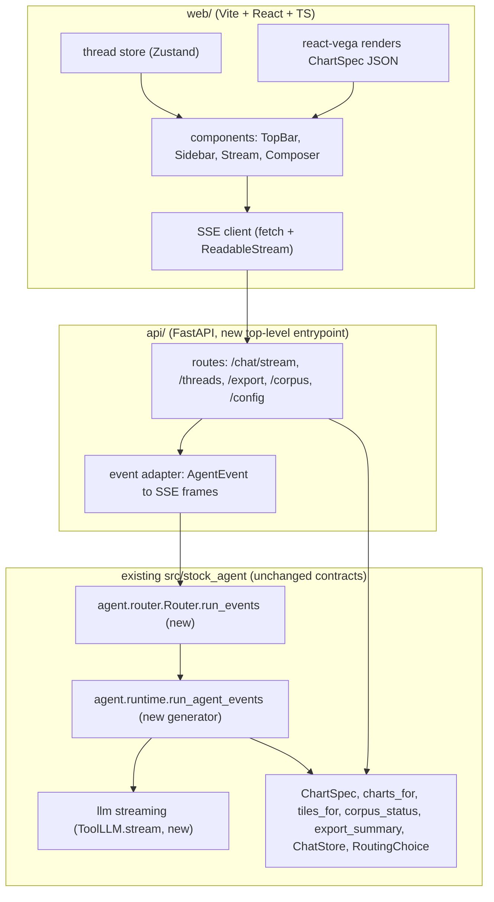

# Phase 2 — React + FastAPI Frontend (Plan of Record)

Supersedes the one-paragraph sketch in [APP_REDESIGN.md §9](APP_REDESIGN.md). This is the ordered
build plan; APP_REDESIGN §9 now points here. Read that doc's §1–§8 for the design system and the
Streamlit Phase-1 history this port inherits.

## 1. Objective & trigger

Phase 1 (Streamlit restyle, R0–R6) reaches the palette, typography, tiles, chips, sources, and
export of the target mockup — but four interactions sit **above Streamlit's ceiling** and are the
explicit trigger for Phase 2. Each is present in the reference artifact and flagged "approximated /
Phase 2" in APP_REDESIGN:

| Ceiling item | Mockup evidence | Why Streamlit can't | Phase-2 mechanism |
|---|---|---|---|
| Live per-tool trace during a run | `.trace` row fills tool-by-tool as the agent works | `st.status` shows a spinner, not an event stream; `run_agent` returns only when finished | SSE `tool_start`/`tool_finish` events → trace chips animate in |
| Token-by-token answer streaming | typing feel on the answer prose | no token hook; the whole turn returns at once | SSE `token` deltas from a streaming LLM call |
| Instant client-side theme toggle | `◐` flips `data-theme` with zero reload | Streamlit reruns the server on any state change (R6.B is a workaround for the desync, not a true toggle) | React state flips a `data-theme` attr; tokens are CSS vars |
| `Export ▾` popover + top-bar context chips | Radix-style popover; sticky blurred top bar | `st.popover` is limited; the top bar is not a first-class Streamlit surface | shadcn/ui `Popover`, a real sticky header component |

**Decision (locked):** build React + FastAPI as the *primary* UI; **keep Streamlit runnable as a
reference/fallback** during the port and retire it only once React reaches parity. Full streaming
fidelity (live trace **and** token stream). Local-dev target only (no auth/containers/cloud this
phase). Stack: **Vite + React + TypeScript + Tailwind + shadcn/ui**, Vega-Lite via `react-vega`.

## 2. Guiding invariants (unchanged from Phase 1)

The framework changes; the correctness contract does **not**. The API layer is a new top-level
entrypoint like `cli/` — it depends **downward only** (`api/` → `pipelines`/agent/core → `providers`)
and nothing depends on it.

1. **Numbers vs. narrative.** Tiles, chart data, VaR/ECE/probabilities all originate in
   `indicators/`/`forecasting/`/`backtesting/`, surfaced through `ToolInvocation.result`. The stream's
   `tiles`/`chart`/`sources` events are built by **pure functions over tool results**
   (`ui.tiles.tiles_for`, `viz.charts.charts_for`) — never from LLM text. The React app renders what
   the server sends; it computes no financial numbers.
2. **Grounding guard still runs server-side.** Token streaming does not bypass
   `NumberGrounding`: tokens are streamed as *candidate* text, and the terminal `final` event is only
   emitted after the same ungrounded-figure check (and retry) that `run_agent` enforces today. If the
   guard rejects, the stream emits `error`, not `final`. (See §5 for the ordering contract.)
3. **Non-advisory, citations-from-tools, no web scraping, secrets only in `.env`.** Unchanged. The
   `/export` and `/chat` payloads carry no recommendation field; citations echo the filing sources a
   tool returned.

## 3. Architecture



- **`api/`** (new, `src/stock_agent/api/`): FastAPI app, thin — request validation + call the
  router/streaming runtime + adapt `AgentEvent` → SSE. No business logic (same rule as `cli/`).
- **`web/`** (new, repo-root `web/`): the React SPA. Talks only to `api/` over HTTP/SSE. Never
  imports Python; the design tokens are the shared contract (mirrored into Tailwind, §6).
- **Streamlit `ui/`**: untouched, still `streamlit run ui/chat_app.py`. Both consume the same pure
  contracts, so they cannot drift on numbers.

## 4. The one real backend change: an event-emitting runtime

Today [`run_agent`](../src/stock_agent/agent/runtime.py) is a synchronous loop returning
`AgentResult`. Streaming needs the same loop to *yield as it goes*. Do this as a **behavior-preserving
refactor**, not a fork:

- Extract the loop body into a generator `run_agent_events(...) -> Iterator[AgentEvent]` that yields
  at the points that already exist:
  - before `executor.execute` → `ToolStart(tool, input_summary, hue_key)`
  - after it → `ToolFinish(tool, ok, elapsed_ms)`
  - on the final model turn → `TokenDelta(text)` chunks (from the new streaming LLM call), then the
    grounding check, then `Final(result)` **or** `Error(code, message)`.
- Re-implement `run_agent` as a thin drain: `def run_agent(...): return _collect(run_agent_events(...))`.
  The loop logic lives **once** → existing `run_agent` tests still pin behavior; the generator can't
  diverge.
- `Router.run_events(...)` mirrors `Router.run`: deterministic routes emit `RouteDecided(mode="deterministic", route_name, note)` + their synthesis (single `TokenDelta` if that path isn't
  token-streamed) + `chart`/`sources`/`final`; Auto/classify emit `RouteDecided(mode="auto")` then
  delegate to `run_agent_events`.
- **LLM streaming**: extend the `ToolLLM` Protocol with an optional `stream(...) -> Iterator[TokenDelta | ToolResponse]`. Provide a default: models/fakes that only implement `create` are wrapped so the
  generator yields one `TokenDelta` with the whole answer (keeps `FakeProvider`/`FakeLLM` tests
  working, no network in CI). Only `AnthropicToolClient` implements true token streaming
  (`client.messages.stream(...)`).

**AgentEvent** (discriminated union, `agent/events.py`, JSON-serializable — this is the SSE schema):

| `type` | payload | source (grounded?) |
|---|---|---|
| `turn_start` | `thread_id, turn_id, route, ticker` | routing choice |
| `route_decided` | `mode, route_name, note` | router (the mockup's trace / direct-route chip) |
| `tool_start` | `tool, input_summary, hue_key` | runtime (hue via `crc32(tool)`, stable per tool) |
| `tool_finish` | `tool, ok, elapsed_ms` | runtime |
| `tiles` | `tiles: [{label,value,sub,tone}]` | **`ui.tiles.tiles_for(invocations)`** ✅ |
| `chart` | `spec: ChartSpec (JSON)` | **`viz.charts.charts_for(invocations)`** ✅ |
| `token` | `text` | streaming LLM (candidate text) |
| `sources` | `citations: [{marker,label,url}]` | tool results ✅ |
| `final` | `turn_id, tool_calls, iterations, grounded: true` | runtime, **post-guard** |
| `error` | `code, message` | runtime (incl. grounding rejection) |

## 5. Stream ordering contract (the correctness-critical part)

The server MUST emit in this order so the client renders "summary-before-detail" and never shows
ungrounded prose as final:

```
turn_start → route_decided → (tool_start, tool_finish)*  →  tiles → chart* → token* → sources → final
                                                                                         └─(or)→ error
```

- `tiles`/`chart`/`sources` are emitted **after all tools finish** (they are functions of the complete
  invocation list) and **before/around** the token stream, matching the mockup (tiles sit above the
  prose).
- `token`s are streamed for UX, but the client treats the turn as **provisional** until `final`. If
  `error` arrives (grounding rejection after retry, or a tool/LLM failure), the client discards the
  provisional tokens and shows the error surface — it never persists an unguarded answer.
- Deterministic routes skip the `tool_start/tool_finish` loop; they emit `route_decided(mode="deterministic")` and go straight to `tiles/chart/token/sources/final`.

## 6. Frontend plan

**Component map (mockup → React):**

| Mockup region | Component | Notes |
|---|---|---|
| Sticky blurred top bar | `TopBar` | brand glyph, disclaimer, active-ticker/mode chips, view segmented control, theme toggle |
| Left rail | `Sidebar` | `StatusCard` (corpus/embedder/coverage from `/corpus`), ticker field, routing select, quick-starters, chat list, key chips |
| Conversation | `Stream` → `Turn` → {`UserBubble`, `AssistantTurn`} | `AssistantTurn` composes `TileRow`, `ChartCard`, prose, `TraceRow`, `Sources`, `ExportMenu` |
| Empty state | `Hero` | typewriter (CSS + reduced-motion), `CapCard` grid |
| Composer | `Composer` | context chips + input + send; `focus-within` brass accent |

**Token bridge (zero drift):** the `--sa-*` CSS variables from `ui/theme.py` are the single source of
truth. Mirror them into `web/src/tokens.css` (generated by a small script that reads the Python token
dicts, or hand-synced with a checked test) and reference them from `tailwind.config.ts`
(`colors: { accent: 'var(--sa-accent)', … }`). Theme toggle flips `document.documentElement.dataset.theme`; both dark and light token sets ship (light is the mockup's `[data-theme="light"]` block — Phase 2 gets the real toggle Streamlit R6.B only approximates).

**Charts:** `react-vega` renders the exact `ChartSpec` JSON the `chart` event carries, themed by the
same `viz.render` Vega config. No SVG hand-drawing (the mockup's inline SVG was a mock; production uses
Vega-Lite, identical to Streamlit).

**State:** `Zustand` thread store (threads, active thread, streaming buffer). SSE via `fetch` +
`ReadableStream` reader (not `EventSource`, so we can POST the query body). One reducer folds
`AgentEvent`s into turn state.

## 7. API surface (FastAPI, local-dev)

| Method / path | Purpose | Reuses |
|---|---|---|
| `POST /chat/stream` | SSE: run a turn, stream `AgentEvent`s | `Router.run_events` |
| `GET /threads`, `POST /threads`, `DELETE /threads/{id}` | thread CRUD | `ChatStore` (`chat.history`) |
| `POST /export` | turn text (+ chart PNGs) → pdf/docx/md bytes | `reports.export.export_summary`, `viz.render.to_png` |
| `GET /corpus` | sidebar status card | `rag.status.corpus_status` |
| `GET /config` | routing modes, key availability, default ticker | `settings`, `RoutingChoice` metadata |

Local-dev posture: `uvicorn` on localhost, permissive CORS to the Vite dev origin, no auth. Auth/CORS
lockdown/containers are **out of scope** (a later phase if ever deployed).

## 8. Ordered build plan (incremental slices)

Each slice is independently green (`make check` for Python; `pnpm test`/`tsc` for web) before the next.

- **P2.0 — Scaffolding — ✅ DONE (2026-07-03).** `web/` (Vite + React + TS + Tailwind, token
  bridge, `data-theme` toggle on a static shell) and `src/stock_agent/api/` (FastAPI app,
  `/config` + `/corpus` only, CORS to the Vite origin). No agent calls yet.
  - **Backend:** `api/{app,deps,schemas}.py` + `api/routes/meta.py` — thin adapters over
    `corpus_status` + `DOMAIN_NAMES`/`AUTO_MODE`/settings key state (mirrors the Streamlit
    sidebar, so the two frontends can't drift on what they show). `fastapi`+`uvicorn` added to
    core deps (this is the phase that first needs them). Settings injected via
    `dependency_overrides` in tests (no real `.env`).
  - **Token bridge (decision (a) — generated):** CSS generation lives in the gated pure layer
    (`theme.web_tokens_css()`, emits `:root` dark + `:root[data-theme="light"]`); thin writer
    `scripts/gen_web_tokens.py`; `web/src/tokens.css` committed. `tailwind.config.ts` maps every
    color to a `--sa-*` var → no hardcoded hex on the React side.
  - **Web:** `TopBar` + `Sidebar` render from live `/config`+`/corpus`; `useTheme` flips
    `document.documentElement.dataset.theme` (the instant toggle Streamlit R6.B only
    approximated). pnpm; `make check-web` = token-bridge `--check` + `tsc --noEmit` + Vitest
    (kept **separate** from `make check` until the app is real, per the Phase-2 decision).
  - **Tests:** Python `tests/unit/test_api_meta.py` (5) + `test_token_bridge.py` (5, drift guard);
    web `src/test/{tokens,shell}.test.tsx` (7 — render-from-API + instant toggle + API-error
    surface). `make check` green (Python), `make check-web` green (tsc + 7 vitest).
  - **Scope note:** shadcn/ui is **not** fully `init`-ed here (no `components.json` / component
    fetch) — only its foundation (the `cn` util + the token-driven Tailwind theme). Radix/shadcn
    components (`Popover`, etc.) are installed in the slice that first consumes them (P2.5),
    avoiding dead deps (same "defer to the consuming phase" rule R0 used). `react-vega`/`Zustand`
    likewise land in P2.3.
  - *DoD:* ✅ React shell renders the top bar + sidebar from live `/config`/`/corpus`; theme
    toggle works (unit-tested); API + Vite dev run together (live-smoked). Browser eyeball of the
    styled shell is the one manual confirmation left (consistent with Phase-1's render-check notes).
- **P2.1 — Event-emitting runtime (backend, no UI) — ✅ DONE (2026-07-03).** `agent/events.py`,
  `run_agent_events`, `run_agent` re-expressed as its drain. **No web change.**
  - **Event schema (`agent/events.py`):** the full 10-type `AgentEvent` union (frozen dataclasses,
    JSON-serializable via `to_wire()` — the §4 SSE frame contract) + `hue_for(tool)` (`crc32`,
    palette-agnostic). `Final.to_wire()` projects to the §4 subset `{turn_id, tool_calls,
    iterations, grounded}`; in-process it still carries `messages`/`tool_results` for the drain.
  - **Runtime split (`agent/runtime.py`):** loop extracted into the generator `run_agent_events`,
    which yields only the **runtime-owned** subset — `tool_start`/`tool_finish` around each
    execution, one `token` delta for the (post-guard) answer, then terminal `final` **or**
    `error`. It does **not** emit `tiles`/`chart`/`sources` (adapter builds those from
    `tool_results` via `ui.tiles`/`viz.charts`/`ui.state` — the runtime must not import `ui/`/`viz/`,
    which would cycle with Streamlit) nor `turn_start`/`route_decided` (router-owned, P2.2).
    `run_agent = _collect(run_agent_events)` — concatenates `token`s, reads the transcript off
    `final`, re-raises `AgentGroundingError`/`AgentError` on `error` → callers + `pytest.raises`
    tests unchanged. No LLM-call change (single delta from the existing `create()`); `ToolLLM.stream`
    and true multi-delta streaming are **deferred to P2.4**.
  - **Tests:** `tests/unit/test_agent_events_schema.py` (4 — `to_wire` shapes, `Final` wire-omits
    server-only fields, `hue_for` determinism, JSON-serializability) + `tests/integration/
    test_agent_events.py` (7 — ordering, multi-tool pairing, grounding-reject→`error`-not-`final`
    with no tokens, retry→success emits only the accepted answer, tool-error→`ok=False`, `run_agent`
    ≡ drain). Existing runtime/router tests unchanged. `make check` green (955 passed / 3 skipped).
- **P2.2 — `POST /chat/stream` (non-token) — ✅ DONE (2026-07-03).** SSE endpoint streaming the full
  `AgentEvent` union in §5 order; single `token` carries the whole answer (true token streaming is
  P2.4). **No web change** (backend-only slice).
  - **Router (`agent/router.py`):** new `Router.run_events(...)` mirrors `Router.run` — router owns
    `turn_start` + `route_decided`; the deterministic path emits `tool_start`/`tool_finish` around one
    dispatch, a one-shot `token` (`_render(result)`), and a `Final` carrying the `ToolInvocation` (so
    the adapter can build tiles/chart/sources); the LLM/`auto` path delegates to `run_agent_events`
    (the same generator `run_agent` drains — can't drift) and stamps `turn_id` on its `Final`; the
    `classify` path dispatches or escalates. `RouterError` (bad route / missing param) still raised.
    It does **not** emit `tiles`/`chart`/`sources` (router must not import `ui`/`viz`, which would
    cycle with Streamlit) — those are adapter-owned.
  - **Adapter (`api/streaming.py`):** `adapt_events` weaves `tiles`/`chart`/`sources` in at the §5
    positions (built from `Final.tool_results` via `ui.tiles.stat_tiles_from_tool_results` /
    `viz.charts.charts_for` / `ui.state.sources_from_tool_results`) — buffers the token so tiles/chart
    precede it and sources follow; empty tiles/sources omitted; `Error` discards buffered tokens.
    `sse_frame` = `data: <json>\n\n`; `event_stream` converts a terminal `RouterError` into an
    `error` frame (SSE already 200, so no mid-stream 500). Only the api layer imports `ui`/`viz`
    (nothing imports `api` → no cycle).
  - **Endpoint (`api/routes/chat.py` + `deps.router_dep` + `schemas.ChatStreamRequest`):**
    `POST /chat/stream` → `StreamingResponse(text/event-stream)`; `router_dep` builds the hybrid
    `Router` (overridden in tests with a `FakeToolLLM`/`FakeProvider` router).
  - **Tests:** `tests/integration/test_router_events.py` (7 — ordering, `Final` payloads,
    `run_events` text/tool_calls/structured ≡ `run`, classify dispatch+escalate, `RouterError`),
    `tests/unit/test_streaming_adapter.py` (4 — §5 weave, builder byte-parity, empty-omission,
    error-discard), `tests/integration/test_api_chat_stream.py` (3 — SSE frame shape + §5 order via
    `TestClient`, `tiles`/`chart` byte-identical to builders, grounding-reject → `error` frame,
    bad-route → `error` frame). `make check` green (969 passed / 3 skipped).
- **P2.3 — React conversation — ✅ DONE (2026-07-03).** `Stream`/`AssistantTurn` renders a real
  turn from the SSE stream: `TileRow`, `ChartCard` (react-vega), `TraceRow` animating on
  `tool_start`/`tool_finish`, `Sources`, provisional→final token handling. First real agent turn in
  React.
  - **SSE client (`web/src/lib/stream.ts`):** `streamChat(req, {onEvent})` POSTs `/chat/stream` and
    reads `response.body` as a `ReadableStream`, parsing `data: <json>\n\n` frames (buffered across
    byte-chunk boundaries via the pure `parseSSEBuffer`). `fetch`+reader (not `EventSource`) so the
    query body can be POSTed (§6). In-band failures (grounding/bad route) arrive as terminal `error`
    *frames* (HTTP 200), not throws; only transport failures reject.
  - **Event types (`lib/events.ts`):** the 10-variant `AgentEvent` TS union, a 1:1 mirror of the
    Python `to_wire()` dicts (discriminant `type`). `hueName(hue_key)` reproduces `ui.html.tool_hue`
    (`hue_key % 5` over the same 5-hue order) so a tool's trace-chip color matches Streamlit — pinned
    by a cross-stack parity test using real `crc32` values.
  - **Chart bridge (`lib/chartSpec.ts`):** `chartSpecToVegaLite` is the React twin of
    `viz/render.to_altair` + `ui.chart_theme.altair_config` — the `chart` frame carries the render-
    agnostic `ChartSpec` dict (NOT Vega-Lite), so the client translates it (bar / grouped_bar /
    reliability) with the **dark-token mark palette hardcoded** (matching Python's single-palette-for-
    both-themes rule) → identical charts across stacks. `ChartCard` renders it via react-vega v8's
    `VegaEmbed` (SVG renderer, actions off).
  - **Store (`store/conversation.ts`):** a Zustand store (`turns`, `streaming`, `send`) plus the
    **pure** exported reducer `applyEvent(turn, ev)`: `tool_start` pushes a running chip,
    `tool_finish` resolves the last-running one (handles a tool used twice), `token` appends
    provisional prose, `final` commits (`grounded`), and **`error` discards provisional prose** (§5 —
    never persist an unguarded answer). `send` folds each streamed event into the active turn
    immutably (found by id) so React re-renders.
  - **Components:** `Stream`→`{UserBubble, AssistantTurn}`; `AssistantTurn` composes
    `TileRow`→`ChartCard*`→prose→`TraceRow`→`Sources` in §5 order (prose dim + caret while
    provisional; error surface replaces prose on `error`). `Composer` (Enter sends, Shift+Enter
    newline, disabled while streaming, context chips). `App` wires it: `mode===auto_mode → route
    "auto"`, else the domain name (resolved server-side).
  - **One thin backend change (`api/routes/chat.py`):** resolve a friendly **domain** name (from
    `/config`) → its granular route via the existing `resolve_domain` (else pass through); unknown
    values still fall through to a terminal `error` frame. Keeps routing logic in Python — the client
    only sends the selection.
  - **Tests (24 web / +1 Python):** `reducer.test.ts` (fold, trace-in-order, same-tool-twice,
    error-discards-tokens), `stream.test.ts` (SSE parse incl. split-across-chunks, POST shape,
    non-OK throws), `chartSpec.test.ts` (bar/grouped/reliability VL shape + `hueName` parity),
    `conversation.test.tsx` (component: send→streamed forecast turn renders tiles/trace/chart/prose;
    error frame → error surface, provisional prose discarded), shared golden `fixtures.ts`.
    **Testing note (deviation from §9):** SSE is mocked by stubbing `fetch` with a `ReadableStream`
    (exercises the real parser) rather than MSW — deterministic, no heavy dep, same no-live-backend
    guarantee; the cross-stack golden fixture is retained. `make check` green (970 passed / 3 skip);
    `make check-web` green (tsc + 24 vitest); `pnpm build` green.
  - **Deps:** `zustand`, `react-vega` (v8 → `VegaEmbed`), `vega`, `vega-lite`, `vega-embed`.
    react-vega/Zustand land here per P2.0's "defer to the consuming slice". Vega canvas probe in
    jsdom silenced by a top-level `getContext` stub in the test setup (no chart is really rendered).
- **P2.4 — True token streaming — ✅ DONE (2026-07-03).** Real streaming LLM client + multi-delta
  emission from the runtime, **grounding-safe** (backend-only slice; the P2.3 client already renders
  multiple `token` frames incrementally, so no web change).
  - **Streaming client (`agent/runtime.py`):** `AnthropicToolClient.stream(...)` drives
    `client.messages.stream(...)` — forwards `text_stream` deltas live, then yields ONE terminal
    `ToolResponse` assembled from `get_final_message()` (shared `_tool_response_from_content` with
    `create`; shared `_sampling_kwargs` so temperature is pinned/omitted identically). A new
    `@runtime_checkable StreamingToolLLM` Protocol + `stream_turn(llm, …)` route a streaming LLM to
    `.stream` and **fall back** to a single-delta `create()` for create-only LLMs — so every
    existing test fake is unchanged.
  - **Runtime (`run_agent_events`):** consumes `stream_turn`, collecting text deltas + the terminal
    `ToolResponse`. On the answer turn it emits the accepted answer as **multiple `Token` deltas**
    preserving the model's own chunk boundaries (`_answer_tokens`, which guarantees
    `"".join(deltas) == text`). **Grounding runs on the FULL assembled answer BEFORE any delta is
    yielded** — an ungrounded figure split across chunks (`"92." + "5%"`) is still caught, the
    rejected attempt streams no tokens, and tool-call preamble text is discarded (never a `Token`).
    `run_agent` (the drain) concatenates the deltas → byte-identical text; all P2.1/P2.2 tests hold.
  - **Adapter:** unchanged — it still buffers the `token`s and flushes `tiles → chart* → token* →
    sources → final` at `Final`. Since the deltas are emitted only *after* the guard clears (the
    whole answer is already assembled), buffering them to keep tiles/chart first (§5) costs no
    latency.
  - **Design decision (grounding-safe ordering, flagged):** true live-*during*-generation typing is
    **intentionally deferred**. It is in genuine tension with three locked invariants — the grounding
    guard (needs the whole answer), §5 (`tiles` precede prose, built from the complete tool_results),
    and drain-equivalence / no-preamble-leak. Delivering it would require a **provisional-reset**
    wire frame (to discard tool-preamble + grounding-retry attempts) **and a §5 relaxation**, and it
    would *flash ungrounded figures pre-guard* — directly undercutting the numbers-vs-narrative
    invariant. P2.4 ships the streaming infra (a prerequisite for any future live-gen upgrade) with
    the stronger guarantee that **no ungrounded figure ever reaches the client, even provisionally**.
  - **Tests (11):** `tests/unit/test_streaming_client.py` (7 — deltas-then-terminal-ToolResponse,
    multi-chunk concat == single-shot, tool_use parsed off the final message, temperature
    pin/omit, SDK-error → `AgentError`, `stream_turn` fallback for create-only + forward for
    streaming), `tests/integration/test_agent_events.py` (+4 — one Token per delta with boundaries
    preserved, full-text grounding with a figure split across deltas, tool-turn preamble discarded,
    drain concatenates deltas). `make check` green (981 passed / 3 skipped); no web change.
- **P2.5 — Threads + export.** `/threads` wired to `ChatStore`; `ExportMenu` popover → `/export`
  download. *Tests:* thread round-trip (create/list/delete) reuses existing `ChatStore` tests; export
  bytes non-empty per format (reuses `export_summary` tests).
- **P2.6 — Empty-state hero + quick starters + parity pass.** `Hero`, capability cards, quick-starter
  prefill. Side-by-side parity check vs. the mockup and vs. Streamlit (numbers identical). *DoD:*
  the four ceiling items work; screenshots (light+dark) attached.

## 9. Testing strategy

- **Backend:** all deterministic, no live API (repo rule). SSE tests use FastAPI's `TestClient` +
  `FakeLLM`/`FakeProvider`/`FakeEmbedder`; assert **event ordering** and that `tiles`/`chart`/`sources`
  equal the pure-builder outputs (single source of truth). Grounding-rejection path tested explicitly.
- **Frontend:** Vitest + Testing Library; SSE mocked with MSW from a **recorded event fixture** (the
  same JSON the Python adapter emits — a shared golden file keeps both ends honest). No network, no
  live agent. `tsc --noEmit` in `make check`'s web leg.
- **Contract parity:** a cross-stack golden — one canned turn's `AgentEvent` stream serialized to
  JSON, asserted by the Python adapter test **and** consumed by the React test — so a schema change
  breaks both sides loudly.

## 10. Risks & mitigations

| Risk | Mitigation |
|---|---|
| Streaming refactor changes agent behavior | `run_agent` = drain of the generator (one loop); existing runtime tests are the contract; P2.1 ships backend-only, no UI coupling. |
| Token stream leaks ungrounded numbers as "final" | Tokens are provisional; `final` only post-guard; `error` discards them client-side (§5). |
| Two-stack drift (Streamlit vs React) on numbers | Both render pure-builder output (`tiles_for`/`charts_for`/`ChartSpec`); neither computes figures. Cross-stack golden fixture (§9). |
| Token bridge drifts from `ui/theme.py` | Parity test fails CI if web tokens ≠ Python tokens; generate rather than hand-copy where practical. |
| shadcn/Radix + CSP/font assumptions | Local-dev only; self-host fonts (same system stack as Phase 1, no CDN); revisit for any future deploy. |
| Scope creep into auth/deploy/mobile | Explicit non-goals (§11); local-dev posture fixed for this phase. |

## 11. Non-goals (this phase)

Auth, HTTPS, containers, cloud deploy, rate limiting, multi-user, mobile-native, offline PWA, replacing
Streamlit (it stays as reference until React hits parity), any change to agent tools / router logic /
forecasting math beyond the streaming *emission* refactor.

## 12. Definition of done (overall)

- The four ceiling items (§1) work in React: live trace, token stream, instant theme toggle, export
  popover + top-bar chips.
- Numbers in React match Streamlit and the tools exactly (cross-stack golden green).
- Invariants intact: numbers-from-tools, grounding enforced pre-`final`, non-advisory, citations from
  tools, dependency direction downward (`api/` depends down only).
- `make check` green (Python) **and** the web leg green (`tsc` + Vitest); no live API calls in any test.
- Streamlit app still runs unchanged.
- Before/after screenshots (light + dark) attached; APP_REDESIGN §9 + this doc's checkboxes updated.
