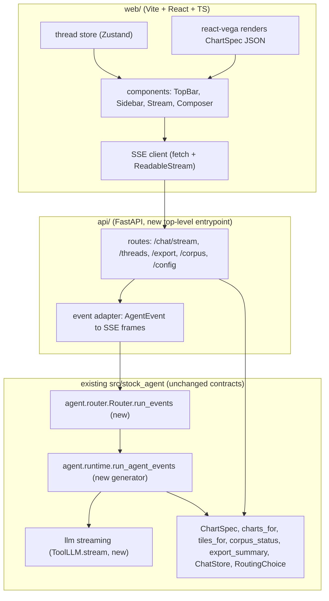

# Phase 2 — React + FastAPI Frontend (Plan of Record)

Supersedes the one-paragraph sketch in [APP_REDESIGN.md §9](APP_REDESIGN.md). This is the ordered
build plan; APP_REDESIGN §9 now points here. Read that doc's §1–§8 for the design system and the
Streamlit Phase-1 history this port inherits.

## 1. Objective & trigger

Phase 1 (Streamlit restyle, R0–R6) reaches the palette, typography, tiles, chips, sources, and
export of the target mockup — but four interactions sit **above Streamlit's ceiling** and are the
explicit trigger for Phase 2. Each is present in the reference artifact and flagged "approximated /
Phase 2" in APP_REDESIGN:

| Ceiling item | Mockup evidence | Why Streamlit can't | Phase-2 mechanism |
|---|---|---|---|
| Live per-tool trace during a run | `.trace` row fills tool-by-tool as the agent works | `st.status` shows a spinner, not an event stream; `run_agent` returns only when finished | SSE `tool_start`/`tool_finish` events → trace chips animate in |
| Token-by-token answer streaming | typing feel on the answer prose | no token hook; the whole turn returns at once | SSE `token` deltas from a streaming LLM call |
| Instant client-side theme toggle | `◐` flips `data-theme` with zero reload | Streamlit reruns the server on any state change (R6.B is a workaround for the desync, not a true toggle) | React state flips a `data-theme` attr; tokens are CSS vars |
| `Export ▾` popover + top-bar context chips | Radix-style popover; sticky blurred top bar | `st.popover` is limited; the top bar is not a first-class Streamlit surface | shadcn/ui `Popover`, a real sticky header component |

**Decision (locked):** build React + FastAPI as the *primary* UI; **keep Streamlit runnable as a
reference/fallback** during the port and retire it only once React reaches parity. Full streaming
fidelity (live trace **and** token stream). Local-dev target only (no auth/containers/cloud this
phase). Stack: **Vite + React + TypeScript + Tailwind + shadcn/ui**, Vega-Lite via `react-vega`.

## 2. Guiding invariants (unchanged from Phase 1)

The framework changes; the correctness contract does **not**. The API layer is a new top-level
entrypoint like `cli/` — it depends **downward only** (`api/` → `pipelines`/agent/core → `providers`)
and nothing depends on it.

1. **Numbers vs. narrative.** Tiles, chart data, VaR/ECE/probabilities all originate in
   `indicators/`/`forecasting/`/`backtesting/`, surfaced through `ToolInvocation.result`. The stream's
   `tiles`/`chart`/`sources` events are built by **pure functions over tool results**
   (`ui.tiles.tiles_for`, `viz.charts.charts_for`) — never from LLM text. The React app renders what
   the server sends; it computes no financial numbers.
2. **Grounding guard still runs server-side.** Token streaming does not bypass
   `NumberGrounding`: tokens are streamed as *candidate* text, and the terminal `final` event is only
   emitted after the same ungrounded-figure check (and retry) that `run_agent` enforces today. If the
   guard rejects, the stream emits `error`, not `final`. (See §5 for the ordering contract.)
3. **Non-advisory, citations-from-tools, no web scraping, secrets only in `.env`.** Unchanged. The
   `/export` and `/chat` payloads carry no recommendation field; citations echo the filing sources a
   tool returned.

## 3. Architecture



- **`api/`** (new, `src/stock_agent/api/`): FastAPI app, thin — request validation + call the
  router/streaming runtime + adapt `AgentEvent` → SSE. No business logic (same rule as `cli/`).
- **`web/`** (new, repo-root `web/`): the React SPA. Talks only to `api/` over HTTP/SSE. Never
  imports Python; the design tokens are the shared contract (mirrored into Tailwind, §6).
- **Streamlit `ui/`**: untouched, still `streamlit run ui/chat_app.py`. Both consume the same pure
  contracts, so they cannot drift on numbers.

## 4. The one real backend change: an event-emitting runtime

Today [`run_agent`](../src/stock_agent/agent/runtime.py) is a synchronous loop returning
`AgentResult`. Streaming needs the same loop to *yield as it goes*. Do this as a **behavior-preserving
refactor**, not a fork:

- Extract the loop body into a generator `run_agent_events(...) -> Iterator[AgentEvent]` that yields
  at the points that already exist:
  - before `executor.execute` → `ToolStart(tool, input_summary, hue_key)`
  - after it → `ToolFinish(tool, ok, elapsed_ms)`
  - on the final model turn → `TokenDelta(text)` chunks (from the new streaming LLM call), then the
    grounding check, then `Final(result)` **or** `Error(code, message)`.
- Re-implement `run_agent` as a thin drain: `def run_agent(...): return _collect(run_agent_events(...))`.
  The loop logic lives **once** → existing `run_agent` tests still pin behavior; the generator can't
  diverge.
- `Router.run_events(...)` mirrors `Router.run`: deterministic routes emit `RouteDecided(mode="deterministic", route_name, note)` + their synthesis (single `TokenDelta` if that path isn't
  token-streamed) + `chart`/`sources`/`final`; Auto/classify emit `RouteDecided(mode="auto")` then
  delegate to `run_agent_events`.
- **LLM streaming**: extend the `ToolLLM` Protocol with an optional `stream(...) -> Iterator[TokenDelta | ToolResponse]`. Provide a default: models/fakes that only implement `create` are wrapped so the
  generator yields one `TokenDelta` with the whole answer (keeps `FakeProvider`/`FakeLLM` tests
  working, no network in CI). Only `AnthropicToolClient` implements true token streaming
  (`client.messages.stream(...)`).

**AgentEvent** (discriminated union, `agent/events.py`, JSON-serializable — this is the SSE schema):

| `type` | payload | source (grounded?) |
|---|---|---|
| `turn_start` | `thread_id, turn_id, route, ticker` | routing choice |
| `route_decided` | `mode, route_name, note` | router (the mockup's trace / direct-route chip) |
| `tool_start` | `tool, input_summary, hue_key` | runtime (hue via `crc32(tool)`, stable per tool) |
| `tool_finish` | `tool, ok, elapsed_ms` | runtime |
| `tiles` | `tiles: [{label,value,sub,tone}]` | **`ui.tiles.tiles_for(invocations)`** ✅ |
| `chart` | `spec: ChartSpec (JSON)` | **`viz.charts.charts_for(invocations)`** ✅ |
| `token` | `text` | streaming LLM (candidate text) |
| `sources` | `citations: [{marker,label,url}]` | tool results ✅ |
| `final` | `turn_id, tool_calls, iterations, grounded: true` | runtime, **post-guard** |
| `error` | `code, message` | runtime (incl. grounding rejection) |

## 5. Stream ordering contract (the correctness-critical part)

The server MUST emit in this order so the client renders "summary-before-detail" and never shows
ungrounded prose as final:

```
turn_start → route_decided → (tool_start, tool_finish)*  →  tiles → chart* → token* → sources → final
                                                                                         └─(or)→ error
```

- `tiles`/`chart`/`sources` are emitted **after all tools finish** (they are functions of the complete
  invocation list) and **before/around** the token stream, matching the mockup (tiles sit above the
  prose).
- `token`s are streamed for UX, but the client treats the turn as **provisional** until `final`. If
  `error` arrives (grounding rejection after retry, or a tool/LLM failure), the client discards the
  provisional tokens and shows the error surface — it never persists an unguarded answer.
- Deterministic routes skip the `tool_start/tool_finish` loop; they emit `route_decided(mode="deterministic")` and go straight to `tiles/chart/token/sources/final`.

## 6. Frontend plan

**Component map (mockup → React):**

| Mockup region | Component | Notes |
|---|---|---|
| Sticky blurred top bar | `TopBar` | brand glyph, disclaimer, active-ticker/mode chips, view segmented control, theme toggle |
| Left rail | `Sidebar` | `StatusCard` (corpus/embedder/coverage from `/corpus`), ticker field, routing select, quick-starters, chat list, key chips |
| Conversation | `Stream` → `Turn` → {`UserBubble`, `AssistantTurn`} | `AssistantTurn` composes `TileRow`, `ChartCard`, prose, `TraceRow`, `Sources`, `ExportMenu` |
| Empty state | `Hero` | typewriter (CSS + reduced-motion), `CapCard` grid |
| Composer | `Composer` | context chips + input + send; `focus-within` brass accent |

**Token bridge (zero drift):** the `--sa-*` CSS variables from `ui/theme.py` are the single source of
truth. Mirror them into `web/src/tokens.css` (generated by a small script that reads the Python token
dicts, or hand-synced with a checked test) and reference them from `tailwind.config.ts`
(`colors: { accent: 'var(--sa-accent)', … }`). Theme toggle flips `document.documentElement.dataset.theme`; both dark and light token sets ship (light is the mockup's `[data-theme="light"]` block — Phase 2 gets the real toggle Streamlit R6.B only approximates).

**Charts:** `react-vega` renders the exact `ChartSpec` JSON the `chart` event carries, themed by the
same `viz.render` Vega config. No SVG hand-drawing (the mockup's inline SVG was a mock; production uses
Vega-Lite, identical to Streamlit).

**State:** `Zustand` thread store (threads, active thread, streaming buffer). SSE via `fetch` +
`ReadableStream` reader (not `EventSource`, so we can POST the query body). One reducer folds
`AgentEvent`s into turn state.

## 7. API surface (FastAPI, local-dev)

| Method / path | Purpose | Reuses |
|---|---|---|
| `POST /chat/stream` | SSE: run a turn, stream `AgentEvent`s | `Router.run_events` |
| `GET /threads`, `POST /threads`, `DELETE /threads/{id}` | thread CRUD | `ChatStore` (`chat.history`) |
| `POST /export` | turn text (+ chart PNGs) → pdf/docx/md bytes | `reports.export.export_summary`, `viz.render.to_png` |
| `GET /corpus` | sidebar status card | `rag.status.corpus_status` |
| `GET /config` | routing modes, key availability, default ticker | `settings`, `RoutingChoice` metadata |

Local-dev posture: `uvicorn` on localhost, permissive CORS to the Vite dev origin, no auth. Auth/CORS
lockdown/containers are **out of scope** (a later phase if ever deployed).

## 8. Ordered build plan (incremental slices)

Each slice is independently green (`make check` for Python; `pnpm test`/`tsc` for web) before the next.

- **P2.0 — Scaffolding.** `web/` (Vite+TS+Tailwind+shadcn init, token bridge, theme toggle on a
  static shell) and `src/stock_agent/api/` (FastAPI app, `/config` + `/corpus` only). No agent calls
  yet. *Tests:* token-bridge parity test (web tokens == Python tokens); FastAPI `/config`,`/corpus`
  contract tests (mocked settings). *DoD:* React shell renders the top bar + sidebar from live
  `/config`/`/corpus`, theme toggle works.
- **P2.1 — Event-emitting runtime (backend, no UI).** `agent/events.py`, `run_agent_events`,
  `run_agent` re-expressed as its drain. *Tests:* event-ordering test (§5) with `FakeLLM`+fake tools;
  regression — existing `run_agent` tests unchanged and green; grounding still rejects → `error` not
  `final`. **No web change.**
- **P2.2 — `POST /chat/stream` (non-token).** Adapter emits everything except real `token` streaming
  (single `token` with full text). *Tests:* SSE frame-shape + ordering via FastAPI test client;
  `tiles`/`chart`/`sources` are byte-identical to `tiles_for`/`charts_for`/citation builders.
- **P2.3 — React conversation.** `Stream`/`AssistantTurn` renders a real turn from the stream:
  `TileRow`, `ChartCard` (react-vega), `TraceRow` animating on `tool_start/finish`, `Sources`,
  provisional→final token handling. *Tests:* component tests with an MSW-mocked SSE fixture (no live
  backend); trace fills in order; error event discards provisional text.
- **P2.4 — True token streaming.** `AnthropicToolClient.stream`; adapter forwards deltas. *Tests:*
  streaming client unit test against a recorded/faked chunk sequence (no network); multi-chunk →
  concatenated == single-shot answer.
- **P2.5 — Threads + export.** `/threads` wired to `ChatStore`; `ExportMenu` popover → `/export`
  download. *Tests:* thread round-trip (create/list/delete) reuses existing `ChatStore` tests; export
  bytes non-empty per format (reuses `export_summary` tests).
- **P2.6 — Empty-state hero + quick starters + parity pass.** `Hero`, capability cards, quick-starter
  prefill. Side-by-side parity check vs. the mockup and vs. Streamlit (numbers identical). *DoD:*
  the four ceiling items work; screenshots (light+dark) attached.

## 9. Testing strategy

- **Backend:** all deterministic, no live API (repo rule). SSE tests use FastAPI's `TestClient` +
  `FakeLLM`/`FakeProvider`/`FakeEmbedder`; assert **event ordering** and that `tiles`/`chart`/`sources`
  equal the pure-builder outputs (single source of truth). Grounding-rejection path tested explicitly.
- **Frontend:** Vitest + Testing Library; SSE mocked with MSW from a **recorded event fixture** (the
  same JSON the Python adapter emits — a shared golden file keeps both ends honest). No network, no
  live agent. `tsc --noEmit` in `make check`'s web leg.
- **Contract parity:** a cross-stack golden — one canned turn's `AgentEvent` stream serialized to
  JSON, asserted by the Python adapter test **and** consumed by the React test — so a schema change
  breaks both sides loudly.

## 10. Risks & mitigations

| Risk | Mitigation |
|---|---|
| Streaming refactor changes agent behavior | `run_agent` = drain of the generator (one loop); existing runtime tests are the contract; P2.1 ships backend-only, no UI coupling. |
| Token stream leaks ungrounded numbers as "final" | Tokens are provisional; `final` only post-guard; `error` discards them client-side (§5). |
| Two-stack drift (Streamlit vs React) on numbers | Both render pure-builder output (`tiles_for`/`charts_for`/`ChartSpec`); neither computes figures. Cross-stack golden fixture (§9). |
| Token bridge drifts from `ui/theme.py` | Parity test fails CI if web tokens ≠ Python tokens; generate rather than hand-copy where practical. |
| shadcn/Radix + CSP/font assumptions | Local-dev only; self-host fonts (same system stack as Phase 1, no CDN); revisit for any future deploy. |
| Scope creep into auth/deploy/mobile | Explicit non-goals (§11); local-dev posture fixed for this phase. |

## 11. Non-goals (this phase)

Auth, HTTPS, containers, cloud deploy, rate limiting, multi-user, mobile-native, offline PWA, replacing
Streamlit (it stays as reference until React hits parity), any change to agent tools / router logic /
forecasting math beyond the streaming *emission* refactor.

## 12. Definition of done (overall)

- The four ceiling items (§1) work in React: live trace, token stream, instant theme toggle, export
  popover + top-bar chips.
- Numbers in React match Streamlit and the tools exactly (cross-stack golden green).
- Invariants intact: numbers-from-tools, grounding enforced pre-`final`, non-advisory, citations from
  tools, dependency direction downward (`api/` depends down only).
- `make check` green (Python) **and** the web leg green (`tsc` + Vitest); no live API calls in any test.
- Streamlit app still runs unchanged.
- Before/after screenshots (light + dark) attached; APP_REDESIGN §9 + this doc's checkboxes updated.
