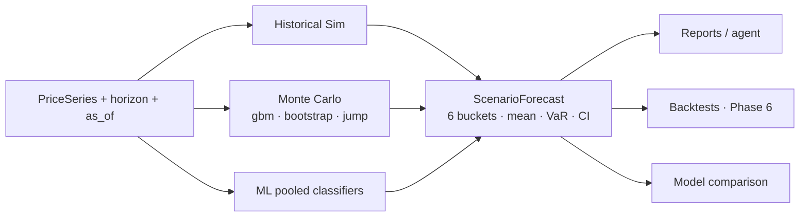
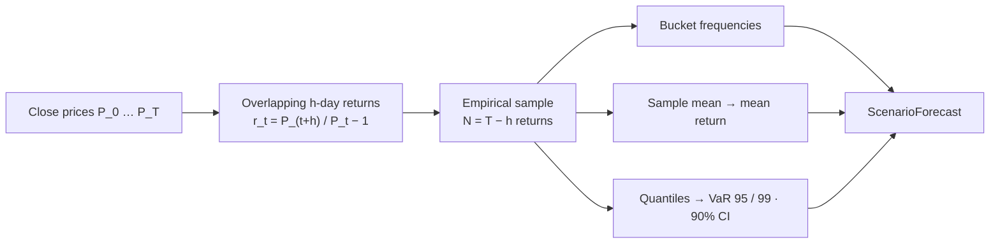
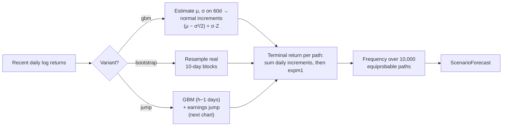
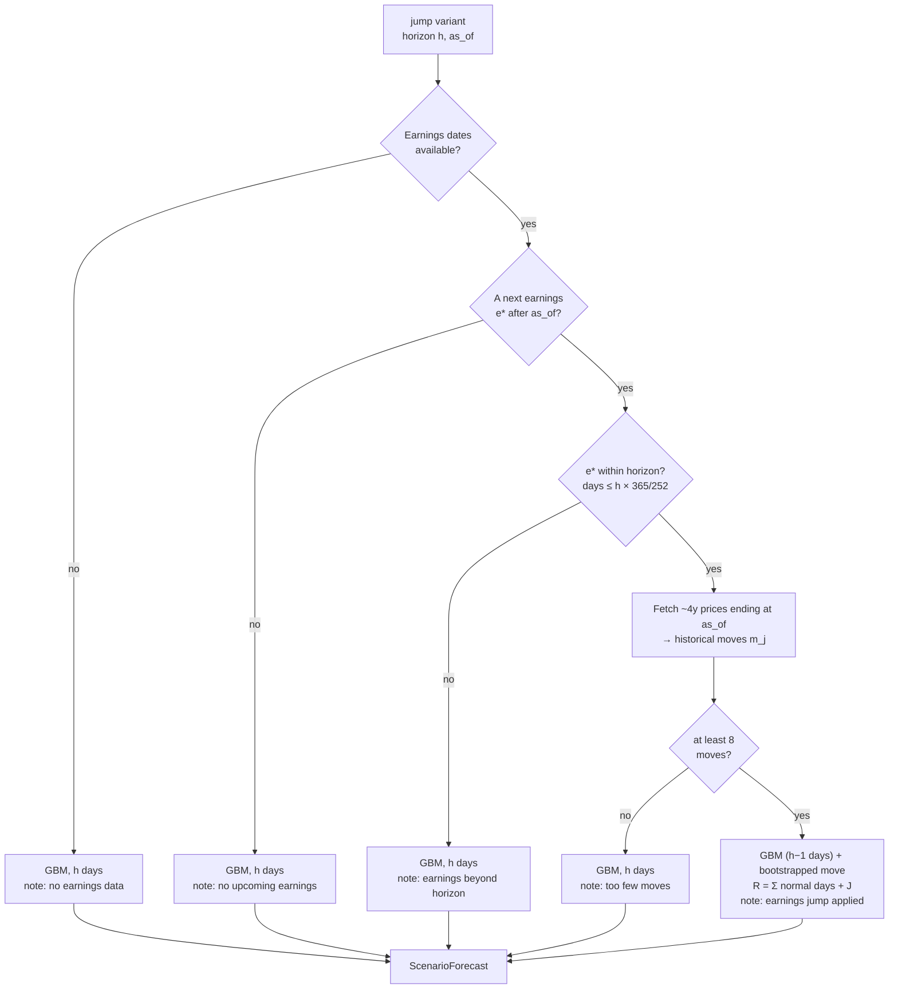
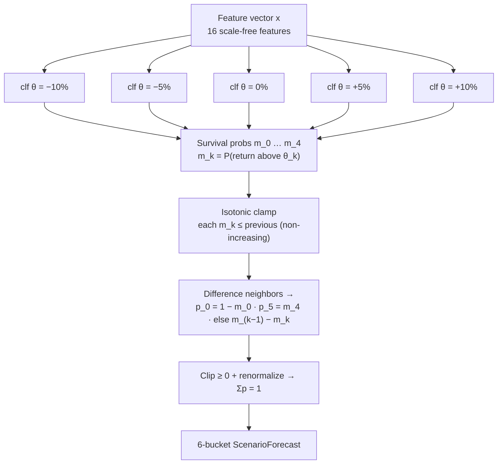
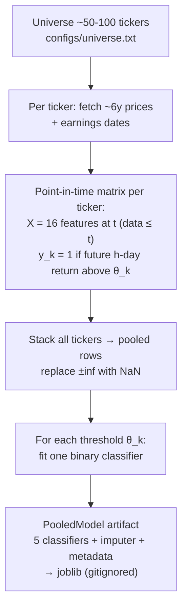
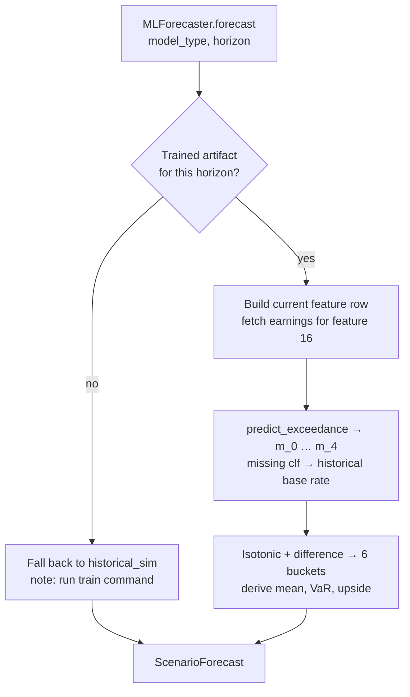

# Forecasting Models — Detailed Explanation

This document explains the three probabilistic forecasting approaches in the
project in depth, with the equations, assumptions, and the exact algorithms as
implemented:

1. **Historical Simulation** — empirical, assumption-free baseline.
2. **Monte Carlo (GBM, block-bootstrap, earnings-jump)** — parametric/semi-parametric simulation.
3. **Machine Learning (pooled, price-only classifiers)** — cross-sectional supervised models.

All three are *probabilistic*: they output a full distribution over forward
returns, not a point prediction or a buy/sell signal.

---

## Table of contents

- [0. The shared output contract](#0-the-shared-output-contract)
- [1. Historical Simulation](#1-historical-simulation)
- [2. Monte Carlo: GBM, bootstrap, and earnings-jump](#2-monte-carlo-gbm-bootstrap-and-earnings-jump)
- [3. Machine Learning: pooled, price-only classifiers](#3-machine-learning-pooled-price-only-classifiers)
- [4. Side-by-side comparison](#4-side-by-side-comparison)
- [5. What none of them do](#5-what-none-of-them-do)

---

## 0. The shared output contract

Every model implements one interface ([forecasting/base.py](../src/stock_agent/forecasting/base.py)):

```python
def forecast(series: PriceSeries, *, horizon_days: int, as_of: date | None) -> ScenarioForecast
```

and returns the **same** object, `ScenarioForecast`
([schemas/forecast.py](../src/stock_agent/schemas/forecast.py)). This is what
makes the models directly comparable in reports and backtests. Its key fields:

| Field | Meaning |
|---|---|
| `buckets` | Six probabilities over forward-return ranges (sum to 1) |
| `expected_return` | $\mathbb{E}[r]$ over the horizon (fractional) |
| `upside_prob` / `downside_prob` | $P(r>0)$ / $P(r<0)$ |
| `var_95`, `var_99` | Value-at-Risk: the 5th / 1st percentile of return (typically negative) |
| `ci_low`, `ci_high` | 90% predictive interval (5th–95th percentile) |
| `calibration_status` | `unknown` until Phase 6 validates the probabilities |
| `notes` | Model caveats (e.g. fallback, sparse data, jump applied) |

### The six buckets

Forward fractional return $r = P_{t+h}/P_t - 1$ is partitioned into six ranges
([forecasting/buckets.py](../src/stock_agent/forecasting/buckets.py)). Convention:
each bucket is **half-open `[lower, upper)`** — lower inclusive, upper exclusive.

| # | Label | Range |
|---|---|---|
| 0 | `< -10%` | $(-\infty, -0.10)$ |
| 1 | `-10% to -5%` | $[-0.10, -0.05)$ |
| 2 | `-5% to 0%` | $[-0.05, 0)$ |
| 3 | `0% to +5%` | $[0, 0.05)$ |
| 4 | `+5% to +10%` | $[0.05, 0.10)$ |
| 5 | `> +10%` | $[0.10, +\infty)$ |

The internal boundaries $\{-0.10, -0.05, 0, +0.05, +0.10\}$ are reused by the ML
models as classifier thresholds (Section 3) — the buckets and the ML targets are
the *same* partition by design.

*All three models converge on the identical output object — which is exactly what lets reports and backtests compare them directly:*



> **Horizon units.** `horizon_days` is **trading days** throughout (≈ 21/month,
> 252/year). Where calendar days are needed (e.g. comparing an earnings date), we
> convert with the factor $365/252 \approx 1.448$.

---

## 1. Historical Simulation

**File:** [forecasting/historical.py](../src/stock_agent/forecasting/historical.py)
· **Model name:** `historical_sim`

### Idea

Estimate the forward-return distribution **empirically** from the stock's own
past, with *no distributional assumption*. It is the reference baseline: a more
complex model has to beat this to justify itself.

### Method

Given the close series $P_0, P_1, \dots, P_T$ and horizon $h$, form **every
overlapping $h$-day simple return**:

$$
r_t = \frac{P_{t+h}}{P_t} - 1, \qquad t = 0, 1, \dots, T-h
$$

This yields a sample $\{r_t\}$ of size $T-h$. Everything is read directly off
this empirical sample:

$$
\widehat{\mathbb{E}}[r] = \frac{1}{N}\sum_t r_t,
\qquad
P(\text{bucket}_k) = \frac{1}{N}\sum_t \mathbb{1}[\, r_t \in \text{bucket}_k \,]
$$

$$
\mathrm{VaR}_{95} = Q_{0.05}(\{r_t\}), \quad
\mathrm{VaR}_{99} = Q_{0.01}(\{r_t\}), \quad
\text{90\% CI} = \big[Q_{0.05}, Q_{0.95}\big]
$$

where $Q_p$ is the empirical $p$-quantile and $N = T-h$. `upside_prob` is just
$\frac{1}{N}\sum_t \mathbb{1}[\, r_t > 0 \,]$.

If fewer than `_MIN_SAMPLES = 30` returns are available, the forecast is still
produced but flagged low-confidence in `notes`.

*The whole pipeline is a single pass from prices to the empirical distribution:*



### Worked intuition

For a 20-day horizon on ~2 years of data ($T \approx 500$), you get ~480
overlapping 20-day returns. If 60 of them exceeded +10%, then
$P(\text{> +10\%}) = 60/480 = 12.5\%$. That's the entire model — it is the
stock's *own historical frequency table* of 20-day outcomes.

### Assumptions & failure modes

- **Stationarity.** Assumes the future 20-day-return distribution looks like the
  past. Breaks across regime shifts (a low-vol history won't anticipate a crash).
- **Overlapping windows ⇒ autocorrelation.** Consecutive $r_t$ share $h-1$ days,
  so the *effective* sample size is far below $N$. This **understates tail
  uncertainty** — a documented limitation, acceptable for a baseline.
- **No conditioning.** It cannot react to *today's* state (an earnings date next
  week, an overbought RSI). Every day gets the same unconditional distribution.

### Strengths

- Assumption-free, transparent, hard to beat out-of-sample for liquid names.
- Naturally captures real fat tails and skew present in the history.

---

## 2. Monte Carlo: GBM, bootstrap, and earnings-jump

**File:** [forecasting/monte_carlo.py](../src/stock_agent/forecasting/monte_carlo.py)
· **Model names:** `monte_carlo_gbm`, `monte_carlo_bootstrap`, `monte_carlo_jump`

Monte Carlo **simulates $N$ forward price paths** ($N = 10{,}000$), reads each
path's terminal return, and forms the distribution by *frequency over the
ensemble* — every path is equiprobable, so:

$$
P(\text{bucket}_k) = \frac{1}{N}\sum_{i=1}^{N} \mathbb{1}[\, r_i \in \text{bucket}_k \,]
$$

The terminal-return sample is then fed through the **same** `sample_to_forecast`
used by historical simulation, so E[r], VaR, and CI are computed identically.
Three variants differ only in *how the daily returns are generated*.

*Shared simulation core — the three variants diverge only at the increment-generation step, then rejoin:*



### 2.1 GBM (parametric) — `monte_carlo_gbm`

**Model.** Geometric Brownian Motion: log returns are i.i.d. Normal. In
continuous time $dP/P = \mu\,dt + \sigma\,dW_t$; discretized to one trading day
($dt = 1$) the **log** return increment is

$$
r^{\log}_d = \Big(\mu - \tfrac{1}{2}\sigma^2\Big) + \sigma Z_d,
\qquad Z_d \sim \mathcal{N}(0,1) \;\text{i.i.d.}
$$

The $-\tfrac{1}{2}\sigma^2$ is the **Itô correction**: it makes
$\mathbb{E}[\text{simple return}] = e^{\mu}-1$ rather than inflating the mean
through Jensen's inequality.

**Estimation.** $\mu$ and $\sigma$ are the sample mean and std (`ddof=1`) of the
**most recent `vol_window = 60`** daily log returns — so the simulation reflects
the *current* volatility regime, not the whole history.

**Simulation.** Draw a matrix $Z \in \mathbb{R}^{N \times h}$, build daily
increments, and sum across the horizon to get each path's terminal log return:

$$
R_i = \sum_{d=1}^{h} r^{\log}_{i,d}, \qquad
\text{simple return}_i = e^{R_i} - 1 \;\; (\texttt{expm1})
$$

Because log returns are i.i.d. Normal, $R_i \sim \mathcal{N}\!\big(h(\mu-\tfrac12\sigma^2),\; h\sigma^2\big)$ —
the terminal distribution is exactly lognormal. (We still simulate rather than
use the closed form, so the *same* code path serves all three variants.)

### 2.2 Block bootstrap (non-parametric) — `monte_carlo_bootstrap`

GBM assumes normality and zero autocorrelation — both false for real returns
(fat tails, volatility clustering). The block bootstrap drops the normality
assumption: it **resamples contiguous blocks of actual historical log returns**.

- Block length `block_size = 10` days. To build one $h$-day path, draw
  $\lceil h / 10 \rceil$ blocks (each a random contiguous 10-day slice of the
  real history), concatenate, truncate to $h$, and sum.
- Sampling whole blocks (not individual days) **preserves short-run
  autocorrelation and volatility clustering**; resampling with replacement
  **preserves the empirical fat tails and skew**.
- Implemented fully vectorized (numpy fancy indexing, no Python path loop).

Use it when the return distribution is visibly non-normal and you want the
tails the data actually exhibits rather than the tails Normal implies.

### 2.3 Earnings-jump (jump-diffusion) — `monte_carlo_jump`

**Motivation.** A plain GBM treats an earnings day like any other day: a
$\pm\sigma$ (~2–3%) wiggle. But real earnings days move **±8–24%**. When an
earnings announcement falls inside the horizon, the price model is *blind* to
that binary catalyst. The jump variant injects it.

**Model.** GBM for the "normal" days plus **one empirical jump** on the earnings
day (a Merton-style jump-diffusion, but with the jump drawn from the stock's own
realized history rather than a fitted parametric jump):

$$
R_i = \underbrace{\sum_{d=1}^{h-1} r^{\log}_{i,d}}_{\text{GBM, } h-1 \text{ normal days}}
      \;+\; \underbrace{J_i}_{\text{one earnings move}},
\qquad
J_i \sim \mathrm{Uniform}\big(\{m_1, \dots, m_M\}\big)
$$

where $\{m_j\}$ are the **historical post-earnings log moves** (below). Note
$h-1$ normal days, not $h$ — the earnings day is *replaced* by the jump, not
stacked on top of a normal day (avoids double-counting that day's variance).

**Calibrating the jump.** `historical_earnings_moves` computes, for each *past*
earnings date $e$, the close-before → close-after log move:

$$
m_j = \log\!\frac{P_{i_j + 1}}{P_{i_j}},
\qquad i_j = \text{index of the last bar on or before } e_j
$$

The announcement is typically after the close, so the realized reaction spans
into the next trading day — hence close-before to close-after.

**Why a longer calibration window than the forecast.** The forecast loads only
~420 calendar days of prices, which contains just ~4–5 quarterly earnings — too
few to characterize a jump. So the jump variant separately fetches
**~4 years (`_CALIBRATION_LOOKBACK_DAYS = 1460`)** of prices *only* for
calibration, yielding ~16 historical moves. Critically the fetch **ends at
`as_of`** (point-in-time: no future leakage). A minimum of
`_MIN_JUMP_SAMPLES = 8` moves is required or it falls back to GBM.

**When the jump fires.** All of the following must hold, else it falls back to
plain GBM with an explanatory `note`:

1. earnings dates are available (registry returns them);
2. there is a next earnings date $e^\* > \texttt{as\_of}$;
3. it lands inside the horizon: $(e^\* - \texttt{as\_of})_{\text{cal days}} \le h \cdot \frac{365}{252}$;
4. at least 8 historical moves exist.

*The fallback ladder — the jump fires only when all four gates pass; any failure degrades to plain GBM with a disclosing note:*



**Mean-inclusive design.** The moves are bootstrapped **as-is** (not de-meaned),
so the path keeps the stock's real post-earnings *skew*. For a name whose
earnings have historically popped (e.g. NVDA, mean ≈ +2%), the jump shifts the
distribution right *and* widens it — it is **not** a symmetric risk-widener.

#### Worked example (NVDA-representative)

Illustrative inputs: $\mu = 0.28\%/\text{day}$, $\sigma = 2.4\%/\text{day}$,
$h = 65$, earnings on ~day 61; 16 historical moves with mean $\approx +2\%$,
$\sigma_J \approx 8.5\%$.

Three sample paths — diffusion part $D = \sum_{d=1}^{64} r^{\log}_d$, plus one
earnings draw $J$:

| Path | $D$ | $J$ (drawn move) | $R = D+J$ | $e^R - 1$ | bucket |
|---|---|---|---|---|---|
| #1 | +0.05 | **+0.18** (past blowout) | +0.23 | **+25.9%** | `> +10%` |
| #2 | +0.30 | −0.12 (past miss) | +0.18 | +19.7% | `> +10%` |
| #3 | −0.10 | **−0.08** (past miss) | −0.18 | **−16.5%** | `< -10%` |

Path #3 is the point: under plain GBM the earnings day would have added a normal
≈ −1%, giving −10.4% (barely in the tail); the real −8% miss drove it to
−16.5%. Across 10,000 paths this fattens both tails.

#### Why E[r] *and* VaR both move (mean/variance decomposition)

Since $J$ is independent of the diffusion (separate RNG stream, `seed + 1`):

$$
\mathbb{E}[R_{\text{jump}}] = (h-1)(\mu - \tfrac12\sigma^2) + \bar{m},
\qquad
\mathrm{Var}[R_{\text{jump}}] = (h-1)\sigma^2 + \sigma_J^2
$$

- **Mean ↑** by $\bar m$ (the positive historical earnings skew) → E[r] rises.
- **Variance ↑** by exactly $\sigma_J^2$ → VaR worsens.

Plugging the example numbers: $\mathrm{std}(R)$ goes $0.194 \to 0.210$ (+8%) and
the mean shifts up ~2%. Net live effect on NVDA at $h=65$: E[r] $+16.5\% \to
+19.1\%$, $\mathrm{VaR}_{95}\ -14.5\% \to -15.4\%$, $P(\text{>+10\%})\ 59\% \to
62\%$.

#### Horizon dependence (important)

The jump's relative impact is governed by the variance ratio
$\sigma_J^2 / \big[(h-1)\sigma^2 + \sigma_J^2\big]$:

- At $h = 65$: $\sigma_J^2$ is ~19% of total variance → modest (~+3pp on buckets).
- At $h = 10$ straddling earnings: diffusion std $\approx \sigma\sqrt{10} \approx 7.6\%$,
  so the 8.5% jump is **>55%** of total variance → swings buckets by *tens* of
  points. The jump matters most exactly when the horizon is short and the
  catalyst dominates — the case GBM is most wrong about.

### Monte Carlo: assumptions & failure modes

- **GBM:** normality + constant $\mu, \sigma$ over the horizon; no autocorrelation.
  Underestimates tails. $\mu$ from 60 days can be a noisy drift estimate.
- **Bootstrap:** assumes the historical block distribution is representative;
  block length is a bias/variance knob (longer = more autocorrelation preserved,
  fewer distinct blocks).
- **Jump:** assumes past earnings reactions are representative of the next one;
  thin sample ($M \approx 16$) means the jump distribution itself is uncertain;
  the mean-inclusive choice imports historical directional skew.

---

## 3. Machine Learning: pooled, price-only classifiers

**Files:** [forecasting/ml.py](../src/stock_agent/forecasting/ml.py) (inference),
[forecasting/pooled.py](../src/stock_agent/forecasting/pooled.py) (artifact +
training), [forecasting/train_pooled.py](../src/stock_agent/forecasting/train_pooled.py)
(orchestration), [features/](../src/stock_agent/features/) (feature matrix)
· **Model names:** `ml_logistic`, `ml_xgboost`, `ml_lightgbm`, `ml_random_forest`

Unlike the previous two (which are unconditional or path-simulated), the ML
models are **conditional**: they map *today's* feature vector to a forward-return
distribution, learned from labeled history across many stocks.

### 3.1 The threshold-classifier construction

We do **not** regress the return directly. Instead we discretize using the same
five bucket boundaries as thresholds
($\Theta = \{-0.10, -0.05, 0, +0.05, +0.10\}$, `THRESHOLDS` in
[assembler.py](../src/stock_agent/features/assembler.py)) and train **one binary
classifier per threshold** predicting the survival probability:

$$
m_k(\mathbf{x}) = P\big(r > \theta_k \mid \mathbf{x}\big), \qquad k = 0, \dots, 4
$$

The bucket probabilities are then **differences of consecutive survival
probabilities** (a telescoping of the survival function $S(\theta)=P(r>\theta)$):

$$
\begin{aligned}
P(r < -0.10) &= 1 - m_0 \\
P(-0.10 \le r < -0.05) &= m_0 - m_1 \\
P(-0.05 \le r < 0) &= m_1 - m_2 \\
P(0 \le r < +0.05) &= m_2 - m_3 \\
P(+0.05 \le r < +0.10) &= m_3 - m_4 \\
P(r \ge +0.10) &= m_4
\end{aligned}
$$

**Isotonic enforcement.** A survival function must be non-increasing in
$\theta$, but independently-trained classifiers can violate this. So before
differencing we clamp $m_k \leftarrow \min(m_k, m_{k-1})$, then clip negatives
and renormalize to sum to 1 (`_exceedance_to_buckets`). This guarantees a valid
distribution.

**Derived statistics.** `expected_return` is the probability-weighted sum of
bucket midpoints (open tails floored/capped at $\mp 0.20$); `upside_prob` sums
buckets entirely at or above 0. Note $P(r>0) = m_2$ falls straight out of the
construction.

*From one feature vector to a valid 6-bucket distribution — five survival classifiers, made monotone, then differenced:*



#### Worked example

Suppose for some stock today the five classifiers output (already monotone):

$$
\mathbf{m} = [\,0.85,\ 0.70,\ 0.55,\ 0.38,\ 0.20\,]
$$

Differencing gives buckets:

$$
[\,1-0.85,\ 0.85-0.70,\ 0.70-0.55,\ 0.55-0.38,\ 0.38-0.20,\ 0.20\,]
= [\,0.15,\ 0.15,\ 0.15,\ 0.17,\ 0.18,\ 0.20\,]
$$

With midpoints $[-0.15, -0.075, -0.025, 0.025, 0.075, 0.15]$:

$$
\mathbb{E}[r] = \sum_k \text{mid}_k \cdot p_k \approx +1.0\%, \qquad
\text{upside} = 0.17+0.18+0.20 = 0.55\ (= m_2)
$$

### 3.2 The 16 features (all scale-free)

The feature vector $\mathbf{x}$ is **price-derived and scale-free** — ratios and
bounded indicators, never raw price levels. Scale-freeness is what makes pooling
across tickers valid (a \$20 stock and a \$900 stock map to the same feature
space). Defined in
[features/price_features.py](../src/stock_agent/features/price_features.py),
`PRICE_FEATURE_COLS`:

| # | Feature | Definition / convention |
|---|---|---|
| 1–4 | `ret_1d`, `ret_5d`, `ret_20d`, `ret_60d` | Trailing simple returns $P_t/P_{t-k}-1$ |
| 5 | `rsi14` | RSI, period 14, Wilder smoothing, $\in[0,100]$ |
| 6 | `macd_hist` | MACD histogram = MACD(12,26) − signal(9), EMAs `adjust=False` |
| 7 | `price_to_ma20` | $P_t/\mathrm{MA}_{20}-1$ |
| 8 | `price_to_ma50` | $P_t/\mathrm{MA}_{50}-1$ |
| 9 | `ma50_to_ma200` | $\mathrm{MA}_{50}/\mathrm{MA}_{200}-1$ (golden/death cross) |
| 10 | `hist_vol_20` | Annualized std of log returns, 20-day window, $\times\sqrt{252}$ |
| 11 | `hist_vol_60` | Same, 60-day window |
| 12 | `vol_ratio` | $\mathrm{hist\_vol}_{20}/\mathrm{hist\_vol}_{60}$ (>1 = vol expanding) |
| 13 | `atr_pct` | ATR(14, Wilder) $/\,P_t$ (normalized daily range) |
| 14 | `drawdown` | $P_t/\max_{s\le t}P_s - 1\ (\le 0)$ |
| 15 | `B_perc` | Bollinger %B: $(P_t - \text{lower})/(\text{upper}-\text{lower})$, bands = $\mathrm{SMA}_{20}\pm2\sigma$ |
| 16 | `days_to_next_earnings` | Leakage-safe earnings-proximity estimate (below) |

Missing values (e.g. `ma50_to_ma200` before 200 bars exist, or `vol_ratio` going
inf on a degenerate window → replaced by NaN) are handled per model type
(Section 3.4).

### 3.3 `days_to_next_earnings` — display ≠ feature

Earnings proximity is economically meaningful (vol rises into earnings), but the
*real* future date is leakage if used as a training feature. So two different
quantities are computed ([data/earnings.py](../src/stock_agent/data/earnings.py)):

- **Display context** (report / agent): uses the **real** known next date.
- **Model feature**: a **leakage-safe cadence estimate** using only *past* dates.
  Let cadence = median plausible (30–200 day) gap between past earnings (default
  91 ≈ quarterly). For feature date $t$ with most recent past earnings
  $e_{\text{last}} \le t$:

$$
\texttt{days\_to\_next\_earnings}(t) = \mathrm{clip}\big(\text{cadence} - (t - e_{\text{last}}),\ 0,\ \text{cadence}\big)
$$

This is computed **identically at train and inference** and uses no future
information — point-in-time valid. (NVDA live: feature 82 vs real display 88.)

### 3.4 Pooled, cross-sectional training

**Why pooled, not per-ticker.** A single ticker yields only a few hundred
overlapping windows with high autocorrelation → tiny effective sample, severe
overfit. Pooling across a **universe** of ~50–100 names
([configs/universe.txt](../configs/universe.txt)) stacks tens of thousands of
rows. Valid *because* the features are scale-free, so a row from AAPL and a row
from XOM live in the same space.

**Pipeline** (`train_pooled` → `train_pooled_from_series`):

1. For each ticker, fetch ~6 years (`_TRAIN_LOOKBACK_DAYS = 2200`) of prices and
   its earnings dates.
2. Build the point-in-time $(X, y)$ matrix
   ([assembler.py](../src/stock_agent/features/assembler.py)):
   - $X$ = the 16 features at each date $t$ (data up to and including $t$).
   - $y$ = five binary columns, $\mathbb{1}[\,r_{t \to t+h} > \theta_k\,]$,
     where the target uses `close.shift(-horizon)` — **strictly future**.
   - A leakage assertion checks the feature index equals the price-date index
     (features never depend on the forward-shifted series).
   - The last $h$ rows (no realized future return) are dropped.
3. Stack all tickers, replace $\pm\infty \to$ NaN.
4. Train one classifier per threshold on the pool. A threshold with only one
   class present is skipped (logged in `notes`).

*Training stacks many tickers into one pooled fit per threshold — valid because the features are scale-free:*



**Missing-value handling.** Tree boosters (XGBoost, LightGBM) handle NaN
natively. Logistic regression and random forest get a `SimpleImputer(median)`
that is **fit on the pooled training data and persisted in the artifact**, so
inference uses the identical fill values (no per-row imputation leak).
`keep_empty_features=True` keeps an all-NaN column (e.g.
`days_to_next_earnings` when no earnings data) at constant width instead of
dropping it.

**Model types & hyperparameters** (`_make_classifier`):

| Type | Configuration |
|---|---|
| `logistic` | `LogisticRegression(max_iter=1000, class_weight="balanced")` + imputer |
| `xgboost` | `XGBClassifier(n_estimators=300, max_depth=4, lr=0.05, subsample=0.8, colsample_bytree=0.8)` |
| `lightgbm` | `LGBMClassifier(n_estimators=300, max_depth=4, lr=0.05)` |
| `random_forest` | `RandomForestClassifier(n_estimators=300, max_depth=8, class_weight="balanced")` + imputer |

The fitted classifiers + imputer + metadata are bundled into a `PooledModel`
and persisted with joblib at
`outputs/models/pooled_{type}_h{horizon}.joblib` (gitignored).

### 3.5 Inference

At forecast time (`MLForecaster.forecast`):

1. Load the artifact for `(model_type, horizon)`. **If absent → fall back to
   `historical_sim`** with a note telling you to train. (So ML degrades safely.)
2. Build the single current feature row (fetching the target's earnings dates via
   the registry for feature 16).
3. `predict_exceedance` → the five $m_k$; any missing classifier is filled with
   the stock's historical base rate $P(r>\theta_k)$.
4. Isotonic + difference → six buckets → derived stats.

*Inference is cheap and degrades safely — no artifact means an automatic historical-sim fallback:*



### ML: assumptions & failure modes

- **Stationarity of the learned mapping** $\mathbf{x}\mapsto P(r>\theta)$ across
  time and across the universe (cross-sectional pooling assumes a *shared*
  relationship; a feature may behave differently for a utility vs a chip maker).
- **Calibration is not guaranteed** by training — predicted probabilities must be
  validated against realized frequencies (Phase 6). Until then
  `calibration_status = "unknown"` — treat the probabilities as ordinal.
- **Price-only (Option A):** news/sentiment are deliberately *not* model inputs
  (no point-in-time historical news to train on), only display context. So the
  model cannot react to a headline, only to price/vol/earnings-cadence state.
- **Label imbalance** at extreme thresholds (few +10% events) → `class_weight`
  / single-class skips mitigate but tails are data-starved.

---

## 4. Side-by-side comparison

| | Historical Sim | Monte Carlo (GBM/bootstrap/jump) | ML (pooled) |
|---|---|---|---|
| **Type** | Empirical, unconditional | Parametric / semi-parametric simulation | Conditional supervised |
| **Conditions on today's state?** | No | Only via recent $\mu,\sigma$ (+ earnings for jump) | **Yes** (16 features) |
| **Distributional assumption** | None | GBM: Normal log-returns; bootstrap: none; jump: + empirical jump | None on returns; learned mapping |
| **Data needed** | This ticker's prices | This ticker's prices (+ earnings for jump) | Universe history + a trained artifact |
| **Captures fat tails?** | Yes (empirically) | GBM no; bootstrap/jump yes | Via thresholds; tails data-starved |
| **Captures event risk (earnings)?** | No | **Only the jump variant** | Via `days_to_next_earnings` (weakly) |
| **Main failure mode** | Regime shift; tail under-coverage | GBM thin tails; jump thin sample | Overfit / miscalibration; needs training |
| **Cost** | Trivial | Cheap ($10^4$ paths) | Train: slow/offline; infer: cheap |
| **Best used as** | Baseline / sanity check | Forward risk + catalyst scenarios | State-conditional view |

**How they relate.** All emit the identical `ScenarioForecast`, so you can run
several and compare. The historical baseline is the bar the others must clear.
GBM/bootstrap give a forward, regime-aware risk picture; the jump adds the
binary earnings catalyst. ML adds *conditioning on today*. A **skill-weighted
ensemble** over these is deferred until **Phase 6** provides the out-of-sample
calibration/Brier scores needed to weight them honestly (averaging the bucket
distributions, never averaging quantiles).

---

## 5. What none of them do

- **No model number ever comes from the LLM.** Every probability, return, VaR,
  and CI here is produced by `forecasting/` code. The LLM only *explains* a
  `ScenarioForecast` (Roles A/C) — enforced by the numeric-grounding guard.
- **No buy/sell recommendation.** The schema has no recommendation field by
  construction. These models characterize a *distribution of outcomes*, not an
  action.
- **No claim of calibration yet.** `calibration_status = "unknown"` until Phase 6
  validates predicted probabilities against realized frequencies. Until then,
  trust the *ordering* of probabilities more than their absolute levels.

---

*See also:* [ARCHITECTURE.md](ARCHITECTURE.md) (system design, layering),
[ROADMAP.md](ROADMAP.md) (build phases), [TASKS.md](TASKS.md) (decision log with
the Option-A, pooled-training, and earnings-jump rationale).
