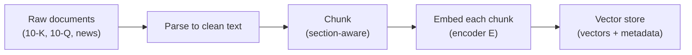
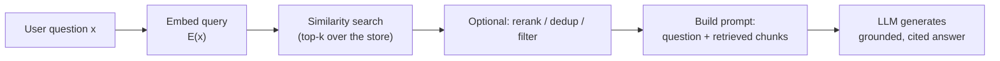
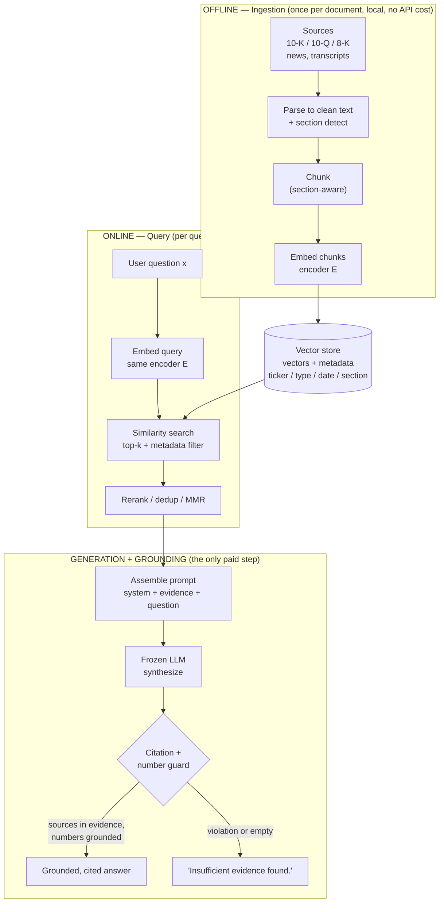
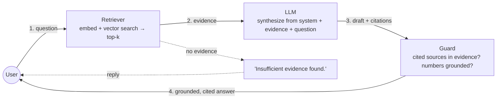
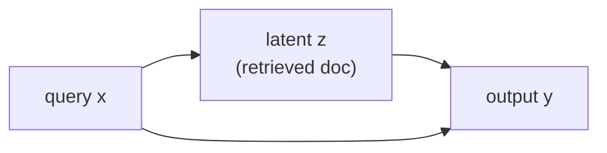
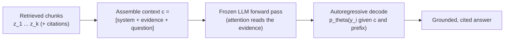
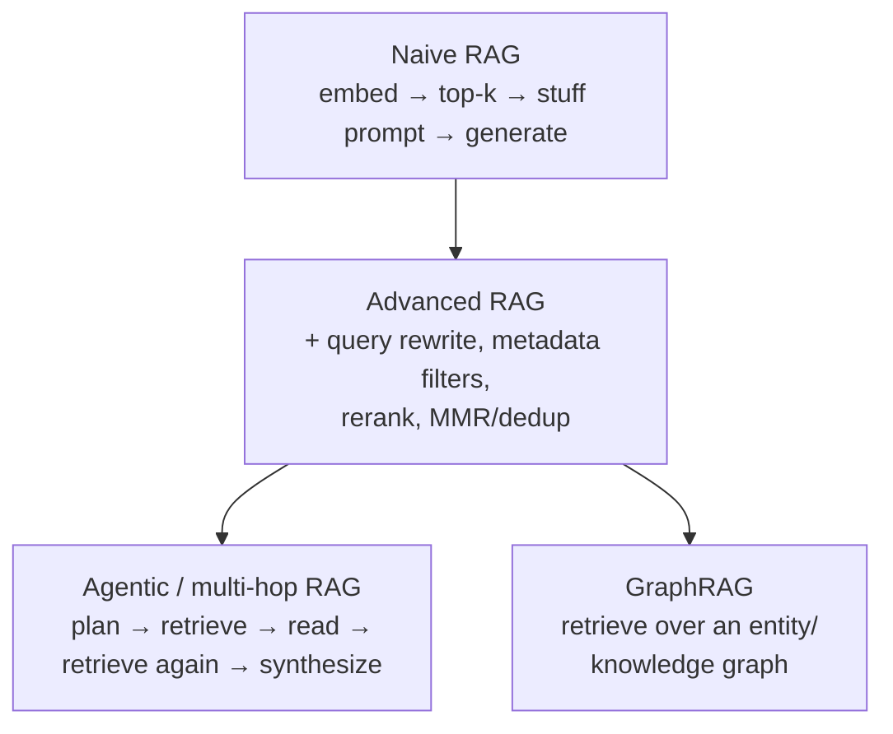
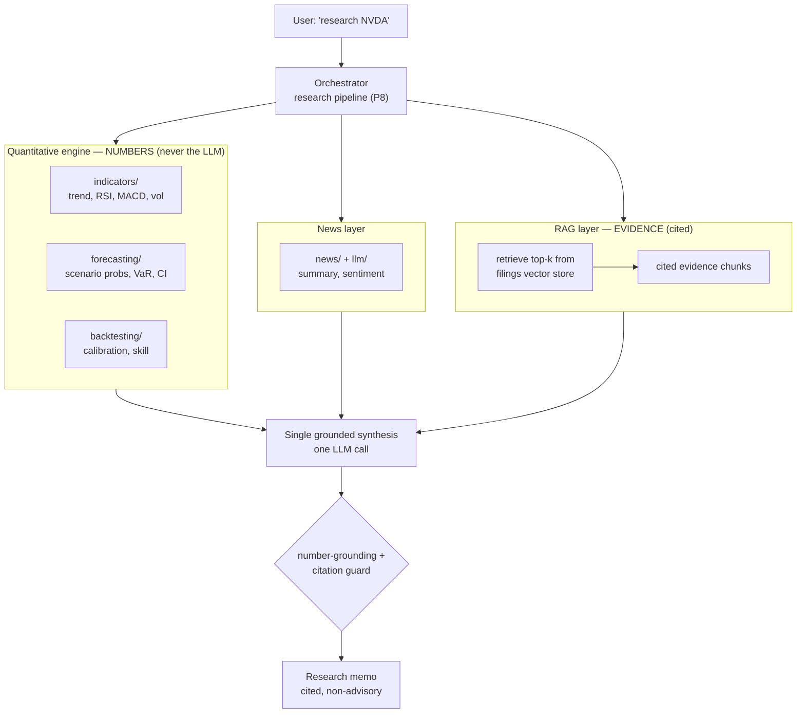
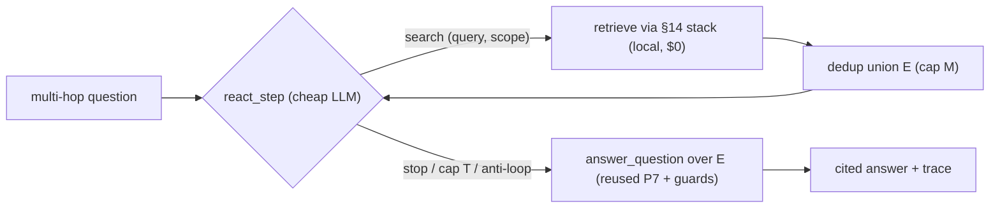

# RAG Concepts — From First Principles to Practice

> A self-contained primer on Retrieval-Augmented Generation (RAG): the intuition,
> the full probabilistic + retrieval mathematics, how it plugs into LLMs, worked
> (stock) examples, and applications across math / data science / AI / engineering.
> Equations render on GitHub via MathJax; diagrams via Mermaid. Where useful, the
> text connects back to how *this* repository implements RAG (see
> [RAG_TODO.md](RAG_TODO.md) and [RAG_IMPLEMENTATION_PLAN.md](RAG_IMPLEMENTATION_PLAN.md)).

---

## Table of contents
1. [The problem RAG solves](#1-the-problem-rag-solves)
2. [Anatomy of a RAG system](#2-anatomy-of-a-rag-system)
3. [Mathematical formulation (latent retrieval)](#3-mathematical-formulation-latent-retrieval)
4. [The retrieval mathematics in depth](#4-the-retrieval-mathematics-in-depth)
5. [A worked stock example (with numbers)](#5-a-worked-stock-example-with-numbers)
6. [Evaluating RAG](#6-evaluating-rag)
7. [How RAG is used with LLMs (patterns)](#7-how-rag-is-used-with-llms-patterns)
8. [Applications](#8-applications)
9. [Limitations and failure modes](#9-limitations-and-failure-modes)
10. [How this repository instantiates RAG](#10-how-this-repository-instantiates-rag)
11. [Evaluation in practice — the A-track metrics](#11-evaluation-in-practice--the-a-track-metrics)
12. [Reranking — bi-encoders, cross-encoders, two-stage retrieval](#12-reranking--bi-encoders-cross-encoders-two-stage-retrieval)
13. [Hybrid search — BM25 and Reciprocal Rank Fusion](#13-hybrid-search--bm25-and-reciprocal-rank-fusion)
14. [The four retrieval configurations (dense / reranked / hybrid / hybrid+rerank)](#14-the-four-retrieval-configurations-dense--reranked--hybrid--hybridrerank)
15. [Agentic RAG — the ReAct loop for multi-hop retrieval](#15-agentic-rag--the-react-loop-for-multi-hop-retrieval)
16. [GraphRAG — knowledge graphs and graph-augmented retrieval](#16-graphrag--knowledge-graphs-and-graph-augmented-retrieval)
17. [References](#17-references)

---

## 1. The problem RAG solves

A large language model stores everything it "knows" in its weights $\theta$ — this is
**parametric memory**. Decoding produces text from the conditional distribution

$$
p_\theta(y \mid x) = \prod_{i=1}^{N} p_\theta\left(y_i \mid x, y_{1:i-1}\right),
$$

where $x$ is the prompt and $y = (y_1,\dots,y_N)$ the generated tokens. Parametric
memory has four structural weaknesses:

- **Hallucination.** $p_\theta$ is a smooth distribution over *plausible* continuations,
  not *true* ones. With no external check, fluent-but-false text has high probability.
- **Staleness.** Knowledge is frozen at training cutoff; a 10-K filed yesterday is invisible.
- **No provenance.** The model cannot point to a source — fatal for research/compliance.
- **Finite context + cost.** You cannot paste an entire corpus into the prompt; attention
  is $O(L^2)$ in sequence length $L$ and tokens cost money/latency.

**RAG** adds a **non-parametric memory**: an external corpus you can search at inference
time. Instead of asking the model to *recall*, you *retrieve* relevant evidence and let
the model *read and synthesize* it. Three levers for injecting knowledge into an LLM:

| Approach | Knowledge lives in | Update cost | Provenance | Best when |
|---|---|---|---|---|
| **Fine-tuning** | weights $\theta$ | retrain | none | fixed style/skill, stable facts |
| **Long context** | the prompt | per query (tokens) | weak | one document, short-lived |
| **RAG** | external index | re-embed a doc | **strong (citations)** | large, changing, citeable corpora |

RAG is the right tool when the knowledge is **large, changing, and must be cited** —
exactly the case for SEC filings, news, and research notes.

---

## 2. Anatomy of a RAG system

Three components: a **knowledge store** (chunked + embedded documents), a **retriever**
(finds relevant chunks for a query), and a **generator** (an LLM that conditions on the
retrieved chunks). Work splits into an **offline ingestion** path (run once per document)
and an **online query** path (run per question).

**Ingestion (offline, local, $0):**



**Query (online):**



The cardinal rule (and the cost model): **embed once at ingestion, never re-embed the
corpus at query time.** A query embeds *one* string and does a vector lookup — no LLM
call is needed for retrieval. The only (optionally) paid step is the final generation.

### 2.1 The complete picture (one architecture)

The two paths above are not separate systems — they share the **knowledge store** and the
**same embedder** $E$. The full architecture, end to end, with the trust boundary that keeps
generation honest:



Read it as three stages over one store: **ingestion** fills the vector store (offline, free);
**query** reads it (embed once, lookup, no LLM); **generation** is the single LLM call, and a
**guard** sits on its output so a hallucinated citation or an invented number is rejected
rather than returned. The embedder $E$ **must be identical** on both paths — query and
document vectors are only comparable in the *same* embedding space.

### 2.2 The same flow as a cycle

Drawn as a loop, the per-query cycle returns to the user (who can then ask the next
question). The numbered edges give the order; the dotted branch is the empty-retrieval exit:



---

## 3. Mathematical formulation (latent retrieval)

### 3.1 Retrieval as a latent variable

Treat the retrieved document $z$ as a **latent variable** drawn from a corpus
$\mathcal{Z}$. The quantity we want, $p(y \mid x)$, marginalizes over which document was used:

$$
p(y \mid x) = \sum_{z \in \mathcal{Z}} p(y, z \mid x)
= \sum_{z \in \mathcal{Z}} \underbrace{p_\eta(z \mid x)}_{\text{retriever}}
\underbrace{p_\theta(y \mid x, z)}_{\text{generator}} .
$$

The corpus has millions of chunks, so the exact sum is intractable. We approximate it by
the **top-$k$** documents the retriever scores highest:

$$
p(y \mid x) \approx \sum_{z \in \mathrm{TopK}(x)} p_\eta(z \mid x) p_\theta(y \mid x, z).
$$

This is the core RAG identity (Lewis et al., 2020): a **mixture** over retrieved
documents, weighted by how relevant each is.



The graphical model $x \to z \to y$ with the direct edge $x \to y$: the answer depends on
the query *and* on the retrieved evidence.

### 3.2 Two ways to use the mixture

**RAG-Sequence** uses a *single* $z$ for the whole output (simplest; what most
applications and this repo approximate):

$$
p_{\text{seq}}(y \mid x) = \sum_{z \in \mathrm{TopK}(x)} p_\eta(z \mid x)
\prod_{i=1}^{N} p_\theta\left(y_i \mid x, z, y_{1:i-1}\right).
$$

**RAG-Token** lets *each token* attend to a (possibly different) $z$ — strictly more
expressive, used when different facts must be stitched mid-sentence:

$$
p_{\text{tok}}(y \mid x) = \prod_{i=1}^{N} \sum_{z \in \mathrm{TopK}(x)}
p_\eta(z \mid x) p_\theta\left(y_i \mid x, z, y_{1:i-1}\right).
$$

The difference is where the sum sits: **outside** the product (one document per answer)
vs **inside** it (one document per token).

### 3.3 The retriever distribution

A **bi-encoder** (dense passage retrieval, DPR) maps query and document into a shared
$\mathbb{R}^d$ space with encoders $E_q, E_d$ and scores them by inner product:

$$
s(x, z) = E_q(x)^{\top} E_d(z).
$$

The retriever turns scores into a distribution with a softmax over the retrieved set:

$$
p_\eta(z \mid x) = \frac{\exp\big(s(x, z)\big)}
{\sum_{z' \in \mathrm{TopK}(x)} \exp\big(s(x, z')\big)} .
$$

Two encoders (one for the query, one for documents) is what makes retrieval cheap: every
document vector $E_d(z)$ is precomputed once; a query only computes $E_q(x)$ and does a
nearest-neighbor lookup.

### 3.4 Inference-time RAG with a frozen LLM (what this repo does)

Modern applications rarely jointly train retriever and generator. Instead both are
**frozen**, and retrieval is injected into the prompt. Mathematically this is a
**maximum-a-posteriori (MAP) approximation** of the mixture: collapse the sum onto the
top-$k$ set and condition the generator on it directly,

$$
p(y \mid x) \approx p_\theta\big(y \mid x, z_{1:k}\big),
\qquad z_{1:k} = \mathrm{TopK}_{z \in \mathcal{Z}} s(x, z),
$$

i.e. "retrieve the best $k$ chunks, paste them into context, generate." You lose the
end-to-end gradient through retrieval, but you gain modularity: swap the embedder, the
vector store, or the LLM independently. This is the pragmatic RAG the rest of this doc
(and this codebase) assumes.

### 3.5 Why conditioning curbs hallucination (intuition)

Generation is sampling from $p_\theta(\cdot \mid x, z)$. Conditioning on relevant evidence
$z$ **concentrates** that distribution: the entropy

$$
H\big(Y \mid x, z\big) \le H\big(Y \mid x\big)
$$

drops because the evidence rules out continuations inconsistent with it — conditioning
never increases uncertainty in expectation, $H(Y \mid X, Z) \le H(Y \mid X)$. Probability
mass moves from "plausible" onto "supported." It is **not** a proof of truthfulness — a
bad retrieval or an unfaithful generator still errs — which is why RAG systems add a
**citation/grounding guard** (every claim must trace to a retrieved chunk) as a separate
correctness layer.

### 3.6 Inside the LLM: how retrieved context becomes the answer

The equations above say *what* distribution we want; this section is the concrete
**mechanics** — how the retrieved chunks actually get into a frozen LLM and drive
generation. There is no magic and no weight update: **RAG edits the model's *input*, not
its *parameters*.**

**Step A — assemble one token sequence.** The generator is a function over a single token
stream. RAG builds that stream by concatenating three parts into the **context**
$c$:

$$
c = \big[ \underbrace{\text{sys}}_{\text{instructions}} ;
\underbrace{z_{1:k}}_{\text{retrieved evidence}} ;
\underbrace{x}_{\text{user question}} \big],
$$

where `sys` is a system instruction ("answer only from the evidence; cite each claim; if
unsupported, say *insufficient evidence*"), $z_{1:k}$ are the top-$k$ chunks (each tagged
with its citation), and $x$ is the question. A concrete assembled prompt for the §5 example:

```text
SYSTEM:
You are an equity-research assistant. Answer ONLY from the evidence below.
Cite every claim as [source]. If the evidence is insufficient, say exactly:
"Insufficient evidence found." Do not output probabilities or forecasts.

EVIDENCE:
[1] (NVDA 10-K 2025-02-26 — Item 7. MD&A) "AI accelerators drove record
    data-center sales ..."
[2] (NVDA 10-K 2025-02-26 — Item 7. MD&A) "Data-center revenue grew on AI demand ..."

QUESTION:
What AI growth drivers did NVDA management highlight?
```

**Step B — decode autoregressively, conditioned on $c$.** The model samples tokens one at a
time from

$$
p_\theta\big(y_i \mid c, y_{1:i-1}\big),
$$

so every generated token sees the *entire* assembled context — including the evidence — as
its prefix. This is the literal meaning of "conditioning on $z$" from §3.1.

**Step C — the conditioning is implemented by attention.** Inside the transformer, each
position $i$ forms an attention query $\mathbf{a}_i$ and attends over the keys
$\mathbf{m}_j$ of *all* prior positions $j$ — which include the evidence tokens — with weights

$$
\alpha_{ij} = \frac{\exp\big(\mathbf{a}_i^{\top}\mathbf{m}_j / \sqrt{d_h}\big)}
{\sum_{j'} \exp\big(\mathbf{a}_i^{\top}\mathbf{m}_{j'} / \sqrt{d_h}\big)},
\qquad
\mathbf{o}_i = \sum_{j} \alpha_{ij}\mathbf{v}_j .
$$

(Here $\mathbf{a}, \mathbf{m}, \mathbf{v}$ are the attention query / key / value vectors and
$d_h$ the head dimension — distinct from the *retrieval* query of §3.3.) When the model
writes "data-center demand," the $\alpha_{ij}$ on the evidence tokens for that phrase are
large: the answer is being *copied/paraphrased from* the retrieved text, not recalled from
weights. This is why RAG answers can be grounded and citeable.

**This is in-context learning, not training.** Knowledge enters through $c$ at inference;
$\theta$ is frozen. Contrast the two ways to inject knowledge into an LLM at the mechanism
level:

| | Fine-tuning | RAG (in-context) |
|---|---|---|
| What changes | the weights $\theta$ (gradient steps) | the input context $c$ (no gradient) |
| New fact lands in | parameters | the prompt, per query |
| To update | retrain | re-embed one document |
| Can cite source | no | yes (the chunk is in $c$) |



**Practical consequences that fall straight out of this picture:**

- **Token budget = the evidence you paste.** The whole of $c$ is processed by $O(L^2)$
  attention, so $k$ and chunk size set both cost and latency — bound them (§4.6).
- **Order matters ("lost in the middle," §9).** Attention under-weights the middle of a long
  $c$; put the strongest chunks at the edges.
- **Prompt caching.** The `sys` + evidence prefix is a fixed prefix for a given question set;
  caching its key/value tensors avoids recomputing attention over it — the cost lever this
  repo uses for repeated synthesis.
- **Grounding is an *instruction plus a guard*, not a guarantee.** The `sys` text *requests*
  evidence-only, cited answers; because the model can still disobey, RAG systems add a
  **citation guard** that mechanically rejects any cited source not in $z_{1:k}$ (§3.5, §10).

In one line: **retrieval chooses what goes into the context window; attention turns that
context into the answer; the frozen weights only supply *fluency and reasoning*, not the
facts.**

---

## 4. The retrieval mathematics in depth

### 4.1 Embeddings

An **embedding model** $E : \text{text} \to \mathbb{R}^d$ maps a string to a dense vector
so that *semantically* similar texts land near each other. For `bge-small-en-v1.5`
(this repo's default), $d = 384$. Embeddings are the bridge from language to geometry:
once text is a vector, "relevance" becomes "closeness."

### 4.2 Similarity measures

Given query vector $\mathbf{q}=E(x)$ and document vector $\mathbf{d}=E(z)$:

- **Dot product:** $\mathbf{q}^{\top}\mathbf{d} = \sum_{i=1}^{d} q_i d_i.$
- **Cosine similarity** (scale-invariant):
$$
\text{cos}(\mathbf{q}, \mathbf{d}) =
\frac{\mathbf{q}^{\top}\mathbf{d}}{\lVert \mathbf{q}\rVert\lVert \mathbf{d}\rVert}
= \frac{\sum_i q_i d_i}{\sqrt{\sum_i q_i^2}\sqrt{\sum_i d_i^2}} \in [-1, 1].
$$
- **Euclidean (L2) distance:** $\lVert \mathbf{q}-\mathbf{d}\rVert.$

These are not independent. If embeddings are **unit-normalized** ($\lVert\mathbf{q}\rVert=\lVert\mathbf{d}\rVert=1$):

$$
\lVert \mathbf{q}-\mathbf{d}\rVert^2
= \lVert\mathbf{q}\rVert^2 + \lVert\mathbf{d}\rVert^2 - 2\mathbf{q}^{\top}\mathbf{d}
= 2 - 2\text{cos}(\mathbf{q}, \mathbf{d}).
$$

So **maximizing cosine similarity is equivalent to minimizing L2 distance** for normalized
vectors. This matters in practice: vector stores (e.g. ChromaDB) often return a **distance**
(smaller = closer), while application code reasons in **similarity** (larger = closer). The
wrapper must convert consistently, e.g. $\text{sim} = 1 - \tfrac{1}{2}\text{dist}^2$ or
$\text{sim} = -\text{dist}$, or top-$k$ ranking silently inverts. *(This is exactly the
"score convention" note flagged for this repo's vector-store layer.)*

### 4.3 Why embeddings are semantic: contrastive learning

Embeddings are not hand-built; they are **learned** so that matching pairs are close and
mismatched pairs are far. The workhorse objective is **InfoNCE** (contrastive loss). For a
query $q$ with one positive document $d^{+}$ and a set of negatives $\{d^{-}_j\}$:

$$
\mathcal{L}_{\text{InfoNCE}}
= -\log \frac{\exp\big(\text{sim}(q, d^{+})/\tau\big)}
{\exp\big(\text{sim}(q, d^{+})/\tau\big) + \sum_{j}\exp\big(\text{sim}(q, d^{-}_j)/\tau\big)} ,
$$

where $\tau > 0$ is a **temperature**. Minimizing $\mathcal{L}$ pulls $q$ toward $d^{+}$
and pushes it from the $d^{-}_j$. Geometrically, gradient descent on this loss *organizes*
the vector space so that "same meaning" implies "small angle." Small $\tau$ sharpens the
contrast (harder push/pull); large $\tau$ softens it. This is why a query like
"AI data-center demand" lands near a 10-K passage about "accelerated computing revenue,"
despite zero shared keywords — the model learned the semantic geometry.

### 4.4 Approximate nearest neighbor (ANN)

Exact top-$k$ scans every vector: $O(N d)$ per query for a corpus of $N$ chunks. At
$N=10^6$, $d=384$ that is hundreds of millions of multiply-adds per query — too slow at
scale. **ANN indexes** trade a little recall for large speedups:

- **HNSW** (hierarchical navigable small-world graphs): greedy search over a layered
  proximity graph, roughly $O(\log N)$ hops per query.
- **IVF** (inverted file / coarse quantization): partition the space into $n_{\text{list}}$
  cells, search only the few nearest cells.
- **PQ** (product quantization): compress vectors to cut memory and speed distance math.

For an MVP corpus (thousands–tens of thousands of chunks) **exact search is fine and
simpler**; ANN earns its complexity only at large $N$.

### 4.5 Sparse retrieval (BM25) and hybrid search

Dense embeddings capture *meaning* but can miss **exact terms** (a ticker, a statute, a
product codename). The classic lexical scorer **BM25** complements them:

$$
\text{BM25}(q, d) = \sum_{t \in q} \text{IDF}(t)\cdot
\frac{f(t,d)(k_1 + 1)}{f(t,d) + k_1\big(1 - b + b\frac{\lvert d\rvert}{\text{avgdl}}\big)},
\qquad
\text{IDF}(t) = \log\left(\frac{N - n_t + 0.5}{n_t + 0.5} + 1\right),
$$

where $f(t,d)$ is term frequency, $n_t$ the number of documents containing $t$,
$\lvert d\rvert$ the document length, $\text{avgdl}$ the average length, and $k_1, b$ are
tuning constants. **Hybrid search** fuses dense and sparse rankings — a robust, parameter-free
choice is **Reciprocal Rank Fusion (RRF)**:

$$
\text{RRF}(d) = \sum_{r \in \{\text{dense},\text{sparse}\}} \frac{1}{c + \text{rank}_r(d)},
$$

with a small constant $c$ (often $60$). Hybrid is a V1 feature here; the MVP uses dense
retrieval only.

### 4.6 Chunking — the granularity tradeoff

Documents are split into **chunks** before embedding because (a) one vector cannot
faithfully summarize a 100-page 10-K, and (b) you want to retrieve and cite the *specific*
passage. Chunk size $c$ trades two errors:

- **Too large** → a chunk mixes many topics; its single embedding is a blurred average, so
  retrieval precision falls and you waste context tokens on irrelevant text.
- **Too small** → a chunk loses the surrounding context needed to be self-explanatory; a
  sentence about "growth of 22%" is useless without "data-center revenue."

A practical sweet spot is a few hundred to ~1,000 tokens with ~10–20% **overlap** so a fact
straddling a boundary survives in at least one chunk. **Section-aware** chunking (never
splitting across "Item 1A. Risk Factors" / "Item 7. MD&A") preserves the citation unit —
which is why this repo chunks on filing-section anchors.

### 4.7 Diversity and redundancy: Maximal Marginal Relevance (MMR)

Top-$k$ by similarity often returns $k$ near-duplicate chunks (filings repeat boilerplate),
wasting context. **MMR** re-selects for relevance *and* novelty, greedily building the
result set $S$:

$$
\text{MMR} = \arg\max_{d_i \in R \setminus S}
\Big[ \lambda \text{sim}(q, d_i) - (1-\lambda)\max_{d_j \in S}\text{sim}(d_i, d_j) \Big],
$$

where $R$ is the candidate pool and $\lambda \in [0,1]$ trades relevance ($\lambda\to 1$)
against diversity ($\lambda\to 0$). MMR (or simple dedup) keeps the $k$ chunks
complementary.

### 4.8 Reranking with cross-encoders

A bi-encoder embeds $q$ and $d$ **separately**, so it cannot model fine token-level
interactions — fast but coarse. A **cross-encoder** scores the *pair jointly*,

$$
s_{\text{ce}}(q, d) = \text{CrossEncoder}\big([q ; d]\big),
$$

running full attention over the concatenation. It is far more accurate but $O(k)$ model
calls per query, so the standard pattern is **retrieve-then-rerank**: cheaply fetch the
top-$M$ (say 50) with the bi-encoder, then rerank to the top-$k$ (say 8) with the
cross-encoder. (V1 here; the MVP skips it.)

---

## 5. A worked stock example (with numbers)

**Question:** *"What AI growth drivers did NVDA management highlight?"*

Suppose ingestion produced three (toy, 3-dimensional) chunk embeddings from the 10-K, and
the query embeds to $\mathbf{q} = [0.90, 0.10, 0.20]$:

| Chunk | Text (abbreviated) | Embedding $\mathbf{d}$ |
|---|---|---|
| $d_1$ | "Data-center revenue grew on AI demand" | $[0.80, 0.20, 0.10]$ |
| $d_2$ | "Gaming GPU sales declined" | $[0.10, 0.90, 0.10]$ |
| $d_3$ | "AI accelerators drove record data-center sales" | $[0.85, 0.05, 0.25]$ |

**Step 1 — cosine similarities** (using $\text{cos}=\mathbf{q}^{\top}\mathbf{d}/(\lVert\mathbf{q}\rVert\lVert\mathbf{d}\rVert)$, with $\lVert\mathbf{q}\rVert = \sqrt{0.86} \approx 0.927$):

$$
\text{cos}(\mathbf{q}, d_1) = \frac{0.76}{0.927\cdot 0.831} \approx 0.986, \quad
\text{cos}(\mathbf{q}, d_2) = \frac{0.20}{0.927\cdot 0.911} \approx 0.237, \quad
\text{cos}(\mathbf{q}, d_3) = \frac{0.82}{0.927\cdot 0.887} \approx 0.996.
$$

**Step 2 — top-$k$** ($k=2$): keep $\{d_3, d_1\}$; drop $d_2$ (the gaming chunk is
semantically far — note it shares no keyword with the query, yet is correctly excluded by
*meaning*).

**Step 3 — retriever weights** (softmax with $\tau=0.5$, logits $= \text{cos}/\tau$):

$$
p_\eta(d_3 \mid x) \approx 0.455,\quad p_\eta(d_1 \mid x) \approx 0.446,\quad
p_\eta(d_2 \mid x) \approx 0.099.
$$

**Step 4 — grounded generation.** The LLM conditions on $\{d_3, d_1\}$ and writes, with
citations:

> "Management highlighted **AI accelerators** and **data-center demand** as the primary
> growth drivers [NVDA 10-K — Item 7. MD&A]."

**Crucial discipline (this repo's invariant):** any *quantitative* figure — a probability,
an expected return, a VaR — does **not** come from the LLM or a retrieved sentence; it comes
from the quantitative modules (`forecasting/`, `indicators/`). RAG supplies the
**qualitative, cited narrative**; the numbers stay model-generated. A separate **citation
guard** rejects any source the answer cites that is not in $\{d_3, d_1\}$, and if retrieval
returns nothing the system answers *"Insufficient evidence found."* rather than inventing.

---

## 6. Evaluating RAG

RAG has two stages, each with its own metrics.

**Retrieval quality** (did we fetch the right chunks?). With $\mathcal{R}_q$ the set of
truly relevant chunks for query $q$:

- **Recall@k** — fraction of relevant chunks captured in the top-$k$:
$$
\text{Recall@}k = \frac{\big\lvert \{\text{relevant chunks}\} \cap \mathrm{TopK} \big\rvert}{\lvert \mathcal{R}_q \rvert}.
$$
- **MRR** (mean reciprocal rank of the first relevant hit), over a query set $Q$:
$$
\text{MRR} = \frac{1}{\lvert Q\rvert} \sum_{q \in Q} \frac{1}{\text{rank}_q},
$$
where $\text{rank}_q$ is the position of the first relevant chunk.
- **nDCG@k** (graded relevance, rank-discounted):
$$
\text{DCG@}k = \sum_{i=1}^{k} \frac{2^{\text{rel}_i} - 1}{\log_2(i + 1)}, \qquad
\text{nDCG@}k = \frac{\text{DCG@}k}{\text{IDCG@}k},
$$
where $\text{rel}_i$ is the relevance grade at rank $i$ and IDCG is DCG of the ideal ordering.

**Generation quality** (did the answer use the evidence well?):

- **Faithfulness / groundedness** — the fraction of the answer's claims entailed by the
  retrieved context (penalizes hallucination).
- **Answer relevance** — does the answer actually address $x$?
- **Context precision / recall** — were the retrieved chunks on-topic, and was the needed
  evidence present?

A healthy RAG system is tuned on **both** axes: you can retrieve perfectly and still
generate an unfaithful summary, or generate beautifully from the wrong chunks.

---

## 7. How RAG is used with LLMs (patterns)



- **Naive RAG** — the linear pipeline of §2; the MVP target here.
- **Advanced RAG** — query transformation (rewrite/expand the question — analogous to the
  keyword expansion already in this repo's topic-news path), **metadata filtering** (restrict
  to `ticker = NVDA`, `document_type = 10-K`, `filing_date ≥ …` *before* the vector search),
  reranking, and dedup.
- **Agentic / multi-hop RAG** — the LLM *plans* retrievals, reads, and retrieves again to
  answer compositional questions ("compare NVDA's and AMD's stated data-center risks"). This
  is where RAG meets tool-using agents.
- **GraphRAG** — retrieve over a knowledge graph of entities/relations rather than flat text,
  for global/connective questions.

**Prompt construction** in all of them is the same shape: a system instruction ("answer only
from the evidence; cite sources; say 'insufficient evidence' if unsupported"), the retrieved
chunks (each tagged with its citation), and the user question. Keeping that prompt **compact**
(bounded $k$, deduped chunks) is the main runtime cost lever.

---

## 8. Applications

RAG is general "ground an LLM in an external, searchable knowledge base," so it appears
wherever authoritative text must drive generation.

- **Finance / equity research (this project).** Ground answers and research memos in SEC
  filings, transcripts, and news, with citations and dates — turning a signal analyzer into
  a *cited* research assistant. Numbers from quantitative models; narrative + evidence from RAG.
- **Mathematics.** Retrieve relevant theorems, lemmas, and prior results to assist proof
  search or literature review; retrieval-augmented autoformalization (pull matching library
  lemmas in Lean/Coq before generating a tactic). The embedding space organizes statements by
  semantic role, not surface syntax.
- **Data science.** "Talk to your data/docs": retrieve over experiment logs, data
  dictionaries, model cards, and notebooks to answer "which feature encodes X?" or "what
  preprocessing did run 47 use?" — and as a feature: retrieved context as side-information
  for downstream models.
- **AI / NLP.** Open-domain QA, knowledge-grounded dialogue, long-term **agent memory**
  (store and retrieve past interactions), and tool-augmented reasoning. RAG is the standard
  way to give a frozen LLM fresh, citeable knowledge without retraining.
- **Engineering / software.** Code search and Q&A over a large repo, grounding answers in the
  actual codebase; retrieval over runbooks, design docs, and past incidents for on-call
  assistance; documentation assistants that cite the manual.

The common thread: **the corpus is the source of truth; the LLM is the reader and writer.**

---

## 9. Limitations and failure modes

- **Retrieval is the ceiling.** If the right chunk is not in the top-$k$, no amount of LLM
  skill recovers it ("garbage in, garbage out"). Tune recall first.
- **Chunking artifacts.** Bad boundaries split a fact in half or merge unrelated topics,
  degrading both retrieval and citation.
- **Embedding mismatch / domain shift.** A general embedder may underperform on dense
  financial/legal jargon; this is where a domain model or hybrid search helps.
- **Stale or conflicting evidence.** Two filings disagree across quarters; the system must
  surface dates and contradictions rather than silently average them.
- **Unfaithful synthesis.** The LLM can still ignore or misread the evidence — hence the
  separate **citation/grounding guard** and the explicit *"insufficient evidence"* path.
- **Context dilution.** Too many or too-long chunks bury the signal and inflate cost; bound
  $k$ and dedup.
- **Lost-in-the-middle.** LLMs attend less to the *middle* of a long context; ordering
  matters — put the strongest evidence at the edges.

These are why production RAG is mostly **retrieval and grounding engineering**, not prompt
wording.

---

## 10. How this repository instantiates RAG

Mapping the theory above onto the planned modules ([RAG_TODO.md](RAG_TODO.md)):

```mermaid
flowchart LR
  SEC["providers/sec_edgar.py<br/>(EDGAR official API)"] --> DOC["documents/<br/>parse + section-detect"]
  DOC --> CH["rag/chunking.py<br/>(section-aware, §4.6)"]
  CH --> EM["rag/embeddings.py<br/>(fastembed/BGE, §4.1-4.3)"]
  EM --> VS["rag/vector_store.py<br/>(Chroma, §4.2 distance↔sim)"]
  VS --> RET["rag/retriever.py<br/>(top-k + filters + dedup, §4.4/4.7)"]
  RET --> SYN["research/synthesis.py<br/>(one grounded LLM call, §3.4)"]
  SYN --> MEMO["research/memo.py<br/>(cited research memo)"]
```



**Zooming out — RAG is one component, not the whole.** The research pipeline runs the
quantitative engine, the news layer, and RAG *in parallel*, then makes a **single** grounded
synthesis call. The boundary is strict and is what keeps the product honest: the quant engine
owns every **number**, RAG owns the cited **evidence**, and the LLM only **narrates** — gated
by the guards.



Design choices, justified by the math:

- **Local `fastembed` + `bge-small-en-v1.5`** ($d=384$): contrastively-trained semantic
  embeddings (§4.3) at $0 cost; quality parity with paid APIs for this corpus.
- **ChromaDB** with **metadata filtering** (ticker / type / date): cut the candidate set
  *before* the vector search (advanced-RAG filtering, §7). The wrapper converts Chroma's
  **distance** to a **similarity** consistently (§4.2).
- **Section-aware chunking** (§4.6) so a chunk = a citeable unit (Item 1A, Item 7).
- **Inference-time / frozen-LLM RAG** (§3.4): one grounded synthesis call; retrieval does
  **no** LLM calls — the cost discipline.
- **Invariants as correctness layers:** numbers come from `forecasting/`/`indicators/`, never
  the LLM (§5); the **citation guard** enforces that every cited source is in the retrieved
  set (the grounding layer of §3.5); empty retrieval ⇒ *"Insufficient evidence found."*;
  non-advisory by construction (evidence, not recommendations).

In short: this codebase is a **naive-but-disciplined RAG** (the §2 pipeline), local-first for
cost, with the grounding guarantees bolted on as explicit guards rather than hoped-for LLM
behavior.

---

## 11. Evaluation in practice — the A-track metrics

§6 defined retrieval/generation metrics abstractly. This section is the **operational** theory
behind phase A1 (`rag/eval.py`): the exact relevance model, the nDCG and citation-accuracy
formulas as implemented, and *why* the harness — not the model — is the prerequisite for every
later retrieval change (rerank, hybrid, graph, RL). Measurement is the gate: a "better" retriever
is only better if it moves a number on a fixed labeled set.

### 11.1 Graded, chunking-invariant relevance

Labels are answer-bearing **phrases**, never `chunk_id`s — so the *same* labels survive re-chunking
(A2/A3 re-chunk constantly; chunk-id labels would rot). For query $q$ with labeled span set $S_q$,
the graded relevance (the **gain**) of chunk $c$ is the count of distinct spans it contains, gated by
optional metadata constraints:

$$
g_q(c) = \Big\lvert \{ s \in S_q : \hat{s} \subseteq \hat{c} \} \Big\rvert \cdot \mathbb{1}\big[\mathrm{meta}_q(c)\big],
$$

where $\hat{x}$ is the normalized text (lowercased, whitespace-collapsed), $\hat s \subseteq \hat c$
means "the span occurs in the chunk," and $\mathbb{1}[\mathrm{meta}_q(c)]$ is 1 iff $c$'s
`document_type` and `section` satisfy the query's optional `expected_document_types` /
`expected_sections` filters (else 0). Binary relevance is the special case $\mathrm{rel}_q(c) = \mathbb{1}[g_q(c) > 0]$.
A higher grade means a chunk answers *more* of the question — and graded gains are exactly what
nDCG consumes.

### 11.2 nDCG@k — graded, rank-discounted quality

These four quantities build on each other. The goal is **one number for ranking quality** that
satisfies three intuitions: (1) retrieving a relevant chunk is good; (2) a chunk that answers *more*
of the question is worth more than one that answers a little (graded, not binary); (3) a relevant
chunk at rank 1 is worth more than the same chunk at rank 10. Each metric below adds exactly one of
these.

**CG — Cumulative Gain (the starting point, not reported).** Give each retrieved chunk a *gain*
$g_i$ = its relevance grade (here, the distinct-span count from §11.1). Cumulative gain is just their
sum down to depth $k$:

$$
\mathrm{CG@}k = \sum_{i=1}^{k} g_i.
$$

In plain English: "how much total relevance did the top-$k$ contain." It honors intuitions (1) and
(2) but **ignores order** — shuffling the top-$k$ leaves CG unchanged, so a system that buries the
answer at rank 8 scores the same as one that puts it at rank 1. That is the flaw the discount fixes.

**DCG — Discounted Cumulative Gain.** Divide each gain by a **position discount** $\log_2(i+1)$ that
grows with rank, so later positions contribute less:

$$
\mathrm{DCG@}k = \sum_{i=1}^{k} \frac{2^{g_i} - 1}{\log_2(i+1)}.
$$

Two deliberate choices, in words:
- **Gain transform $2^{g_i}-1$** (the "exponential" convention; Järvelin & Kekäläinen). For binary
  grades it changes nothing ($2^1-1=1$, $2^0-1=0$). For graded relevance it makes one grade-2 chunk
  ($2^2-1 = 3$) outweigh two grade-1 chunks ($1+1 = 2$) — i.e. a chunk that answers more of the
  question beats two that each cover a sliver. (The "linear" convention uses $g_i$ directly; we use
  exponential.)
- **Discount $\log_2(i+1)$**: rank 1 → divide by $\log_2 2 = 1$ (no penalty), rank 2 → by
  $\log_2 3 \approx 1.585$, rank 3 → by $\log_2 4 = 2$, … The *log* (rather than $1/i$) is a gentle
  decay: rank 3-vs-4 still matters, it is not all-or-nothing at the top.

DCG now honors all three intuitions, but it is **unbounded and query-dependent** — a question with
five relevant chunks can score far higher than one with a single relevant chunk, so raw DCG cannot be
compared or averaged across queries. Normalization fixes that.

**IDCG — Ideal DCG (the normalizer).** The DCG of the **best possible ranking**: take all the
relevant gains, sort them **descending** (highest gain first — the optimal order), and compute DCG of
that ideal list:

$$
\mathrm{IDCG@}k = \sum_{i=1}^{k}\frac{2^{g_{(i)}} - 1}{\log_2(i+1)}, \qquad g_{(1)} \ge g_{(2)} \ge \cdots
$$

In words: "the score a perfect retriever would get on this query" — the maximum achievable DCG@k.

**nDCG — Normalized DCG (what we report).** The ratio of the two, which lands in $[0, 1]$:

$$
\mathrm{nDCG@}k = \frac{\mathrm{DCG@}k}{\mathrm{IDCG@}k}.
$$

$1.0$ means you ranked as well as the ideal ordering; $0.0$ means no relevant chunk was retrieved (or
none exists). Because every query is now scored *relative to its own achievable best*, nDCG is
**comparable across queries**, so the mean over a benchmark is meaningful — which is exactly what lets
us say "hybrid beat dense by $X$."

| metric | what it adds | formula | range | plain English |
|---|---|---|---|---|
| CG@k | graded relevance | $\sum_{i\le k} g_i$ | unbounded | total relevance in the top-$k$ |
| DCG@k | + rank discount | $\sum_{i\le k}\frac{2^{g_i}-1}{\log_2(i+1)}$ | unbounded | relevance, weighted toward the top |
| IDCG@k | the ideal DCG | DCG of corpus gains sorted ↓ | $=\max \mathrm{DCG}$ | a perfect ranker's score |
| nDCG@k | normalize → comparable | $\mathrm{DCG}/\mathrm{IDCG}$ | $[0,1]$ | how close to perfect this ranking is |

**The capping subtlety (why IDCG uses the corpus pool).** The ideal gains must be drawn from **all**
relevant chunks in the (ticker-scoped) corpus, not just the retrieved ones. If a relevant chunk
exists but was never retrieved, it still belongs in the ideal ranking, so it inflates IDCG and
correctly **caps** nDCG below 1 — folding recall into the score. Computing IDCG from the retrieved
gains alone would score a retriever that found one of three relevant chunks — all ranked perfectly —
as nDCG = 1, hiding the missed recall. In code, `evaluate_query` passes `ideal_gains =` the
corpus-relevant grades.

**Worked micro-examples** (the exact values asserted in the tests):
- *Self-ideal* — retrieved gains $[1,0,1]$, $k=3$:
$\mathrm{DCG} = \underbrace{\tfrac{2^1-1}{\log_2 2}}_{1} + \underbrace{\tfrac{2^0-1}{\log_2 3}}_{0} + \underbrace{\tfrac{2^1-1}{\log_2 4}}_{0.5} = 1.5$;
ideal order $[1,1,0]$ gives $\mathrm{IDCG} = 1 + \tfrac{1}{\log_2 3} = 1.6309$, so
$\mathrm{nDCG} = 1.5 / 1.6309 = 0.9197$. The score is below 1 *only* because the second relevant
chunk sits at rank 3 instead of rank 2.
- *IDCG capping* — retrieved $[1]$ but the corpus holds three relevant chunks $[1,1,1]$, $k=3$:
$\mathrm{DCG}=1$, $\mathrm{IDCG} = 1 + \tfrac{1}{\log_2 3} + \tfrac{1}{\log_2 4} = 2.1309$,
$\mathrm{nDCG}=0.4693$. Even though *every retrieved chunk was relevant* (precision $1.0$), nDCG is
~0.47 because the two relevant chunks you **missed** belong in the ideal — self-normalizing would
have reported a misleading $1.0$.

### 11.3 Citation accuracy — citation precision (the deterministic generation metric)

Retrieval metrics ask "did we fetch the right chunks?"; the first *generation* question is "did the
answer cite honestly?" For an answer's citation set $C = \{(m_t, j_t)\}$ (inline marker $m$ →
`chunk_id` $j$), with retrieved set $R$ and the relevance predicate $\mathrm{rel}_q$:

$$
\mathrm{CitAcc}_q = \frac{1}{\lvert C \rvert} \sum_{(m,j)\inC} \mathbb{1}\big[ j \in R \ \wedge\ \mathrm{rel}_q(j) \big], \qquad (\text{undefined when } \lvert C \rvert = 0).
$$

It is the **precision** of citations: of everything the answer claimed a source for, how much pointed
to a chunk that was both retrieved and actually relevant. A citation to a non-retrieved chunk counts
as wrong (the P7 citation guard should already preclude it — this metric *measures* what the guard
*enforces*). When the answer makes no citations (an honest "insufficient evidence" refusal), the
metric is undefined and **excluded** from the mean — a refusal is not a wrong answer.

This sits *below* **faithfulness** (is every claim entailed by its cited chunk?), which needs a paid
LLM judge and is subjective; that layer is deliberately deferred and opt-in. Citation accuracy is the
cheap, deterministic floor we can gate on in code.

### 11.4 Aggregation and the CI-vs-real-corpus split

Per-query metrics average into a `SystemReport`, with one convention: **queries with no
corpus-relevant chunk are excluded** from the nDCG and recall means (a mislabeled or out-of-corpus
query has an undefined ideal, so averaging its 0 would distort the system score); hit, MRR, and
precision average over all queries.

Finally, a reproducibility point that recurs across this repo: the unit tests use a **hash-based
`FakeEmbedder`** (deterministic, non-semantic), so CI verifies the harness *mechanics* — metric
arithmetic, Protocol conformance, citation bookkeeping — without ever downloading a model. The
**real** benchmark numbers (which embedder/retriever actually retrieves better) come from a **local**
`make rag-eval` run against the embedded corpus, exactly as model backtests run locally rather than
in CI. A metric you cannot recompute deterministically is not a regression gate.

---

## 12. Reranking — bi-encoders, cross-encoders, two-stage retrieval

§4.8 introduced cross-encoder reranking briefly; this is the operational theory behind phase A2
(`rag/rerank.py`). The core idea is that the *fast* model used for retrieval and the *accurate*
model used for final ranking should be **different models**, run in two stages.

### 12.1 Two ways to score a (query, passage) pair

**Bi-encoder (what dense retrieval uses).** The query and each passage are embedded **independently**
into fixed vectors, and relevance is their cosine:

$$
s_{\mathrm{bi}}(q, d) = \cos\big(E(q), E(d)\big),
$$

where $E(\cdot)$ is the embedding model (§4.1). In plain English: the model looks at the query and
the passage *separately*, turns each into a point in space, and scores by angle. The win is
**precomputation** — every passage vector $E(d)$ is built once at ingestion, so at query time you
embed only $q$ and do an approximate-nearest-neighbor lookup (§4.4). The loss is **resolution**: the
model never sees the query and passage *together*, so it cannot reason about which query term the
passage actually answers, negations, or which entity a number belongs to. Two passages with similar
vocabulary get similar scores even if only one truly answers the question.

**Cross-encoder (what a reranker uses).** Concatenate the query and passage and feed them through the
transformer **jointly**, producing a single learned relevance scalar:

$$
s_{\mathrm{ce}}(q, d) = f\big([q ; d]\big) \in \mathbb{R},
$$

where $[q;d]$ is the paired input and $f$ is the cross-encoder (a transformer + a scoring head).
Because every layer attends over the query and passage tokens *together*, $f$ models fine-grained
interactions — term overlap, paraphrase, negation, entity binding — and is markedly more accurate.
The cost: $s_{\mathrm{ce}}$ **cannot be precomputed** (it needs the specific pair), so scoring $N$
passages is $N$ full forward passes at query time. Over a whole corpus (10⁴–10⁶ chunks) that is
hopeless; over a few dozen it is milliseconds.

### 12.2 Retrieve-wide-then-narrow

The two models are complementary, so use each where it is strong:

1. **Stage 1 — recall (bi-encoder).** Retrieve a *wide* candidate set of `fetch_k` ≈ 30 chunks with
   cheap dense (or, at A3, hybrid) search. Goal: get the relevant chunks *somewhere* in the set.
2. **Stage 2 — precision (cross-encoder).** Rescore those `fetch_k` candidates with $s_{\mathrm{ce}}$
   and keep the top `top_k` (5–8). Goal: put the *most* relevant at the very top, where the synthesis
   LLM weighs them most.

```
question ─▶ bi-encoder ANN ─▶ fetch_k≈30 candidates ─▶ cross-encoder rescore ─▶ keep top_k≈6 ─▶ synthesis
            (recall, cheap, precomputed)                 (precision, ~fetch_k forward passes)
```

The two knobs trade quality for latency:
- **`fetch_k`** sets the recall ceiling. The reranker can only promote a chunk stage 1 actually
  returned — if the answer is the 40th dense hit and `fetch_k = 30`, reranking can never recover it.
  Larger `fetch_k` → higher ceiling but more cross-encoder passes.
- **`top_k`** is how many survive into the prompt (the §2 context-window lever, unchanged from A1).

**Added cost** is one cross-encoder forward pass per candidate, i.e. ≈ `fetch_k` passes per query —
tens of milliseconds for a small local MiniLM-class model, zero extra **paid** tokens (the local
reranker is onnx/\$0; the Voyage reranker is the opt-in paid alternative). Retrieval stays \$0/local.

### 12.3 Worked intuition

Query: *"What does NVIDIA disclose about U.S. export controls on China sales?"* Suppose dense
retrieval returns, in order:

1. a boilerplate sentence mentioning "China" and "sales" (high vocabulary overlap, low relevance),
2. a generic competition risk paragraph,
3. the actual Item 1A sentence on *export-control licensing requirements for China* (the answer).

The bi-encoder ranked (1) first because, scoring query and passage separately, it rewarded surface
word overlap. The cross-encoder, reading each *pair* jointly, recognizes that (3) directly answers
the question and lifts it to rank 1; (1) drops. Keeping `top_k = 2` now yields `[3, 2]` instead of
`[1, 2]` — the synthesis sees the on-point evidence first. (The A2 tests encode exactly this: a
`FakeReranker` scoring by query-term overlap moves a buried relevant chunk to the top and truncates
to `top_k`.)

### 12.4 Grounding and measurement

Reranking only **reorders and selects** chunks — it never edits their text — so every citation still
resolves to a real retrieved chunk and the number-grounding guard is unaffected (the P7 invariants
hold unchanged). And because `RerankingRetriever` is just another `RetrievalSystem`, A1's harness
scores it directly: we accept reranking only if `evaluate_system` shows a **measured nDCG@k / recall
win** over the dense baseline on the labeled set (`make rag-eval`). Default-OFF until it does.

---

## 13. Hybrid search — BM25 and Reciprocal Rank Fusion

§4.5 sketched sparse retrieval and hybrid search; this is the operational theory behind phase A3
(`rag/sparse_store.py`, `rag/hybrid.py`). The premise: dense and sparse retrieval **fail
differently**, so fusing them recovers each other's misses.

### 13.1 Why a second, lexical retriever

Dense (bi-encoder) retrieval scores by *meaning* (§12.1), which is exactly why it blurs **exact
tokens**: a ticker (`AVGO`), a section name ("Item 7A"), a defined product ("Hopper"), a precise
dollar figure. Embeddings map near-synonyms close together, so an exact, rare string isn't specially
privileged — a chunk that merely *talks about* the topic can outscore the one that contains the
literal term. A **lexical** retriever (BM25) has the opposite bias: it scores by term overlap, so it
nails the exact string but is blind to paraphrase. Running both and merging is **hybrid search**.

### 13.2 BM25 — the sparse scorer

BM25 ("Best Match 25", Robertson & Zaragoza) scores a document $d$ for a query $q$ by summing, over
the query terms, three intuitions: a term matters more if it's **rare** (IDF), if it appears **often**
in $d$ (term frequency, but with diminishing returns), and **less** if $d$ is long (length
normalization):

$$
s(q, d) = \sum_{t \in q} \mathrm{IDF}(t)\cdot\frac{f(t, d)(k_1 + 1)}{f(t, d) + k_1\big(1 - b + b\frac{\lvert d\rvert}{\mathrm{avgdl}}\big)},
$$

term by term, in plain English:
- $f(t, d)$ — how many times term $t$ occurs in $d$. The numerator grows with it, but the same $f$
  in the denominator makes it **saturate**: the 5th occurrence of a word adds far less than the 1st
  (controlled by $k_1$, here $1.5$). Without this, one keyword-stuffed chunk would dominate.
- $\lvert d\rvert / \mathrm{avgdl}$ — the document's length over the corpus average. $b$ (here $0.75$)
  tunes how hard long documents are penalized; it stops a long chunk from scoring high just by
  containing more words.
- $\mathrm{IDF}(t) = \ln\big(\frac{N - n_t + 0.5}{n_t + 0.5} + 1\big)$ — inverse document
  frequency: $N$ is the corpus size, $n_t$ the number of chunks containing $t$. A term in *every*
  chunk ($n_t \approx N$) gets IDF $\approx 0$ (it discriminates nothing); a **rare** term gets a
  large IDF. The $+1$ inside the log keeps IDF non-negative. This is why matching "Hopper" (rare)
  counts for much more than matching "the" (everywhere).

So BM25 ranks a chunk highly when it contains **rare query terms, several times, without being
bloated** — exactly the exact-term sensitivity dense search lacks.

### 13.3 Reciprocal Rank Fusion — combining the two rankings

Now we have two ranked lists (dense by cosine, sparse by BM25) and must merge them. Their **scores
are not comparable** — a cosine of $0.7$ and a BM25 of $11.3$ live on different scales — so averaging
raw scores is meaningless and needs fragile normalization. **Reciprocal Rank Fusion** (Cormack et
al.) sidesteps this by using only each item's **rank**:

$$
\mathrm{RRF}(d) = \sum_{L} \frac{1}{k + \mathrm{rank}_L(d)},
$$

where the sum is over the lists $L$ (dense, sparse), $\mathrm{rank}_L(d)$ is $d$'s 1-based position
in list $L$ (a list that doesn't contain $d$ contributes $0$), and $k$ (here $60$) is a damping
constant. In words: each list "votes" for a document with weight $1/(k+\text{rank})$ — rank 1 votes
most, later ranks less, and the $k$ flattens the curve so the very top of one list can't single-
handedly dominate. A document ranked decently by **both** retrievers accumulates two moderate votes
and beats a document ranked highly by only one. Rank-based fusion means we never touch the raw
cosine/BM25 magnitudes.

**Worked example** (the values asserted in the tests): dense returns $[a, b, c]$, sparse returns
$[b, d]$, $k = 60$:

| doc | dense rank → vote | sparse rank → vote | RRF score |
|---|---|---|---|
| $b$ | 2 → $1/62$ | 1 → $1/61$ | $1/62 + 1/61 = 0.03252$ |
| $a$ | 1 → $1/61$ | — | $0.01639$ |
| $d$ | — | 2 → $1/62$ | $0.01613$ |
| $c$ | 3 → $1/63$ | — | $0.01587$ |

Fused order: $[b, a, d, c]$. Note $b$ wins despite being *first* in neither list — it's the only
doc both retrievers liked. Ties (e.g. a dense-rank-1 and a sparse-rank-1 each scoring $1/61$) are
broken by id for determinism.

### 13.4 The hybrid pipeline + grounding

`HybridRetriever` over-fetches `dense_k` from the embedder and `sparse_k` from the BM25 index (same
`ChunkFilter` on both), fuses by RRF, and keeps `top_k`. Chunks the dense side never returned
(sparse-only hits) are **materialized** from the sparse store, which holds the text + metadata. With
no sparse hits (empty index, or a query whose terms match nothing) it returns the dense ranking
unchanged — hybrid never does *worse* than dense on recall. Like reranking, fusion only reorders and
selects chunks, so citations and number-grounding are untouched. And because `HybridRetriever` is a
`RetrievalSystem`, the production read path composes to `rerank(hybrid(dense, sparse))` by config,
and A1's harness scores it directly — we enable hybrid only on a measured `make rag-eval` win.

---

## 14. The four retrieval configurations (dense / reranked / hybrid / hybrid+rerank)

§§4, 12, 13 built the components; this section assembles them into the **four end-to-end retrieval
pipelines** the system can run — the `rag eval --systems` lattice, the production read path, and the
A6 retrieval-RL action space. All four share the same ingest foundation (parse → chunk → index, §2)
and the same contract — a `RetrievalSystem`: given a query (and optional metadata filter) return the
top-`k` chunks. They differ **only in the retrieval/ranking stages in between**. Below: the exact
data flow, the scoring math, the per-query cost, and the measured result for each.

### 14.0 Shared notation

- **Corpus** $D = \{d_1, \dots, d_N\}$ — the chunks (each carries text + flat metadata).
- **Query** $q$ — the natural-language question.
- **Filter** $\varphi$ — an optional metadata predicate (`ChunkFilter`: ticker / form / section / date).
  Retrieval is always over the filtered set $D_\varphi = \{ d \in D : \varphi(d)\}$; if $\varphi$
  is empty, $D_\varphi = D$.
- **Embedder** $E : \text{text} \to \mathbb{R}^{m}$ — maps text to an $m$-dim **unit** vector
  (our stores L2-normalize, so $\lVert E(\cdot)\rVert = 1$). Built once at ingest for every chunk;
  at query time only $E(q)$ is computed.
- $\operatorname{Top}_n[ g(\cdot) ; S]$ — the $n$ items of set $S$ with the largest score
  $g$, in descending order. (Approximated for dense search by ANN / HNSW, §4.4.)
- **Knobs:** $k$ = final chunks returned (`top_k`); $k_f$ = wide candidate count for reranking
  (`fetch_k`); $k_d, k_s$ = dense / sparse over-fetch (`hybrid_dense_k` / `hybrid_sparse_k`);
  $k_{\mathrm{rrf}}$ = RRF damping (`hybrid_rrf_k`, =60).

The numbers quoted per config are from the promotion run (`make rag-eval`, voyage-4 base, 25 Q / 5
tickers; see `rag_implementation_notes.md` "Promotion").

### 14.1 Dense — semantic only (the A1 baseline)

```
q ─▶ E(q) ─▶ cosine top-k over D_φ ─▶ k chunks
```

A single **bi-encoder** stage. Score each chunk by cosine similarity between the query and chunk
embeddings:

$$
s_{\mathrm{dense}}(q, d) = \cos\big(E(q), E(d)\big) = \frac{\langle E(q), E(d)\rangle}{\lVert E(q)\rVert\lVert E(d)\rVert} \overset{\text{unit}}{=} \langle E(q), E(d)\rangle = \sum_{j=1}^{m} E(q)_j E(d)_j,
$$

then return $\operatorname{Top}_k[ s_{\mathrm{dense}}(q,\cdot) ; D_\varphi]$. The crucial property is
that the score **factorizes** into a dot product of two independently-computed vectors — so every
$E(d)$ is precomputed at ingest and the query needs just one embed plus an ANN lookup.

- **Captures:** meaning / paraphrase (§12.1). **Misses:** rare exact tokens (tickers, "Item 7A").
- **Per query:** 1 embedding (a paid call only when the embedder is Voyage) + ANN search $O(\log N)$. No model beyond the embedder.
- **Measured:** nDCG@8 **0.787**, P@8 0.760, MRR 0.890 (the baseline every other config is judged against).

### 14.2 Reranked — dense, then a cross-encoder

```
q ─▶ dense retrieve k_f (≈30) ─▶ cross-encoder rescore ─▶ top-k
```

Two stages (the **retrieve-wide-then-narrow** pattern, §12.2). Stage 1 uses the cheap bi-encoder for
recall; stage 2 uses an expensive **cross-encoder** for precision on the small candidate set:

$$
C = \operatorname{Top}_{k_f}\big[ s_{\mathrm{dense}}(q,\cdot) ; D_\varphi\big], \qquad
\text{return } \operatorname{Top}_{k}\big[ s_{\mathrm{ce}}(q,\cdot) ; C\big],
$$

where the cross-encoder scores the **jointly-encoded pair**

$$
s_{\mathrm{ce}}(q, d) = f_\theta\big([q;d]\big) \in \mathbb{R}.
$$

Unlike $s_{\mathrm{dense}}$, $s_{\mathrm{ce}}$ does **not** factorize — $f_\theta$ attends over the
query and chunk tokens together, so it can model term-binding/negation, but it **cannot be
precomputed** and must run once per candidate. Hence $\lvert C\rvert = k_f$ transformer forward
passes at query time.

- **Captures:** fine-grained query–chunk relevance the cosine blurs. **Risk:** a domain-mismatched
  reranker can *reorder badly* (our `ms-marco-MiniLM` is web-trained, not finance).
- **Per query:** 1 embedding + ANN + $k_f$ cross-encoder passes (tens–hundreds of ms; the local onnx reranker is free).
- **Measured:** nDCG@8 **0.777** (≈ dense — marginal/negative here; helped hit@8 but not the ordering).

### 14.3 Hybrid — dense ⊕ sparse, fused by RRF (the promoted default)

```
        ┌─ dense retrieve k_d  (cosine)   ─┐
q ─▶ φ ─┤                                  ├─ RRF fuse ─▶ top-k
        └─ sparse retrieve k_s (BM25)     ─┘
```

Run the two **complementary** retrievers independently over $D_\varphi$, then fuse their *rankings*.
Dense gives a list $L_d$ ordered by $s_{\mathrm{dense}}$; sparse gives a list $L_s$ ordered by BM25
(§13.2),

$$
s_{\mathrm{bm25}}(q, d) = \sum_{t \in q} \mathrm{IDF}(t)\frac{f(t,d)(k_1+1)}{f(t,d) + k_1\big(1 - b + b\lvert d\rvert/\mathrm{avgdl}\big)},
$$

(term frequency $f$ with saturation $k_1$, length penalty $b$, rarity weight $\mathrm{IDF}$ — §13.2).
The two score scales are not comparable (cosine $\in[-1,1]$, BM25 $\in[0,\infty)$), so we fuse by
**rank**, not score — **Reciprocal Rank Fusion** (§13.3):

$$
\mathrm{RRF}(q, d) = \sum_{L \in \{L_d, L_s\}} \frac{1}{k_{\mathrm{rrf}} + \mathrm{rank}_L(d)},
\qquad
\text{return } \operatorname{Top}_k\big[ \mathrm{RRF}(q,\cdot) ; L_d \cup L_s\big],
$$

where $\mathrm{rank}_L(d)$ is $d$'s 1-based position in list $L$ (a list **not** containing $d$
contributes 0), and $k_{\mathrm{rrf}}=60$ damps the top so neither list dominates. A chunk both
retrievers rank decently beats one ranked highly by only one. Sparse-only hits (in $L_s$ but not
$L_d$) are **materialized** from the sparse store (it holds the chunk text); an empty sparse result
makes $\mathrm{RRF}$ collapse to the dense order — hybrid never under-recalls dense.

- **Captures:** the **union** of semantic (dense) and exact-term (sparse) signal — recovers each
  retriever's blind spot (§13.1, the bidirectional example).
- **Per query:** 1 embedding + ANN + a BM25 inverted-index lookup (**no model**) + $O(k_d + k_s)$
  fusion. Essentially dense's cost; the sparse half is stdlib FTS5, **free**.
- **Measured:** nDCG@8 **0.823**, P@8 0.805, MRR 0.907 — **wins on every metric**. (The sparse-only
  diagnostic even out-recalls dense, 0.153 vs 0.142 — direct evidence BM25 adds chunks dense misses.)
  This is why hybrid was promoted to the default.

### 14.4 Hybrid + rerank — the full lattice

```
q ─▶ HYBRID (RRF) ─▶ k_f candidates ─▶ cross-encoder rescore ─▶ top-k
```

Compose A3 then A2: hybrid produces the **wide** candidate set, the cross-encoder rescensores it.
Formally $\text{rerank}\big(\text{hybrid}(\text{dense}, \text{sparse})\big)$:

$$
C = \operatorname{Top}_{k_f}\big[ \mathrm{RRF}(q,\cdot) ; L_d \cup L_s\big], \qquad
\text{return } \operatorname{Top}_{k}\big[ s_{\mathrm{ce}}(q,\cdot) ; C\big].
$$

The over-fetch **cascades**: the reranker asks hybrid for $k_f$ candidates; hybrid asks dense for
$k_d$ and sparse for $k_s$ (each $\ge k_f$). So recall is set by the dense+sparse legs, fusion picks
the best $k_f$, and the cross-encoder does the final precision pass.

- **Captures:** hybrid's recall + the cross-encoder's ordering — the most expressive config.
- **Per query:** the union of all costs — 1 embedding + ANN + BM25 + fusion + $k_f$ cross-encoder
  passes. The slowest.
- **Measured:** nDCG@8 **0.819** (≈ hybrid), but **perfect hit@8 = 1.000** and the best MRR (0.923).
  So rerank-on-hybrid surfaces *a* relevant chunk to the very top, without improving the graded
  ordering — marginal for our synthesis use case (the LLM reads all top-`k`), hence left OFF.

### 14.5 Side-by-side

| config | stages | extra model | extra cost | latency | captures | nDCG@8 |
|---|---|---|---|---|---|---|
| **dense** | cosine top-k | — | — | low | meaning | 0.787 |
| **reranked** | dense $k_f$ → cross-encoder | cross-encoder | free (local) | +med | meaning, then joint re-score | 0.777 |
| **hybrid** ⭐ | dense ⊕ sparse → RRF | — | free (FTS5) | low | meaning **+ exact terms** | **0.823** |
| **hybrid+rerank** | hybrid $k_f$ → cross-encoder | cross-encoder | free (local) | +med | recall + joint re-score | 0.819 |

⭐ promoted default. "extra" = on top of the one query embedding every config pays (which is a paid
call only when the embedder is Voyage; the local fastembed fallback is free).

### 14.6 How they compose in code

All four implement the one `RetrievalSystem` contract (`name` + `retrieve(query, *, top_k, where)`),
so they are interchangeable building blocks:

- `Retriever` (dense) is the base; `RerankingRetriever(base, reranker, …)` wraps any base;
  `HybridRetriever(dense, sparse, …)` fuses two; rerank can wrap a hybrid base → the lattice.
- `build_named_system(name, …)` constructs each by toggling `retrieval_mode` (dense|hybrid) and
  `rerank_provider` (none|local|voyage) over `build_retrieval_system` — the composition root.
- Because everything downstream (`research/synthesis`, the memo, the agent tools, the eval harness)
  depends only on `RetrievalSystem`, swapping configs is a **config change, not a code change**.
  Mechanism detail → `rag_implementation_notes.md` (§A1–A3 + the eval-lattice note).

### 14.7 Why all four are kept — the A6 connection

Promotion (hybrid) only sets the **default**; every config above stays reachable. That is deliberate:
these four are the **discrete action space of the A6 retrieval-RL selector**. A contextual bandit will
pick one *per query* from features of the question (length, has-ticker, question-type), with reward =
the §11 metrics (later, user feedback). The intuition: different question types want different
retrieval — a risk question naming "Item 7A export controls" wants hybrid's exact-term recall; a broad
"overview" wants dense + high-`k`. A fixed default can't be best for all, so a learned selector *might*
beat it (with a possible rigorous negative — a tuned hybrid is a strong baseline). `build_named_system`
is already that action executor; A6 adds the policy on top.

---

## 15. Agentic RAG — the ReAct loop for multi-hop retrieval

§§11–14 made *one* retrieval better (graded eval, reranking, hybrid fusion, the four configs). This
section is about a different axis: when **one** retrieval — however good — *cannot* answer the
question, because the right second query is only knowable *after* you see the first result. That is a
**multi-hop** question, and the answer is to let the system **retrieve more than once, adaptively**.
This is the A4 phase. (Status: the controller below is implemented and tested; the agent-tool / CLI
surfaces are pending — see `rag_implementation_notes.md` §A4.)

### 15.1 The problem: single-shot retrieval is a fixed-point query

Every config in §14 computes **one** evidence set $E = \text{retrieve}(q, k)$ from the *literal*
question $q$, then synthesizes. That is optimal only when the question is **answerable from a single
neighborhood** of the corpus. Two structural failures break that assumption, and they define which
questions need multi-hop retrieval:

- **(D) Disjoint-evidence** — the answer must combine material from corpus regions a *single* top-$k$
  cannot jointly cover (different companies, periods, sections, or filings). One query returns a
  blurred mix or only one side.
- **(C) Conditional / dependent** — the *right* second query is only knowable *after* seeing the
  first result; the query sequence is data-dependent.

The concrete SEC shapes — the routing taxonomy the agent tool advertises — are instances of one or
both:

- **Comparative / multi-entity (D)** — *"Compare NVDA's and AMD's AI supply-chain risks."* Evidence
  for each lives in different filings; one scoped query returns one side, an unscoped query blurs them.
- **Temporal / change (D)** — *"What changed in TSLA's risk disclosures from 2022 to 2024?"* needs the
  two periods retrieved **separately**, then contrasted.
- **Bridging / dependent (C)** — *"Which of NVDA's named suppliers flag the same export-control
  risk?"* First retrieve to learn *who the suppliers are*, **then** query about *those names* — query
  2 is a function of observation 1; no up-front query can express it.
- **Compound / multi-part (D)** — *"What is NVDA's AI strategy, **and** which stated risks threaten
  it?"* Two sub-questions whose evidence sits in different sections (Business vs. Risk Factors).
- **Aggregation / set-spanning (D)** — *"Pull together every segment's stated headwinds."* The answer
  spans many disjoint passages that a single top-$k$ truncates.
- **Causal / consistency (D, often C)** — *"Does management's MD&A optimism square with the risk
  factors?"* Retrieve both sides, then judge agreement.

Formally: single-shot retrieval assumes the optimal query is $q$ itself. Multi-hop questions need a
**sequence** $q_1, q_2, \ldots$ where $q_{i+1} = f(q, E_1, \ldots, E_i)$ — each query may depend on
the evidence gathered so far ((C)), or simply target a different region than its predecessors ((D)).
That dependency/coverage gap is the entire difficulty, and it is what an agent adds. (The *simple*
case — one topic, one entity, one section — stays on single-shot `search_filings`: the fast path.)
A worked catalog of which questions route which way — the ten multi-hop shapes plus the single-shot
contrast — is in [example_rag_questions.md](example_rag_questions.md).

### 15.2 Two ways to be "agentic": plan-and-execute vs. ReAct

There are two standard ways to produce that query sequence:

- **Query decomposition (plan-and-execute).** One up-front LLM call splits $q$ into a *fixed* set of
  sub-queries $\{q_1,\ldots,q_m\}$, each retrieved independently, then the union is synthesized. Simple
  and parallelizable — but the plan is frozen *before any evidence is seen*. It **cannot** express the
  bridging case (§15.1), because $q_2$ there is unknowable until $E_1$ exists.
- **ReAct (reason + act), the choice here.** Interleave reasoning and retrieval in a loop: the model
  *reasons* about what is still missing, *acts* (issues one query), *observes* the result, and
  repeats — deciding each step *with the previous observations in hand*. This is strictly more
  expressive: it handles dependent hops, and it **degenerates to decomposition** when the hops happen
  to be independent. The cost is sequentiality (hops can't be fully parallelized) and one cheap LLM
  call per step.

ReAct is the original "reason-and-act" agent pattern (Yao et al. 2023). Note the precise scope of our
design — two distinctions that are easy to blur:

- **ReAct ≠ Reflexion.** *Reflexion* = self-critique-and-**retry across whole attempts** (run, grade
  yourself, try again). Here the only "reflective" element is the per-step self-assessment *"do I have
  enough evidence to stop?"* — a stop decision, not a retry of a failed answer.
- **A4 is "P7, but iterative," not "P8, but agentic."** The loop's *only* synthesis is the unavoidable
  cited-answer composition, and it **reuses** the P7 guarded answerer (§10) verbatim. It does **not**
  rebuild the executive memo (P8). The agent adds *iteration over retrieval*, nothing else.

### 15.3 The loop, precisely

State carried across steps: an accumulating **evidence union** $E$ (deduped `RetrievedChunk`s) and a
**trace** of executed steps. One iteration:

1. **Decide (reason).** One *cheap* structured-output LLM call sees the question, the steps so far,
   and a **compact summary** of $E$ (a short snippet per chunk, not full text — that keeps the
   decision call small), and emits a `ReActStep`:

   $$\text{step} = (\text{thought},\ \text{action} \in \{\textsf{search},\textsf{stop}\},\ \text{query},\ \text{scope}).$$

   Crucially the decision emits **only a query and a scope — never numbers, never citations.** There
   is nothing in a decision that *could* be hallucinated-grounded, so the grounding guards have
   nothing to check mid-loop (see §15.5).
2. **Stop?** If $\text{action} = \textsf{stop}$ (the *reflective stop*: the model judges $E$
   sufficient), leave the loop.
3. **Act (retrieve).** Else run $E_i = \text{retrieve}(\text{query}, k_{\text{step}}, \text{scope})$
   through the **existing** §14 stack ($0/local) and fold it in:

   $$E \leftarrow \big(\text{dedup}(E \cup E_i)\big)[:M],$$

   deduped by `chunk_id`, order-preserving (earlier, higher-scored provenance kept), capped at
   $M$ (`max_evidence`) to bound context and cost.
4. Append a trace row; repeat, up to a hard cap of $T$ (`max_steps`) iterations.

**Terminal.** Synthesize once over the accumulated union with the reused P7 answerer —
`answer_question(q, EvidenceSet(E))`. If $E = \varnothing$ (e.g. the ticker was never ingested), that
call short-circuits to *"Insufficient evidence found."* with **no LLM call** — the honest-refusal
invariant, for free.

### 15.4 Boundedness — why this can't run away (or run up a bill)

Agentic loops have two classic failure modes — **infinite looping** and **cost blowup** — and an
SEC-research tool must be safe on both. Three bounds, all hard:

- **Step cap.** The loop is `for _ in range(T)`; at most $T$ decision calls regardless of model
  behavior. Default $T = 3$ — kept tight: up to three hops cover the common shapes (a 2–3-entity
  compare, a before/after, a discover-then-follow-up, a compound two-parter), and the cap is what
  holds total cost to four LLM calls. Raise it per call (CLI `--max-steps`) for deeper questions.
- **Anti-loop guard.** A step is *executed* only if its **effective request** — the pair
  $(\text{query}, \text{scope})$ — has not been issued before this run; an empty query also stops.
  The key is the *pair*, not the query string alone: a comparative question legitimately reuses one
  query ("AI supply-chain risk") under two different tickers, and keying on the string alone would
  mis-flag the second entity as a duplicate and stop before retrieving it. (This was a real bug caught
  in review; the regression test is `test_same_query_different_ticker_not_deduped`.)
- **Budget.** Exactly one decision call per iteration + one terminal synthesis ⇒

  $$N_{\text{calls}} \le \underbrace{T}_{\text{decisions}} + \underbrace{1}_{\text{terminal}} = 4 \ \text{by default } (T=3)$$

  (a guard-triggered synthesis retry can add one). All *retrieval* between steps is local and free.
  The single heavy call is the terminal answer; the per-step decisions are cheap by construction
  (small structured output over a compact summary, capped at 400 tokens). Bounded exactly like
  `run_backtest`.

A further robustness bound: a decision reply that fails to parse or validate degrades to
$\textsf{stop}$ (it does **not** crash the run or discard evidence already gathered) — one bad LLM
turn ends the loop gracefully over whatever $E$ exists.

### 15.5 Grounding across steps — the invariant is unchanged

The project invariant (no fabricated citations, no invented figures) is enforced **once, at the
terminal**, and it is the *same* P7 guard pair (§10), now over the multi-step **union**:

- **Citation guard.** Every inline $[n]$ in the answer must index a source in $E$ ($1 \le n \le |E|$);
  a marker outside the union is a fabricated citation → one corrective retry, then raise.
- **Number grounding.** Every figure in the answer must appear verbatim in some chunk text of $E$.

This composition is *clean* precisely because of the design in §15.3: the loop's intermediate
decisions carry no numbers and no citations, so there is nothing to ground step-by-step — the only
surface that can hallucinate is the final answer, and the existing guard already covers it over the
union allow-set. The agent therefore **inherits** the grounding guarantees of single-shot RAG without
new guard code; multi-hop adds *coverage of more evidence*, not *new ways to be wrong*.

### 15.6 Where it sits in the stack



A4 reuses `build_retrieval_system` (whatever §14 config is live — currently hybrid) for the *act*
step and `answer_question` for the *terminal*, adding only the controller between them. It composes
*above* §§12–14 (it calls them) and *reuses* §§10–11 (synthesis + guards). The natural next axes:
**A5 GraphRAG** replaces "vector retrieve" in the act step with graph traversal for structural hops;
**A6 retrieval-RL** could *learn* the stop/continue and per-step config decisions the LLM currently
makes heuristically. Mechanism + file map → `rag_implementation_notes.md` §A4.

### 15.7 Measuring multi-hop — union aspect coverage (and the gain)

§11 measures *one* ranked list (nDCG, recall@k). A4 produces a **union** of chunks across hops, so the
right question is: *did the union gather evidence for every part of a multi-hop question, and does that
beat a single retrieval?* We answer it with **aspect coverage**.

Label a multi-hop question with $K$ **aspects** — one per hop/entity. Each aspect $a$ carries a set of
answer-bearing spans $S_a$ (phrases the right passage must contain — the same chunking-invariant idea
as §11.1, grouped by hop). Given a retrieved set $E$ (a set of chunks), aspect $a$ is *covered* iff
some chunk contains some span of $a$, and coverage is the fraction of aspects covered:

$$\text{cov}(E) = \frac{1}{K}\sum_{a=1}^{K}\mathbb{1}\big[\exists c \in E,\ \exists s \in S_a:\ s \subseteq \text{norm}(c)\big]$$

where $\subseteq$ is normalized-substring containment ($\text{norm}$ = lowercase + collapse
whitespace) and $\mathbb{1}[\cdot]$ is 1 when the bracketed condition holds, else 0. Each quantity in
plain English: $K$ = how many distinct things the question asks about; an aspect is "covered" if **any
one** of its acceptable phrases shows up in **any** retrieved chunk; coverage is "what fraction of the
asks did we gather evidence for." Spans should be chosen jointly entity-and-topic specific, so covering
an aspect really means the *right* hop's evidence was gathered (a generic span shared across aspects
would over-credit).

The decisive number is the **gain** over the single-shot baseline — the *same* retriever, one
`retrieve` of the literal question, $E_{\text{single}}$:

$$\Delta_{\text{cov}} = \text{cov}(E_{\text{multi}}) - \text{cov}(E_{\text{single}})$$

Holding the retrieval backend fixed, the only difference is *the number of hops*, so $\Delta_{\text{cov}} > 0$
is the empirical value the loop adds. **Worked micro-example** (the exact values the test asserts): a
compare-NVDA-and-AMD question has $K = 2$ aspects. One retrieval returns only an NVDA chunk →
$\text{cov}(E_{\text{single}}) = 1/2 = 0.5$. The loop's two hops gather an NVDA chunk **and** an AMD
chunk → $\text{cov}(E_{\text{multi}}) = 2/2 = 1.0$, so $\Delta_{\text{cov}} = +0.5$. Reported alongside:
**citation accuracy** of the terminal answer (the §11.3 metric, over the union allow-set) and the loop's
`n_steps`/`n_evidence`. Why *aspects/spans* and not labeled `chunk_id`s: spans survive a re-chunk or an
embedder swap (the same reason §11.1 uses them), so one labeled set scores any retrieval config.
Mechanism + CLI → `rag_implementation_notes.md` §A4; the labeled seed → `example_rag_questions.md`.

### 15.8 Worked end-to-end example — single retrieval vs. the agentic loop

A concrete trace of one labeled question through both paths on the live ~93k-chunk SEC corpus (real
numbers; the companion to the coverage math in §15.7).

**Question.** *"Among the memory suppliers NVIDIA names as key dependencies, which one discloses
significant government or regulatory restrictions in its own SEC filings?"* This is **bridging**: the
answer needs evidence from two different companies' filings — NVIDIA's (to learn *who* the suppliers
are) and that supplier's own (its regulatory disclosure).

**Labels.** Two aspects, each a set of answer-bearing spans (§11.1 / §15.7):
- aspect 1 — "NVDA names the supplier": spans `Micron`, `SK Hynix`.
- aspect 2 — "that supplier's own govt/CAC restriction": spans `critical information infrastructure`,
  `CAC action`, `may not purchase Micron products` (verified present in Micron's filings, absent from
  NVIDIA's — the discrimination §15.7 demands).

**Path A — single retrieval** (`retrieve(question, top_k=8)`, unscoped, no LLM). Actual top-8 came
back as a mix of `NVDA` (×5), `SMCI`, `LLY`, `MCHP` chunks. Scoring: aspect 1 ✓ (NVIDIA's risk-factor
chunk names Micron) · aspect 2 ✗ (no Micron chunk retrieved) → **coverage 0.50**. The failure mode is
instructive: the global top-8 grabbed *semantically similar* regulatory-risk chunks from **unrelated**
firms (SMCI, LLY, MCHP) but never Micron's specific one — because the literal question is about NVIDIA,
nothing ranks a Micron chunk highly.

**Path B — agentic loop + entity-bridge** (`answer_multistep`). The real ReAct trace:

```
hop 1: ticker=NVDA  q="memory suppliers key dependencies single source"      -> 6 chunks
hop 2: ticker=NVDA  q="memory suppliers Samsung SK Hynix Micron dependency"  -> 6 chunks
hop 3: ticker=NVDA  q="memory suppliers named HBM GDDR dependency risk"       -> 6 chunks
```

The loop *alone* stays on NVIDIA (the subject-anchoring documented in §A4) → union all-NVDA → still
0.50. The deterministic **entity-bridge** then pivots: it scans the union text, resolves `micron -> MU`
via the alias map, and forces `retrieve(question, ticker=MU)` → Micron's own chunk containing the CAC
spans. Union = NVIDIA + Micron → aspect 1 ✓, aspect 2 ✓ → **coverage 1.00**.

**Scoring** (`evaluate_multihop`): `single = 0.50`, `multi = 1.00`, **`gain = +0.50`**;
`citation_accuracy = 1.00` (both inline `[n]` markers resolved to chunks that truly contain the spans).

| | single retrieval | agentic RAG |
|---|---|---|
| companies in evidence | NVDA, SMCI, LLY, MCHP | NVDA **+ Micron (MU)** |
| aspect 1 / aspect 2 | ✓ / ✗ | ✓ / ✓ |
| coverage | 0.50 | 1.00 |
| gain | — | **+0.50** |

**Takeaways.** (1) the gain is a *controlled* experiment — the retriever is held fixed, only the
strategy differs, so `+0.50` is the value of being agentic *here*; (2) the eval + trace together
**localize** the failure — the loop alone scored 0.50 with all hops on `ticker=NVDA`, pinpointing an
*agent-decision* gap (not labels or retrieval), which is exactly what justified the structural bridge;
(3) the signal only appears with **discriminating** labels — with generic spans this same question
scored +0.00 because single-shot already had them.

### 15.9 How agentic RAG relates to GraphRAG (A5) — orthogonal layers, not a wrapper

It is tempting to picture GraphRAG (A5) as a bigger box that *contains* agentic RAG (or vice-versa).
The cleaner model is **two independent axes**:
- **Agentic RAG** answers *how* you retrieve — a control-flow **strategy** (loop; decide
  retrieve-more / stop). It lives *above* retrieval and calls a retriever N times.
- **GraphRAG** answers *what* you retrieve over — a retrieval **substrate**: an entity–relationship
  graph plus a primitive that **traverses edges**. It lives *inside* one retrieval call.

| | vector retriever | graph retriever (A5) |
|---|---|---|
| **single-shot (P7)** | plain RAG | "basic GraphRAG" (one traversal) |
| **agentic loop (A4)** | what we have today | A4 calling A5 (iterative traversal) |

All four compose. The glue is the `RetrievalSystem` protocol (`retrieve(query) -> chunks`): the A4
loop's *act* step calls a `RetrievalSystem`, and A5's `GraphRetriever` *is* a `RetrievalSystem`. So if
either wraps the other, **agentic wraps graph** (agentic = outer orchestration; graph = inner
retrieval method) — not the reverse.

**The bridging case makes the difference concrete** (our `NVDA -> Micron(MU)` pivot):
- *Agentic + vector (today):* the loop must discover the relationship **at query time**, and since the
  LLM won't pivot, a deterministic **alias-dictionary** scan of the chunk text resolves `micron -> MU`
  — brittle to typos / abbreviations / firms outside the universe (§A4, and §15.7's labels caveat).
- *Graph retriever (A5):* the relationship `NVDA --depends_on--> MU` is a **stored edge**, extracted
  and resolved **once, offline, at ingest** — where a strong NER/LLM pass + a verification step is
  affordable, with provenance back to the chunk it was stated in. At query time there is **no
  string-matching**; retrieval simply **traverses the edge**.

So a single graph-retrieval *is* the hop: resolve the question's entity (NVDA) → traverse `depends_on`
→ neighbor MU (the graph supplies the **who**) → scoped vector search on MU for the question (the
**what**, e.g. Micron's CAC chunk) → union with NVDA's chunks. The edge does the pivot the agentic
loop strained to perform. Two consequences: GraphRAG often **reduces** the burden on the agentic layer
(some multi-hops collapse to a single traversal), *and* the agentic loop can still **wrap** graph
retrieval for genuinely deep chains (3+ hops, or reasoning *between* hops). Net mental model: move the
`micron -> MU` resolution from *query-time inside the agent* to *ingest-time inside the graph*, and the
hop becomes part of the **index** rather than a runtime decision. (A5 design → [ADVANCED_RAG_TODO.md §A5](ADVANCED_RAG_TODO.md).)

---

## 16. GraphRAG — knowledge graphs and graph-augmented retrieval

§§4–13 retrieve over a **bag of chunks**: the corpus is an unordered set $D$ and the only structure
is geometric (cosine proximity in embedding space) or lexical (term overlap). §15 (agentic) added
*control flow* on top of that bag — multiple retrievals — but each call still hits the same flat
index. **GraphRAG** changes the *substrate*: it builds an explicit **entity–relationship graph** over
the corpus and retrieves by **traversing edges**, so that "who depends on whom", "who competes with
whom", "what risk is shared" become first-class, queryable structure instead of something the
embedder must accidentally encode in a dot product. This section is the durable theory; the A5 build
log lives in [rag_implementation_notes.md](rag_implementation_notes.md) §A5.

### 16.0 The failure mode that motivates a graph

Three question shapes defeat flat retrieval even with hybrid + reranking + an agentic loop:

1. **Relational / structural** — *"Who are NVDA's key suppliers?"* The answer is a *set of entities*,
   not a passage. A supplier may be named once, in a subordinate clause; cosine similarity to the
   word "supplier" is weak, and the entity you actually want (`MU`, `TSM`) may not appear in the query
   at all.
2. **Multi-hop bridging** — *"Does NVDA's main memory supplier face the same capacity risk NVDA
   warns about?"* This needs `NVDA → (supplier) → MU`, then MU's *own* risk disclosure. Vector search
   on the NVDA query never surfaces MU's filing because MU's risk text is not semantically close to a
   *NVDA* question (§15.1's fixed-point problem; §15.9's bridging case).
3. **Global / sensemaking** — *"What themes connect the semiconductor sector's risk disclosures?"*
   No single chunk contains the answer; it is a property of the *whole corpus*. Top-$k$ retrieval
   structurally cannot see it (you would need all chunks at once).

A graph addresses (1) and (2) directly (traverse typed edges), and the *global* GraphRAG variant
(§16.6) addresses (3) via community summaries. Our A5 MVP targets (1) and (2) — the **local**,
entity-centric, query-focused variant — because that is where SEC QA and the A4 bridging benchmark
live.

### 16.1 What a knowledge graph is (formal definition)

A **knowledge graph** is a directed, edge-labeled multigraph

$$
G = (V, R, E), \qquad E \subseteq V \times R \times V,
$$

- $V$ — the **entities** (vertices). In A5: typed nodes — `company`, `product`, `segment`, `risk`,
  `regulatory_topic`. Each entity has a *canonical id* (for companies, the **ticker**, e.g. `MU`) and
  a *surface form* (as written, e.g. "Micron").
- $R$ — the finite set of **relation types** (edge labels). In A5: `depends_on`, `competes_with`,
  `mentions_risk`, `exposed_to`.
- $E$ — the **edges**, each a **triple** $(s, r, o)$: subject entity $s$, relation $r$, object entity
  $o$ (e.g. $(\text{NVDA}, \texttt{depends-on}, \text{MU})$). "Multigraph" because two entities
  can be joined by several relations; "directed" because $\texttt{depends-on}$ is asymmetric
  (NVDA depends on MU $\ne$ MU depends on NVDA).

Every edge additionally carries **provenance** — the `chunk_id`(s) the triple was extracted from, a
`filing_date`, a `source_url`, and a model `confidence`. Provenance is what makes a graph answer
*citeable* (§16.7); an edge with no provenance is inadmissible.

Two derived objects drive retrieval. The **typed neighborhood** of an entity $v$ under relation
$r$:

$$
N_r(v) = \{ u \in V : (v, r, u) \in E \},
$$

and its undirected/relation-agnostic version $N(v)=\bigcup_{r} \big(N_r(v)\cup N_r^{-1}(v)\big)$,
where $N_r^{-1}$ follows edges *backwards* (so `supplies_to` is just `depends_on` traversed in
reverse — we store one direction and derive the other, per the A5 locked decisions).

### 16.2 Multi-hop reachability — the adjacency-matrix view

Stack the (relation-agnostic) edges into an **adjacency matrix** $A \in \{0,1\}^{n \times n}$,
$n=\lvert V\rvert$, with $A_{ij}=1$ iff there is an edge $i \to j$. The classic identity: the entry

$$
\big(A^{k}\big)_{ij} = \big\lvert\{\text{directed walks of length } k \text{ from } i \text{ to } j\}\big\rvert,
$$

so $j$ is **reachable from $i$ within $K$ hops** iff $\big(\sum_{k=1}^{K} A^{k}\big)_{ij} > 0$. This
is the formal meaning of "$K$-hop traversal": the bridging hop NVDA → MU is a length-1 walk; "which
of NVDA's suppliers' competitors…" is length-2. In practice we never materialize $A^k$ (dense, $n^2$)
— we run **breadth-first search** from the seed entity to depth $K$ (here $K\in\{1,2\}$), which is
$O(\lvert V\rvert + \lvert E\rvert)$ and only visits the reachable subgraph. The matrix view is the
*why*; BFS is the *how*.

**Optional: relevance propagation (Personalized PageRank).** Hard $K$-hop is a 0/1 cutoff. A softer,
principled generalization scores every node by a random walk that restarts at the seed set $s$ (a
probability vector concentrated on the query's entities):

$$
\pi = (1-\alpha) P^{\top} \pi + \alpha s
\qquad\Longrightarrow\qquad
\pi = \alpha\big(I - (1-\alpha)P^{\top}\big)^{-1} s,
$$

where $P$ is the row-normalized adjacency (transition matrix), $\alpha \in (0,1)$ the restart
probability, and $\pi$ the stationary **personalized PageRank** vector — each entry $\pi_v$ is "how
much probability mass the seed-anchored walk puts on $v$", a graded structural relevance that decays
smoothly with distance. Several research GraphRAG systems rank candidate nodes/chunks by $\pi$. A5
uses plain bounded BFS (simpler, exact, debuggable); PPR is the natural upgrade if 1–2-hop proves too
blunt.

### 16.3 Construction from text — the offline extraction pipeline

The hard part of GraphRAG is not traversal; it is **turning prose into a faithful graph**. This is
done **once, offline, at ingest** (never at query time), as a cost-gated batch. Five stages:

1. **Candidate selection (cheap pre-filter).** Only chunks likely to contain a relation are sent to
   the LLM — a regex/keyword scan over alias names + risk vocabulary on 10-K **Item 1 (Business)** and
   **Item 1A (Risk Factors)** chunks. This cuts the paid-call set and bounds spend
   (`graph_max_extract_calls`, mirroring `EmbedBudgetExceeded`).
2. **Triple extraction (one structured LLM call per `(ticker, section)`).** Formally, extraction
   approximates the conditional

   $$
   p\big(T \mid c\big), \qquad T = \{(s_i, r_i, o_i)\}_{i=1}^{m},
   $$

   the set of typed triples $T$ supported by chunk text $c$, emitted as JSON with, per triple, the
   supporting **chunk-number(s)** and a `confidence`. The schema constrains $r_i \in R$ and the node
   types — the model fills a *typed template*, it does not invent relation labels.
3. **Entity resolution / canonicalization.** A surface name ("Micron", "Micron Technology, Inc.")
   must map to one canonical id ("MU"), or two filings produce two un-joinable nodes and the graph
   never connects. We reuse the **deterministic alias map** (`research/bridge.load_alias_map`,
   `configs/ticker_aliases.json`) — the *same* resolver the A4 query-time bridge uses, but applied
   **offline and verified** (§15.9's whole point: move `micron → MU` from query-time to ingest-time).
   Resolution is a name-matching map $\rho:\text{surface}\to\text{id}\cup\{\bot\}$; unresolved company
   names are stored with `ticker=None` (lower-value but still cited), non-company nodes get a
   normalized-name id.
4. **Verification — the hallucinated-edge guard.** The edge analogue of the P7 **citation guard**.
   For a **company→company** edge ($r \in \{\texttt{depends-on}, \texttt{competes-with}\}$) keep the
   triple $(s,r,o)$ **iff the object's surface name (or a resolved-ticker alias) literally appears in
   its provenance chunk** $c$, and `confidence` $\ge$ `graph_min_confidence`. The subject $s$ is the
   filing's *own* company — written as "we/our", so it is implicit and not required to appear; the
   load-bearing check is the **object**: a fabricated supplier/competitor name will not be in the
   text. Symbolically, drop the edge unless
   $\big(\exists a \in \text{alias}(o):\ a \subseteq c\big) \wedge \text{conf} \ge \tau$.
   Risk/regulatory objects ($\texttt{mentions-risk}$, $\texttt{exposed-to}$) are model-*paraphrased*
   (no canonical surface to match), so they pass on confidence + a valid provenance mapping rather
   than a substring test. This keeps a *generated* graph grounded: an edge the model asserted but the
   text does not name is discarded, so no fabricated relationship can be traversed into an answer.
5. **Upsert with provenance.** Surviving edges/entities are written idempotently (upsert by id) to
   the store; re-running extraction merges rather than duplicates.

The result is a **grounded graph**: every edge is both a typed fact *and* a pointer back to the exact
filing chunk that licenses it.

### 16.4 Graph-augmented retrieval — turning a traversal into chunks

`GraphRetriever` satisfies the **same `RetrievalSystem` contract** as every other retriever
(`retrieve(query, *, top_k, where) -> EvidenceSet`), so it drops into `build_retrieval_system`, the
A4 loop, and the A1 eval harness with zero caller changes (§15.9's glue). One `retrieve` call is:

1. **Seed.** Resolve the query's anchor entity — `where.ticker`, else `mentioned_tickers(query)`
   (reuse the bridge resolver). Seed set $s_0 = \{\text{NVDA}\}$.
2. **Traverse.** BFS 1–2 hops over the chosen relations → neighbor entities
   $\mathcal{N} = \bigcup_{r}N_r(\text{seed})$ and the **edge-provenance chunk ids** along the way.
   *(The graph supplies the **who**.)*
3. **Materialize provenance.** Fetch the provenance chunks by id (reusing
   `Fts5SparseStore.fetch(ids)` / a vector-store `get`) — these are the chunks the edges were
   extracted from, so they *state the relationship* and cite a real `source_url`.
4. **Scoped vector search per neighbor.** For each neighbor entity (e.g. MU) run a normal filtered
   vector retrieval of the *original question* scoped to that entity
   (`ChunkFilter(ticker="MU")`). *(This supplies the **what** — e.g. Micron's capacity-risk chunk —
   which the structural edge alone does not contain.)*
5. **Union + dedup + top-$k$.** Combine (a) the base `vector_retriever.retrieve(query)`, (b) the
   provenance chunks, (c) the per-neighbor scoped hits; dedup by `chunk_id`; return the top-$k$. The
   union guarantees graph retrieval **never loses** the plain-dense recall — it only *adds* the
   structurally-reached evidence.

So the "hop" is no longer a runtime string-match the agent must improvise; it is a stored edge the
index already contains. `name = "graph(<base>)"` so the eval harness can compare it head-to-head.

### 16.5 Local vs. global GraphRAG — two retrieval regimes

There are two distinct things called "GraphRAG"; they answer different question shapes:

| | **Local / query-focused** (A5) | **Global / sensemaking** (Microsoft GraphRAG) |
|---|---|---|
| Seed | the query's entities | the whole graph |
| Mechanism | BFS from seed → neighbors → chunks | **community detection** (Leiden/Louvain) → per-community LLM **summaries** → map-reduce over summaries |
| Answers | "who/what is related to X" (entity-centric, multi-hop) | "what are the corpus-wide themes" (no anchor entity) |
| Cost | $0/local traversal at query time | summaries precomputed offline; query fans out over them |
| In this repo | **built (A5)** | out of scope (V2+) |

**Global** GraphRAG (Edge et al., 2024) partitions the graph into **communities** — clusters of
densely-interlinked entities found by modularity optimization (Leiden) — pre-summarizes each
community with an LLM, then answers a global query by mapping it over every community summary and
reducing the partial answers. Modularity, the objective the clustering maximizes, is

$$
Q = \frac{1}{2\lvert E\rvert}\sum_{i,j}\Big(A_{ij} - \frac{k_i k_j}{2\lvert E\rvert}\Big)
\mathbb{1}[c_i = c_j],
$$

where $k_i$ is the degree of node $i$, $c_i$ its community, and the $k_ik_j/2\lvert E\rvert$ term is
the edge count expected **by chance** under a degree-preserving random graph — so $Q$ rewards
communities with *more* internal edges than chance predicts. A5 deliberately does **not** build this:
SEC QA is overwhelmingly entity-anchored (a ticker is almost always in the question), so the local
regime captures the value at a fraction of the infra. Global is the natural V2 if "sector-wide theme"
questions become important.

### 16.6 Provenance as citation — the grounding invariant survives

The repo's non-negotiables (numbers-from-models, every claim cited to a *retrieved* chunk) hold
unchanged because a graph answer is **never** synthesized from the graph topology directly. Traversal
only **selects chunk ids**; those chunks become an ordinary `EvidenceSet` handed to the *existing* P7
`answer_question`, whose **citation guard** (every `[n]` ∈ the retrieved union) and **NumberGrounding**
(every figure traceable to a chunk) run exactly as before. The edge-verification step (§16.3.4) is a
*second* grounding layer at *construction* time — the edge analogue of the citation guard — so even
the structure that *routes* retrieval is itself grounded. Net: graph retrieval changes *which* chunks
are found, never *how* the answer is checked.

### 16.7 Worked end-to-end example — the NVDA → MU bridging question

**Question:** *"Does NVDA's main memory supplier face the same supply-capacity risk that NVDA warns
about?"* — a genuine 2-hop: identify the supplier, then read **its** risk disclosure.

**Stage 0 — offline graph construction (once, at ingest).**
From NVDA's 10-K Item 1 (Business), chunk `nvda_10k_business_007` contains:
> "We purchase high-bandwidth memory from suppliers including **Micron** and SK Hynix…"

Extraction emits the triple, resolution maps the surface form, verification passes (the chunk
contains both "NVDA"/"NVIDIA" and "Micron"):

$$
\big(\text{NVDA},\ \texttt{depends-on},\ \text{MU}\big),\quad
\text{provenance} = [\texttt{nvda-10k-business-007}],\ \text{conf}=0.9.
$$

Independently, MU's own 10-K Item 1A yields `mu_10k_risk_021`:
> "Our results depend on **memory capacity** utilization; an industry oversupply or our inability to
> scale capacity could materially harm margins."

stored as $(\text{MU},\ \texttt{mentions-risk},\ \text{capacity-risk})$ with that provenance.

**Stage 1 — query time, the single `GraphRetriever.retrieve` call.**

| Step | Action | Result |
|---|---|---|
| Seed | `mentioned_tickers(q)` | `{NVDA}` |
| Traverse | BFS 1 hop on `depends_on` from NVDA | neighbor `MU`; edge-provenance `nvda_10k_business_007` |
| Materialize | fetch provenance chunk by id | the "purchase…from Micron" chunk (states the relationship, cites NVDA's 10-K URL) |
| Scoped vector | `retrieve(q, where=ChunkFilter(ticker="MU"))` | `mu_10k_risk_021` (Micron's capacity-risk chunk) |
| Base vector | `retrieve(q)` (no filter) | NVDA's own supply-risk chunk(s) |
| Union/dedup/top-k | merge a+b+c | {NVDA supply risk, NVDA→Micron edge chunk, MU capacity risk} |

**Stage 2 — terminal synthesis (reused P7, unchanged).** `answer_question` receives that union and
produces, e.g.: *"NVDA names Micron `[1]` among its memory suppliers; Micron's own filing flags
memory-capacity oversupply as a material risk `[2]`, the same class of supply-capacity exposure NVDA
discloses `[3]`."* The citation guard confirms `[1][2][3]` are all in the retrieved union; numbers (if
any) are chunk-traceable.

**Contrast with the alternatives** (the A5 success metric — re-measured on `rag eval-multistep`):

- **Plain hybrid (single shot):** retrieves NVDA's supply-risk chunk; **misses MU entirely** (MU's
  text isn't close to an NVDA query). Bridging aspect uncovered.
- **A4 agentic + query-time alias bridge:** *can* get there, but only by scanning chunk text for
  alias strings at query time — brittle to "Micron Technology", typos, or a supplier outside the alias
  file (§15.9).
- **GraphRAG:** the `NVDA → MU` edge was resolved and **verified once, offline**; at query time the
  hop is a deterministic traversal of the index. The resolution moved from a fragile runtime decision
  into the **index itself**.

### 16.8 Complexity, cost, and when the graph earns its keep

- **Construction cost** (offline, one-time per filing): $O(\lvert \text{candidate chunks}\rvert)$
  LLM calls, hard-capped by `graph_max_extract_calls`. This is the *only* paid step — graph retrieval
  is $0.
- **Query cost:** BFS is $O(\lvert V\rvert + \lvert E\rvert)$ on the reachable subgraph (milliseconds
  for our small per-ticker graphs) + the scoped vector searches (same cost as any retrieval). No LLM
  call in traversal.
- **Storage:** SQLite (`nodes`/`edges` tables) as source of truth + NetworkX in-memory for traversal;
  Neo4j deferred.
- **When it helps:** relational/structural questions and bridging multi-hops where the connecting
  entity is *not* in the query. **When it doesn't:** single-entity factoid lookups (plain hybrid is
  already optimal — graph adds nothing but extraction cost), and anything where extraction recall is
  poor (a missed edge is an invisible failure). Hence A5 is **default-OFF, promoted only on a measured
  win** on the A4 bridging benchmark — the same discipline as A2/A3, and a *rigorous negative is a
  valid outcome*.

**Principal failure modes (and the mitigations baked into A5):** (i) **hallucinated edges** → the
verification drop + confidence threshold (§16.3.4); (ii) **extraction recall gaps** → a missing edge
silently breaks a hop, so the union always *also* includes plain vector retrieval as a floor; (iii)
**entity-resolution errors** → offline, human-extendable alias map, unresolved names stored but
low-value; (iv) **scope creep** → the MVP is frozen at 5 entity types / 4 relations / 2 sections /
benchmark tickers until the bridging benchmark is beaten.

---

## 17. Multi-hop benchmark construction — span-isolation, stratification, leakage-safe splits

A6.0 (the first retrieval-RL slice) builds the labeled multi-hop benchmark *programmatically* from the
A5 knowledge graph instead of by hand. The interesting content is **methodology**, not a single
formula: how to manufacture a question whose label is trustworthy, and how to split such a dataset
without fooling yourself. (Build log → [rag_implementation_notes.md](rag_implementation_notes.md) §A6.0.)

### 17.1 Aspects and coverage (recap, the unit of truth)

A multi-hop question is labeled by $K$ **aspects**, one per hop, each a set of answer-bearing **spans**
(phrases the right passage must contain). An aspect is *covered* iff some retrieved chunk's text
contains any of its spans; **coverage** $= \frac{1}{K}\sum_{j=1}^{K}\mathbb{1}[\text{aspect } j \text{ covered}]$.
For a 2-hop bridge: $A_1$ = "the seed names the target", $A_2$ = "the target's own filing discloses the
topic". Matching is *normalized substring* (lowercase + whitespace-collapsed), the exact `spans_present`
primitive the eval metric uses.

### 17.2 The span-isolation probe (present-in-target ∧ absent-in-seed)

A bridge question is only a genuine *multi-hop* test if its second aspect **cannot be answered from the
seed's own filing** — otherwise a single retrieval on the seed already covers it. Let $T(x)$ be the set
of chunk texts for ticker $x$, $s$ the seed, $t$ the bridged target, and $\sigma$ the $A_2$ span. Define

$$
\text{stratum}(s,t,\sigma)=
\begin{cases}
\textbf{discard} & \neg\text{present}(T(t),\sigma) \quad\text{(unanswerable: not in the target either)}\\
\textbf{HARD} & \text{present}(T(t),\sigma)\ \wedge\ \neg\text{present}(T(s),\sigma)\\
\textbf{MED} & \text{present}(T(t),\sigma)\ \wedge\ \text{present}(T(s),\sigma)\quad\text{(co-disclosed)}
\end{cases}
$$

where $\text{present}(\mathcal{T},\sigma)=\bigvee_{u\in\mathcal{T}}[\text{norm}(\sigma)\subseteq\text{norm}(u)]$
is exactly `spans_present`. CTRL (single-entity control) questions skip the bridge: one aspect, the
seed's *own* topic, verified present in the seed.

**Probe == metric (the correctness invariant).** The probe and the coverage metric **must call the same
matcher**. If they diverged, a row labeled HARD/absent-in-seed could be scored *covered* by the
single-shot baseline at eval time — a silently corrupt reward label that would poison every RL update
trained against it. Sharing one function ($\text{present}=$ `spans_present`) makes the label
self-consistent with how it is later scored, regardless of whether the exact span is the *semantically*
best phrasing. This is why $A_1$/$A_2$ are drawn from the A5.1-guard-verified edges (present-in-seed /
present-in-target are then *guaranteed*, and the probe only adds the absent-in-seed test).

### 17.3 Stratification and the "count is an output" rule

The benchmark is stratified HARD / MED / CTRL because a *contextual* policy can only be learned if the
optimal action varies with the query: an all-HARD set degenerates to "always bridge", and the learned
policy would then over-retrieve on easy production queries. CTRL is the regression control (graph/agentic
must not hurt single-hop questions).

Because questions are mined from a **fixed graph**, the supply of genuinely distinct, probe-passing
questions is bounded. The generator therefore reports **clean supply** (distinct, deduped,
stoplist-filtered, probe-passing counts per stratum) and treats any requested target count as a **cap,
never a filler**: if supply $<$ target, it emits fewer rather than relax the specificity filter or emit
near-duplicates. The honest way to reach a higher count is to grow the graph universe (more tickers →
more bridges), not to dilute. (Our 20-ticker graph supplied 212: HARD 120 / MED 30 / CTRL 62.)

### 17.4 Group-wise (leakage-safe) splitting

Templated generation produces *near-duplicate* rows — the same bridge pair $\{s,t\}$ with different
topics. A naïve **row-wise** train/test split can place such variants on both sides, so the held-out set
is near-copies of training rows: **pseudo-replication** (CIs look tighter than the information justifies)
and **leakage** (the overfit check silently passes). The fix is to split by **group** $g$, where
$g=\{s,t\}$ for a bridge (order-independent) or $g=s$ for CTRL, partitioning *groups* (not rows) into the
folds:

$$
\text{Train}=\{q : g(q)\notin G_{\text{test}}\},\quad \text{Test}=\{q : g(q)\in G_{\text{test}}\},\quad |G_{\text{test}}|=\lfloor f|G|\rceil
$$

with $G_{\text{test}}$ a seeded random subset of the groups and $f$ the test fraction. This guarantees
$\text{groups}(\text{Train})\cap\text{groups}(\text{Test})=\varnothing$, so no pair's variants straddle
the fold. A6.1f (bandit OPE) and A6.2 (RL) eval protocols **must** use this `split_multihop`, never a
row-wise split. (Verified on the committed set: 149 train / 63 test, 0 group overlap.) This is the
direct analogue of *grouped cross-validation* (GroupKFold) in standard ML, with the bridge pair as the
group key.

---

## 18. Contextual bandits + off-policy evaluation (retrieval as a one-shot decision)

A6 asks a different question from §§11–17: not "how do we retrieve?" but "**which retrieval config
should we run for *this* query?**" A5.3 measured that the best config is **context-dependent** —
single-shot graph *helps* HARD bridge questions but *regresses* easy CTRL ones — so no single fixed
config is optimal everywhere. That is exactly the setting a **contextual bandit** is built for.

### 18.1 The one-shot bandit framing

A **contextual bandit** is a single-step decision: observe a context $x$, choose one **arm** (action)
$a$ from a finite set of size $K$, receive a scalar **reward** $r$, and stop. Unlike full RL there is
no next state — retrieval is one decision, then the episode ends. Formally a **policy** is a
conditional distribution $\pi(a \mid x)$ over arms, and its **value** is the expected reward it earns:

$$V(\pi) = \mathbb{E}_{x} \mathbb{E}_{a \sim \pi(\cdot \mid x)}\big[r(x,a)\big]$$

- **Context** $x = \mathrm{featurize}(\text{query}) \in \mathbb{R}^{d}$ — deploy-time signals only
  ($d=11$: bias, length, ticker/entity flags, a bridging flag, a cheap question-type one-hot, and
  `in_graph_universe`). **Label-free** by construction (leakage rule 1): using the gold stratum would
  make the policy un-deployable.
- **Arms** $a \in \{0,\dots,K-1\}$, $K=5$: `dense, reranked, hybrid, hybrid+rerank, graph`.
- **Reward** $r(x,a)$ — retrieval quality minus a compute penalty (§18.2).
- **Goal** — learn a $\pi$ with $V(\pi)$ higher than the best *fixed* arm, using only **logged** data.

Every symbol in plain English: $x$ describes the question; $a$ is which retriever we ran; $\pi(a \mid
x)$ is the probability the policy would pick arm $a$ on question $x$; $V(\pi)$ is the average reward we
would earn if we deployed $\pi$ over the query distribution.

### 18.2 Reward design — quality minus cost (the reward-hacking guard)

$$r(x,a) = \mathrm{quality}(x,a) - \lambda_c  c(a)$$

- $\mathrm{quality}(x,a) \in [0,1]$ is **retrieval-only and \$0**: graded nDCG@k for a single-shot
  `LabeledQuery`, or single-shot aspect **coverage** for a `MultiHopQuery` (the *same* A6.0 metric the
  labels were built against — no metric drift, leakage rule 3).
- $c(a) \ge 0$ is a **static per-arm compute proxy** (`dense`$=0$, `hybrid`$=0.1$, `reranked`$=0.3$,
  `hybrid+rerank`$=0.4$, `graph`$=0.3$) and $\lambda_c$ (default $0.05$) is the **price of compute in
  quality units**.
- The cost term is the **reward-hacking guard**: without it a policy could always pick the most
  expensive arm "just in case." Subtracting $\lambda_c c(a)$ forces an arm to *earn* its extra
  compute in quality or lose. The faithfulness penalty $\lambda_f$ is **deferred** (it needs a
  synthesis call A6.1 never makes) and pinned to $0$.

Because the oracle is deterministic and \$0, we evaluate **every arm on every query** — the
**full-information reward matrix** $R \in \mathbb{R}^{N \times K}$, $R_{i,a} = r(x_i, a)$. This is a
luxury real bandits never have; we exploit it twice: as the pool the logging policy subsamples, and as
the **ground-truth value** to check the off-policy estimators against.

### 18.3 The off-policy problem and the logging policy

We want $V(\pi)$ for a *candidate* $\pi$ **without deploying it** — using only data logged under a
different **logging policy** $\mu$. Each logged row is a tuple $(x_i, a_i, r_i)$ where
$a_i \sim \mu(\cdot \mid x_i)$ and $r_i = R_{i, a_i}$ (we see the reward of **only** the arm $\mu$
actually pulled — *partial feedback*). We use the uniform logger

$$\mu(a \mid x) = \tfrac{1}{K}\quad\text{for every arm,}$$

which has **full support** ($\mu(a \mid x) > 0$ for all $a$) — the condition that makes off-policy
evaluation *unbiased and exact*. The quantity that makes it work is the **propensity** $\mu(a_i \mid
x_i)$, logged with every row.

### 18.4 IPS — inverse propensity scoring

Reweight each logged reward by the ratio of how likely $\pi$ vs $\mu$ was to take the logged action:

$$w_i = \frac{\pi(a_i \mid x_i)}{\mu(a_i \mid x_i)}, \qquad \hat{V}_{\mathrm{IPS}}(\pi) =
\frac{1}{N}\sum_{i=1}^{N} w_i  r_i$$

**Why it is unbiased** (under full support). Condition on $x_i$ and take the expectation over the
logged action $a_i \sim \mu$:

$$\mathbb{E}_{a_i \sim \mu}\big[w_i r_i \mid x_i\big] = \sum_{a} \mu(a \mid x_i) \frac{\pi(a \mid
x_i)}{\mu(a \mid x_i)} r(x_i,a) = \sum_{a} \pi(a \mid x_i)  r(x_i,a) = \mathbb{E}_{a \sim \pi}\big[
r(x_i,a)\big]$$

so averaging over rows estimates $V(\pi)$. The $\mu$ in the numerator and denominator cancel — that is
the whole trick — but the cancellation needs $\mu(a \mid x) > 0$ wherever $\pi(a \mid x) > 0$.
**Weakness:** when $\pi$ and $\mu$ disagree, a few rows get huge weights and the variance explodes.

- *Worked micro-example.* $K=2$, $\mu$ uniform ($\mu \equiv \tfrac12$), $\pi = $ the one-hot fixed
  policy "always arm 0." A logged row that pulled arm 0 gets $w = \tfrac{1}{1/2} = 2$; a row that
  pulled arm 1 gets $w = \tfrac{0}{1/2} = 0$. So IPS averages $2 r$ over the (~half) rows that sampled
  arm 0 and $0$ elsewhere — recovering $\mathbb{E}[r(x,0)] = V(\text{fixed arm 0})$, as it must.

### 18.5 SNIPS — self-normalized IPS

Divide by the sum of weights instead of by $N$:

$$\hat{V}_{\mathrm{SNIPS}}(\pi) = \frac{\sum_i w_i  r_i}{\sum_i w_i}$$

Since $\mathbb{E}_\mu[\sum_i w_i] = N$ but the *realized* $\sum_i w_i$ fluctuates, normalizing by it
removes IPS's systematic scale error, trading a little bias for much lower variance. Structurally it is
a **weighted average of the observed rewards** with non-negative weights $w_i$, so it is **bounded**:

$$\min_i r_i \ \le\ \hat{V}_{\mathrm{SNIPS}}(\pi)\ \le\ \max_i r_i$$

(the convex-hull property) — IPS has no such guarantee and can land outside $[0,1]$ on unlucky weights.

### 18.6 DR — doubly robust (the control variate)

Combine a **direct method** — a learned reward model $\hat{q}(x,a) \approx r(x,a)$ — with an IPS
**correction on its residual**:

$$\hat{V}_{\mathrm{DR}}(\pi) = \frac{1}{N}\sum_{i=1}^{N}\Big[\underbrace{\sum_{a} \pi(a \mid x_i) 
\hat{q}(x_i,a)}_{\text{direct estimate}} + \underbrace{w_i\big(r_i - \hat{q}(x_i,a_i)\big)}_{\text{IPS
on the residual}}\Big]$$

- The **direct term** is the model's own estimate of $V(\pi)$ at $x_i$ (needs no propensities, low
  variance, but biased if $\hat{q}$ is wrong).
- The **correction term** is IPS applied to the residual $r_i - \hat{q}(x_i,a_i)$ — it cancels the
  model's bias when the propensities are right.
- **Double robustness:** the estimate is consistent if *either* $\hat{q}$ is accurate *or* the
  propensities are correct (here $\mu$ is known exactly, so DR is always consistent). Because $\hat{q}$
  absorbs most of the signal, only the *residual* is importance-weighted, so DR has **lower variance**
  than IPS. If $\hat{q}\equiv 0$ the direct term vanishes and DR collapses **exactly** to IPS (a unit
  test pins this).

**The reward model $\hat{q}$** is a per-arm **ridge** regression (numpy normal equations — the same
linear form as LinUCB below):

$$\hat{\theta}_a = \big(X_a^\top X_a + \lambda I\big)^{-1} X_a^\top r_a, \qquad \hat{q}(x,a) = x^\top
\hat{\theta}_a$$

where $X_a$ / $r_a$ are the logged contexts / rewards for the rows that pulled arm $a$. An arm with no
logged rows keeps $\hat{\theta}_a = 0$ (DR then leans entirely on the IPS correction for it — correct).
$\lambda > 0$ keeps $X_a^\top X_a + \lambda I$ invertible on tiny/collinear data.

**Worked example tying §§18.4–18.6 together (the `test_ope.py` goldens).** Three logged rows, two
arms, target policy $\pi$ = "always arm 0", under a *non-uniform* logger $\mu$ (propensities need not
be flat for OPE to work — only positive):

| row | logged action | propensity `μ` | reward `r` | `π` takes it? | weight `w = π/μ` |
|---|---|---|---|---|---|
| 1 | arm 0 | 0.5 | 1.0 | yes (prob 1) | 2 |
| 2 | arm 1 | 0.5 | 0.0 | no (prob 0) | 0 |
| 3 | arm 0 | 0.25 | 0.4 | yes (prob 1) | 4 |

- **IPS** $= \frac{1}{3}\big(2\cdot 1 + 0\cdot 0 + 4\cdot 0.4\big) = \frac{3.6}{3} = 1.2$ — **outside
  $[0,1]$**. Row 2 (which $\pi$ would never pick) drops out, and the two surviving rows carry weight
  mass $2 + 4 = 6$ while IPS still divides by $N = 3$, so it over-counts. This is the scale/variance
  pathology of §18.4 made concrete: an "average reward" that exceeds the maximum reward any arm can
  earn. In expectation $\mathbb{E}_\mu[\sum_i w_i] = N$, so IPS is still *unbiased* — but any single
  sample can drift far, and here it did.
- **SNIPS** $= \frac{2\cdot 1 + 0 + 4\cdot 0.4}{2 + 0 + 4} = \frac{3.6}{6} = 0.6$ — back **inside** the
  reward hull $[\min r, \max r] = [0,1]$, because it divides by the *realized* weight mass $6$ rather
  than $N$. Same three numbers, a sane estimate — the §18.5 convex-hull property in action.
- **DR** with $\hat{q}\equiv 0$ collapses to IPS $= 1.2$ (the direct term vanishes). A $\hat{q}$ that
  actually explained the reward would leave only a small residual to importance-weight, pulling the
  estimate back toward the $0.6$ region with far less variance — which is why DR is the headline.

These are exactly the values `test_ips_golden` ($1.2$), `test_snips_golden` ($0.6$), and
`test_dr_equals_ips_when_qhat_zero` assert, so the doc and the code agree by construction. The same
mechanism, at the real evaluation's $K=5$ deterministic-policy scale, is why the verdict's confidence
intervals are wide: only $\approx 1/K$ of rows survive the weighting (§18.7).

### 18.7 Trust diagnostics — effective sample size and the group bootstrap

**Kish effective sample size** measures how many *independent* rows the reweighting effectively leaves:

$$\mathrm{ESS} = \frac{\big(\sum_i w_i\big)^2}{\sum_i w_i^2}\ \in\ [1, N]$$

It equals $N$ when all weights are equal and collapses toward $1$ when one weight dominates (the IPS
failure mode) — a cheap "is this estimate trustworthy?" flag.

**Confidence intervals** are a **group-level bootstrap**: resample *groups* (bridge pairs) with
replacement, not rows, and recompute the estimate. Rows sharing a group are near-duplicates (§17.4), so
a row-level bootstrap would pseudo-replicate and understate variance. Resampling whole groups honours
the dependency structure — the direct analogue of clustered standard errors.

### 18.8 The policies

- **FixedPolicy** — always one arm; $\pi(a \mid x) = \mathbb{1}[a = a_0]$. The **baseline to beat** (the
  current promoted default: `graph` for multi-hop, `hybrid` single-shot).
- **EpsilonGreedy** over the ridge model — exploit the model's best arm with probability $1-\varepsilon$,
  explore uniformly with probability $\varepsilon$:

$$\pi_\varepsilon(a \mid x) = \frac{\varepsilon}{K} + (1-\varepsilon) \mathbb{1}\Big[a =
\mathrm{argmax}_{a'} \hat{q}(x,a')\Big]$$

  ($\varepsilon = 1$ degenerates to the uniform logger; $\varepsilon = 0$ to pure greedy.)

- **LinUCB** (disjoint linear UCB, Li et al. 2010) — *optimism under uncertainty*. Maintain per arm a
  Gram matrix and response vector, giving a ridge estimate $\hat{\theta}_a$ and a **confidence bonus**:

$$A_a = \lambda I + \sum_{t:  a_t = a} x_t x_t^\top, \qquad b_a = \sum_{t:  a_t = a} r_t  x_t,
\qquad \hat{\theta}_a = A_a^{-1} b_a$$

$$p_a(x) = \underbrace{\hat{\theta}_a^\top x}_{\text{predicted reward}} + \underbrace{\alpha
\sqrt{x^\top A_a^{-1} x}}_{\text{exploration bonus}}, \qquad a^\star(x) = \mathrm{argmax}_a  p_a(x)$$

  The bonus $\alpha\sqrt{x^\top A_a^{-1} x}$ grows with the **posterior uncertainty** of arm $a$ in the
  direction $x$: an arm with few (or no) observations near $x$ has a large $A_a^{-1}$ there and gets
  explored; a well-observed arm is judged mostly on its predicted reward. $\alpha$ tunes exploration,
  $\lambda$ the prior precision. We fit **offline** in one batch pass over the logged data (no online
  updates during eval), so a given train set yields a fixed, reproducible policy.

- *Worked micro-example (the unit test).* $d=1$, $\lambda=1$, $\alpha=1$. Arm 0 is pulled twice
  ($x=1$, $r=1$), arm 1 once ($x=1$, $r=0$). Then $A_0 = 1 + 1 + 1 = 3$, $b_0 = 1 + 1 = 2$,
  $\hat{\theta}_0 = 2/3$, $A_0^{-1} = 1/3$; and $A_1 = 1 + 1 = 2$, $\hat{\theta}_1 = 0$. At $x=1$:
  $p_0 = \tfrac23 + \sqrt{1/3} \approx 1.244$ and $p_1 = 0 + \sqrt{1/2} \approx 0.707$, so LinUCB picks
  arm 0 — it has both the higher mean and, having been observed, is chosen on merit rather than
  optimism. An *unseen* arm ($\hat{\theta}=0$) would score purely $\alpha\sqrt{x^\top(\lambda^{-1}
  I)x}$, i.e. pure exploration.

All policies are **pure numpy** (leakage rule 5 — torch is reserved for A6.2's full RL). Feature
standardization (z-score, fit on the **train** fold only; the constant bias column passes through) puts
the raw `n_tokens` on the same scale as the 0/1 flags so the LinUCB bonus and ridge conditioning are
scale-sane.

### 18.9 The pre-registered verdict (write the rule before seeing the numbers)

On the **group-wise held-out** test fold, with $\pi_{\text{fixed}}^\star$ the best fixed arm *by DR*:

$$\text{promote} \iff \hat{V}_{\mathrm{DR}}(\pi_{\text{bandit}}) -
\hat{V}_{\mathrm{DR}}(\pi_{\text{fixed}}^\star) > 0 \quad\wedge\quad \mathrm{CI}_{\text{low}} > 0
\quad\wedge\quad \text{no per-stratum (CTRL) regression}$$

The CI is a **paired** group bootstrap on the *difference* (resample groups once per draw, recompute
both DR values on the same rows, take the gap) so it directly tests $\Delta > 0$. Reporting
**per-stratum** (HARD / MED / CTRL) guards against a pooled win that hides a CTRL regression — the
precise failure A5.3 warned about. If the rule fails we keep `adaptive_retrieval` **default-OFF** and
**record the negative**: the logging + OPE + bandit infrastructure is the durable deliverable either
way. Pre-registered likely outcome: tuned hybrid(+graph) is a strong baseline, so a **modest win or a
rigorous negative** — both ship the infra.

### 18.10 The gated router — deterministic routing in front of the bandit

**Why.** The A6.1 verdict was REJECT: the bandit *regressed the CTRL stratum* — it sent easy,
single-filing questions to heavy retrievers where cheap `dense` already suffices — and the $\lambda_c$
cost sweep showed cost-tuning cannot repair it (~97% of the CTRL loss was retrieval-quality, not
cost). The gate removes that failure **by construction**, rather than hoping the bandit learns to
avoid it from $\approx 16$ effective samples (§18.7).

**The policy.** A gated router is a deterministic two-branch mixture: a label-free gate $g$ maps a
context to a branch, and each branch is itself any policy.

$$\pi_{\text{gated}}(a \mid x) = \mathbb{1}[g(x) = \text{hard}] \pi_{\text{hard}}(a \mid x)
+ \mathbb{1}[g(x) = \text{easy}] \pi_{\text{easy}}(a \mid x)$$

$\pi_{\text{easy}}$ is the cheap fixed arm (`dense`, cost 0) and $\pi_{\text{hard}}$ is the branch under
test (a fixed arm, or the bandit). The gate is a threshold on one feature:

$$g(x) = \text{hard} \iff x_j > \tau$$

- $x_j$ — the value of the gate feature on this query. We use `is_bridging` (index $j$): 1 if a bridge
  phrasing is present, else 0. Plain English: *"does the answer likely live in a related company's own
  filings?"* — the exact cue that separates easy (CTRL) from hard (MED/HARD) queries.
- $\tau$ — the decision threshold ($\tau = 0$). $g$ is deterministic and reads **only** the label-free
  feature, never the gold stratum (leakage rule 1).

**Why OPE is unchanged (the key property).** Because $g$ is a *deterministic* function of $x$,
conditioning on $x$ fixes the branch, so $\pi_{\text{gated}}(a \mid x) = \pi_{\text{active branch}}(a
\mid x)$ **exactly**. The gate adds no stochasticity and therefore no new propensity term: the
target-probability matrix the active branch reports *is* the gated policy's, and the same IPS / SNIPS
/ DR estimators (§18.4–18.6) and paired group bootstrap (§18.7) apply verbatim — no re-derivation. A
deterministic branch yields a one-hot $\pi(\cdot \mid x)$; an `EpsilonGreedy` hard branch yields its
$\varepsilon$-mixed $\pi(\cdot \mid x)$ — either way the estimator sees a valid conditional.

**Standardization invariance of the threshold.** The evaluator z-scores contexts (fit on train only,
§18.8). A threshold of 0 on a **binary** feature still recovers the raw indicator, so one policy object
works on raw *or* standardized contexts. For train mean $\mu \in (0,1)$ and std $\sigma > 0$:

$$z(1) = \frac{1 - \mu}{\sigma} > 0, \qquad z(0) = \frac{0 - \mu}{\sigma} = -\frac{\mu}{\sigma} < 0$$

so $z > 0$ recovers the value-1 rows. A constant column (all-0 or all-1 in the fit fold) is passed
through unchanged by the standardizer's zero-variance convention (mean 0, std 1), so $> 0$ still
selects the 1-rows.

- *Worked micro-example (the unit test).* Fit fold has 30 CTRL (`is_bridging` = 0) and 30 HARD (= 1),
  so $\mu = 0.5$, $\sigma = 0.5$. A bridging test row maps to $z = (1 - 0.5)/0.5 = +1 > 0$ (→ hard) and
  a control row to $z = -0.5/0.5 = -1 < 0$ (→ easy) — the gate recovers `is_bridging` on every
  standardized row, independent of the *test* fold's class balance.

**Two pre-registered verdicts.** The gate splits one promotion question into two.

1. **Promote the router?** With $\pi^\star_{\text{fixed}}$ the best fixed arm by DR, on the group-wise
   held-out fold — the §18.9 rule applied to the gated policy:

$$\text{promote} \iff \hat{V}_{\mathrm{DR}}(\pi_{\text{gated}}) - \hat{V}_{\mathrm{DR}}(\pi^\star_{\text{fixed}})
> 0 \quad\wedge\quad \mathrm{CI}_{\text{low}} > 0 \quad\wedge\quad \text{no CTRL regression}$$

   Routing CTRL to `dense` by construction makes the CTRL-regression term hard to trip.

2. **Does the bandit *earn* the hard branch?** Do **not** assume the bandit belongs on hard just
   because a gate protects easy. Restricted to the HARD $\cup$ MED rows only, with `fixed(graph)` the
   A5.3 tiered default for hard queries:

$$\text{earns} \iff \hat{V}_{\mathrm{DR}}(\pi_{\text{linucb}}) - \hat{V}_{\mathrm{DR}}(\pi_{\text{fixed(graph)}})
> 0 \quad\wedge\quad \mathrm{CI}_{\text{low}} > 0$$

   If this fails, the hard branch should stay the fixed arm: the *gate* is worth keeping, the *bandit*
   is not. This is why the router does not silently inherit the A6.1 rejection — it re-poses the bandit
   question on exactly the rows where routing can matter.

**Relation to A5.3 and the literature.** A5.3's tiered router is *already* a deterministic gate
(multi-hop → `graph`, single-shot → `hybrid`). The gated router **generalizes** it: same deterministic
front, but the hard branch may be a *learned* policy, and verdict 2 is exactly the test of whether
learning beats the fixed A5.3 tier. This is the query-complexity routing of **Adaptive-RAG** (Jeong et
al., 2024) — route by a cheap complexity signal, spend heavy retrieval only where it pays — with two
differences: our gate is a single interpretable feature rather than a trained classifier, and the hard
policy is a bandit whose promotion is gated behind an OPE certificate rather than assumed.

---

## 19. References

- Lewis et al. (2020), *Retrieval-Augmented Generation for Knowledge-Intensive NLP Tasks* —
  the original RAG paper (RAG-Sequence / RAG-Token, the latent-variable formulation).
- Karpukhin et al. (2020), *Dense Passage Retrieval for Open-Domain QA* — the DPR bi-encoder
  and in-batch contrastive training.
- Oord et al. (2018), *Representation Learning with Contrastive Predictive Coding* — InfoNCE.
- Robertson & Zaragoza (2009), *The Probabilistic Relevance Framework: BM25 and Beyond*.
- Järvelin & Kekäläinen (2002), *Cumulated Gain-Based Evaluation of IR Techniques* — DCG / nDCG
  and the exponential-gain formulation used in §11.2.
- Nogueira & Cho (2019), *Passage Re-ranking with BERT* — the cross-encoder reranker and the
  retrieve-then-rerank two-stage pattern of §12.
- Cormack, Clarke & Büttcher (2009), *Reciprocal Rank Fusion Outperforms Condorcet and Individual
  Rank Learning Methods* — the RRF fusion of §13.3.
- Malkov & Yashunin (2018), *Efficient and robust approximate nearest neighbor search using
  HNSW graphs*.
- Carbonell & Goldstein (1998), *The Use of MMR for Reordering Documents*.
- Liu et al. (2023), *Lost in the Middle: How Language Models Use Long Contexts*.
- Gao et al. (2023), *Retrieval-Augmented Generation for Large Language Models: A Survey*.
- Yao et al. (2023), *ReAct: Synergizing Reasoning and Acting in Language Models* — the
  reason-act-observe loop of §15.
- Shinn et al. (2023), *Reflexion: Language Agents with Verbal Reinforcement Learning* — the
  self-critique-and-retry pattern §15.2 contrasts ReAct against.
- Trivedi et al. (2023), *Interleaving Retrieval with Chain-of-Thought Reasoning (IRCoT)* —
  multi-step retrieval for multi-hop QA.
- Edge et al. (2024), *From Local to Global: A Graph RAG Approach to Query-Focused Summarization* —
  Microsoft GraphRAG; the community-detection + map-reduce **global** regime of §16.5.
- Han et al. (2024), *Retrieval-Augmented Generation with Graphs (GraphRAG): A Survey* — taxonomy of
  graph construction, indexing, and graph-augmented retrieval.
- Blondel et al. (2008) / Traag et al. (2019), *Louvain* / *Leiden* — modularity-optimizing community
  detection (the clustering behind global GraphRAG, §16.5).
- Haveliwala (2003), *Topic-Sensitive PageRank* — the personalized-PageRank relevance propagation of
  §16.2.
- Li, Chu, Langford & Schapire (2010), *A Contextual-Bandit Approach to Personalized News Article
  Recommendation* — **disjoint LinUCB** (the ridge + UCB score of §18.8).
- Jeong et al. (2024), *Adaptive-RAG: Learning to Adapt Retrieval-Augmented LLMs through Question
  Complexity* — query-complexity **routing** (no-/single-/multi-step); the gated router of §18.10.
- Dudík, Langford & Li (2011), *Doubly Robust Policy Evaluation and Learning* — the **DR** estimator
  of §18.6 (control variate + IPS residual correction).
- Horvitz & Thompson (1952), *A Generalization of Sampling Without Replacement From a Finite
  Universe* — the inverse-propensity (IPS) estimator of §18.4.
- Swaminathan & Joachims (2015), *The Self-Normalized Estimator for Counterfactual Learning* — the
  **SNIPS** estimator of §18.5.
- Kish (1965), *Survey Sampling* — the effective-sample-size (design-effect) diagnostic of §18.7.
