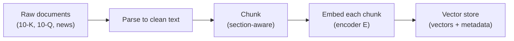
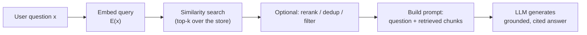
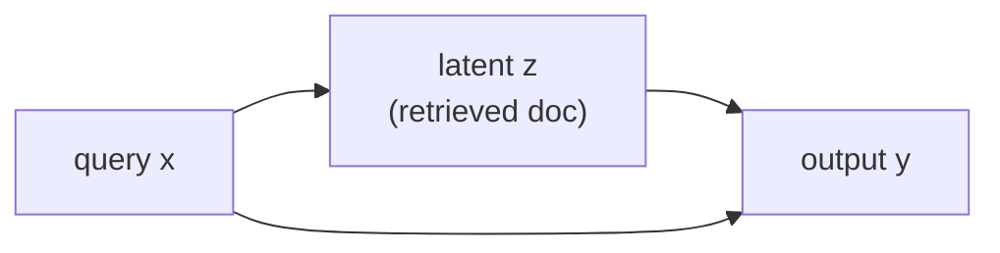
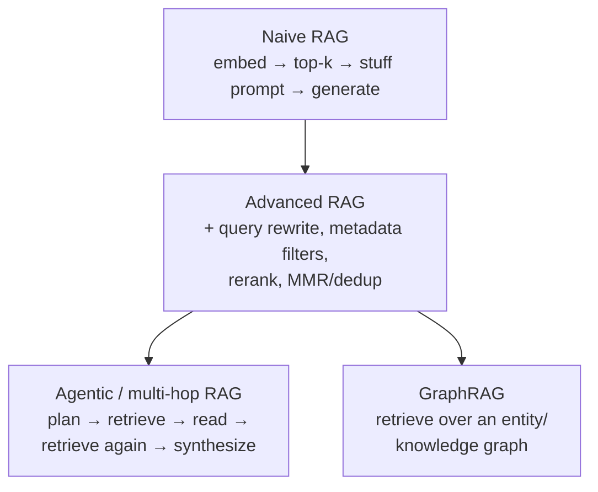
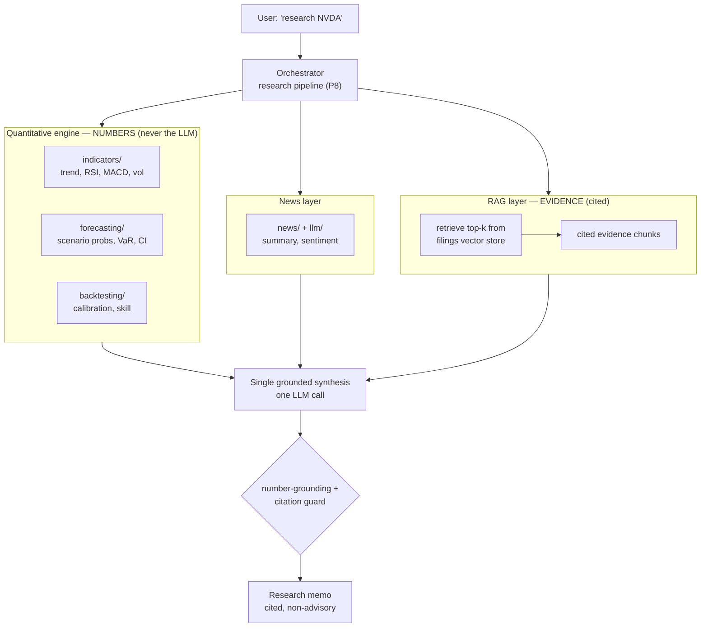

# RAG Concepts — From First Principles to Practice

> A self-contained primer on Retrieval-Augmented Generation (RAG): the intuition,
> the full probabilistic + retrieval mathematics, how it plugs into LLMs, worked
> (stock) examples, and applications across math / data science / AI / engineering.
> Equations render on GitHub via MathJax; diagrams via Mermaid. Where useful, the
> text connects back to how *this* repository implements RAG (see
> [RAG_TODO.md](RAG_TODO.md) and [RAG_IMPLEMENTATION_PLAN.md](RAG_IMPLEMENTATION_PLAN.md)).

---

## Table of contents
1. [The problem RAG solves](#1-the-problem-rag-solves)
2. [Anatomy of a RAG system](#2-anatomy-of-a-rag-system)
3. [Mathematical formulation (latent retrieval)](#3-mathematical-formulation-latent-retrieval)
4. [The retrieval mathematics in depth](#4-the-retrieval-mathematics-in-depth)
5. [A worked stock example (with numbers)](#5-a-worked-stock-example-with-numbers)
6. [Evaluating RAG](#6-evaluating-rag)
7. [How RAG is used with LLMs (patterns)](#7-how-rag-is-used-with-llms-patterns)
8. [Applications](#8-applications)
9. [Limitations and failure modes](#9-limitations-and-failure-modes)
10. [How this repository instantiates RAG](#10-how-this-repository-instantiates-rag)
11. [References](#11-references)

---

## 1. The problem RAG solves

A large language model stores everything it "knows" in its weights $\theta$ — this is
**parametric memory**. Decoding produces text from the conditional distribution

$$
p_\theta(y \mid x) = \prod_{i=1}^{N} p_\theta\!\left(y_i \mid x,\, y_{1:i-1}\right),
$$

where $x$ is the prompt and $y = (y_1,\dots,y_N)$ the generated tokens. Parametric
memory has four structural weaknesses:

- **Hallucination.** $p_\theta$ is a smooth distribution over *plausible* continuations,
  not *true* ones. With no external check, fluent-but-false text has high probability.
- **Staleness.** Knowledge is frozen at training cutoff; a 10-K filed yesterday is invisible.
- **No provenance.** The model cannot point to a source — fatal for research/compliance.
- **Finite context + cost.** You cannot paste an entire corpus into the prompt; attention
  is $O(L^2)$ in sequence length $L$ and tokens cost money/latency.

**RAG** adds a **non-parametric memory**: an external corpus you can search at inference
time. Instead of asking the model to *recall*, you *retrieve* relevant evidence and let
the model *read and synthesize* it. Three levers for injecting knowledge into an LLM:

| Approach | Knowledge lives in | Update cost | Provenance | Best when |
|---|---|---|---|---|
| **Fine-tuning** | weights $\theta$ | retrain | none | fixed style/skill, stable facts |
| **Long context** | the prompt | per query (tokens) | weak | one document, short-lived |
| **RAG** | external index | re-embed a doc | **strong (citations)** | large, changing, citeable corpora |

RAG is the right tool when the knowledge is **large, changing, and must be cited** —
exactly the case for SEC filings, news, and research notes.

---

## 2. Anatomy of a RAG system

Three components: a **knowledge store** (chunked + embedded documents), a **retriever**
(finds relevant chunks for a query), and a **generator** (an LLM that conditions on the
retrieved chunks). Work splits into an **offline ingestion** path (run once per document)
and an **online query** path (run per question).

**Ingestion (offline, local, $0):**



**Query (online):**



The cardinal rule (and the cost model): **embed once at ingestion, never re-embed the
corpus at query time.** A query embeds *one* string and does a vector lookup — no LLM
call is needed for retrieval. The only (optionally) paid step is the final generation.

### 2.1 The complete picture (one architecture)

The two paths above are not separate systems — they share the **knowledge store** and the
**same embedder** $E$. The full architecture, end to end, with the trust boundary that keeps
generation honest:


Read it as three stages over one store: **ingestion** fills the vector store (offline, free);
**query** reads it (embed once, lookup, no LLM); **generation** is the single LLM call, and a
**guard** sits on its output so a hallucinated citation or an invented number is rejected
rather than returned. The embedder $E$ **must be identical** on both paths — query and
document vectors are only comparable in the *same* embedding space.

### 2.2 The same flow as an interaction over time

The sequence view makes the request/response order — and the two exit paths — explicit:

```mermaid
sequenceDiagram
  autonumber
  participant U as User
  participant R as Retriever
  participant E as Embedder
  participant V as Vector store
  participant L as Frozen LLM
  participant G as Guard
  U->>R: question x
  R->>E: embed(x)
  E-->>R: query vector q
  R->>V: search(q, filters, k)
  V-->>R: top-k chunks + scores
  alt evidence found
    R->>L: prompt [system ; evidence ; x]
    L-->>G: draft answer + citations
    Note over G: cited sources within evidence?<br/>numbers traceable to tools?
    G-->>U: grounded, cited answer
  else nothing retrieved
    R-->>U: "Insufficient evidence found."
  end
```

---

## 3. Mathematical formulation (latent retrieval)

### 3.1 Retrieval as a latent variable

Treat the retrieved document $z$ as a **latent variable** drawn from a corpus
$\mathcal{Z}$. The quantity we want, $p(y \mid x)$, marginalizes over which document was used:

$$
p(y \mid x) \;=\; \sum_{z \in \mathcal{Z}} p(y, z \mid x)
\;=\; \sum_{z \in \mathcal{Z}} \underbrace{p_\eta(z \mid x)}_{\text{retriever}}\;
\underbrace{p_\theta(y \mid x, z)}_{\text{generator}} .
$$

The corpus has millions of chunks, so the exact sum is intractable. We approximate it by
the **top-$k$** documents the retriever scores highest:

$$
p(y \mid x) \;\approx\; \sum_{z \in \mathrm{TopK}(x)} p_\eta(z \mid x)\, p_\theta(y \mid x, z).
$$

This is the core RAG identity (Lewis et al., 2020): a **mixture** over retrieved
documents, weighted by how relevant each is.



The graphical model $x \to z \to y$ with the direct edge $x \to y$: the answer depends on
the query *and* on the retrieved evidence.

### 3.2 Two ways to use the mixture

**RAG-Sequence** uses a *single* $z$ for the whole output (simplest; what most
applications and this repo approximate):

$$
p_{\text{seq}}(y \mid x) \;=\; \sum_{z \in \mathrm{TopK}(x)} p_\eta(z \mid x)
\prod_{i=1}^{N} p_\theta\!\left(y_i \mid x, z, y_{1:i-1}\right).
$$

**RAG-Token** lets *each token* attend to a (possibly different) $z$ — strictly more
expressive, used when different facts must be stitched mid-sentence:

$$
p_{\text{tok}}(y \mid x) \;=\; \prod_{i=1}^{N} \;\sum_{z \in \mathrm{TopK}(x)}
p_\eta(z \mid x)\, p_\theta\!\left(y_i \mid x, z, y_{1:i-1}\right).
$$

The difference is where the sum sits: **outside** the product (one document per answer)
vs **inside** it (one document per token).

### 3.3 The retriever distribution

A **bi-encoder** (dense passage retrieval, DPR) maps query and document into a shared
$\mathbb{R}^d$ space with encoders $E_q, E_d$ and scores them by inner product:

$$
s(x, z) \;=\; E_q(x)^{\top} E_d(z).
$$

The retriever turns scores into a distribution with a softmax over the retrieved set:

$$
p_\eta(z \mid x) \;=\; \frac{\exp\!\big(s(x, z)\big)}
{\sum_{z' \in \mathrm{TopK}(x)} \exp\!\big(s(x, z')\big)} .
$$

Two encoders (one for the query, one for documents) is what makes retrieval cheap: every
document vector $E_d(z)$ is precomputed once; a query only computes $E_q(x)$ and does a
nearest-neighbor lookup.

### 3.4 Inference-time RAG with a frozen LLM (what this repo does)

Modern applications rarely jointly train retriever and generator. Instead both are
**frozen**, and retrieval is injected into the prompt. Mathematically this is a
**maximum-a-posteriori (MAP) approximation** of the mixture: collapse the sum onto the
top-$k$ set and condition the generator on it directly,

$$
p(y \mid x) \;\approx\; p_\theta\!\big(y \mid x,\, z_{1:k}\big),
\qquad z_{1:k} = \mathrm{TopK}_{z \in \mathcal{Z}}\; s(x, z),
$$

i.e. "retrieve the best $k$ chunks, paste them into context, generate." You lose the
end-to-end gradient through retrieval, but you gain modularity: swap the embedder, the
vector store, or the LLM independently. This is the pragmatic RAG the rest of this doc
(and this codebase) assumes.

### 3.5 Why conditioning curbs hallucination (intuition)

Generation is sampling from $p_\theta(\cdot \mid x, z)$. Conditioning on relevant evidence
$z$ **concentrates** that distribution: the entropy

$$
H\!\big(Y \mid x, z\big) \;\le\; H\!\big(Y \mid x\big)
$$

drops because the evidence rules out continuations inconsistent with it (conditioning
never increases uncertainty in expectation — $H(Y\mid X,Z)\le H(Y\mid X)$). Probability
mass moves from "plausible" onto "supported." It is **not** a proof of truthfulness — a
bad retrieval or an unfaithful generator still errs — which is why RAG systems add a
**citation/grounding guard** (every claim must trace to a retrieved chunk) as a separate
correctness layer.

### 3.6 Inside the LLM: how retrieved context becomes the answer

The equations above say *what* distribution we want; this section is the concrete
**mechanics** — how the retrieved chunks actually get into a frozen LLM and drive
generation. There is no magic and no weight update: **RAG edits the model's *input*, not
its *parameters*.**

**Step A — assemble one token sequence.** The generator is a function over a single token
stream. RAG builds that stream by concatenating three parts into the **context**
$c$:

$$
c \;=\; \big[\; \underbrace{\text{sys}}_{\text{instructions}} \;;\;
\underbrace{z_{1:k}}_{\text{retrieved evidence}} \;;\;
\underbrace{x}_{\text{user question}} \;\big],
$$

where `sys` is a system instruction ("answer only from the evidence; cite each claim; if
unsupported, say *insufficient evidence*"), $z_{1:k}$ are the top-$k$ chunks (each tagged
with its citation), and $x$ is the question. A concrete assembled prompt for the §5 example:

```text
SYSTEM:
You are an equity-research assistant. Answer ONLY from the evidence below.
Cite every claim as [source]. If the evidence is insufficient, say exactly:
"Insufficient evidence found." Do not output probabilities or forecasts.

EVIDENCE:
[1] (NVDA 10-K 2025-02-26 — Item 7. MD&A) "AI accelerators drove record
    data-center sales ..."
[2] (NVDA 10-K 2025-02-26 — Item 7. MD&A) "Data-center revenue grew on AI demand ..."

QUESTION:
What AI growth drivers did NVDA management highlight?
```

**Step B — decode autoregressively, conditioned on $c$.** The model samples tokens one at a
time from

$$
p_\theta\!\big(y_i \mid c,\, y_{1:i-1}\big),
$$

so every generated token sees the *entire* assembled context — including the evidence — as
its prefix. This is the literal meaning of "conditioning on $z$" from §3.1.

**Step C — the conditioning is implemented by attention.** Inside the transformer, each
position $i$ forms an attention query $\mathbf{a}_i$ and attends over the keys
$\mathbf{m}_j$ of *all* prior positions $j$ — which include the evidence tokens — with weights

$$
\alpha_{ij} \;=\; \frac{\exp\!\big(\mathbf{a}_i^{\top}\mathbf{m}_j / \sqrt{d_h}\big)}
{\sum_{j'} \exp\!\big(\mathbf{a}_i^{\top}\mathbf{m}_{j'} / \sqrt{d_h}\big)},
\qquad
\mathbf{o}_i \;=\; \sum_{j} \alpha_{ij}\,\mathbf{v}_j .
$$

(Here $\mathbf{a}, \mathbf{m}, \mathbf{v}$ are the attention query / key / value vectors and
$d_h$ the head dimension — distinct from the *retrieval* query of §3.3.) When the model
writes "data-center demand," the $\alpha_{ij}$ on the evidence tokens for that phrase are
large: the answer is being *copied/paraphrased from* the retrieved text, not recalled from
weights. This is why RAG answers can be grounded and citeable.

**This is in-context learning, not training.** Knowledge enters through $c$ at inference;
$\theta$ is frozen. Contrast the two ways to inject knowledge into an LLM at the mechanism
level:

| | Fine-tuning | RAG (in-context) |
|---|---|---|
| What changes | the weights $\theta$ (gradient steps) | the input context $c$ (no gradient) |
| New fact lands in | parameters | the prompt, per query |
| To update | retrain | re-embed one document |
| Can cite source | no | yes (the chunk is in $c$) |


**Practical consequences that fall straight out of this picture:**

- **Token budget = the evidence you paste.** The whole of $c$ is processed by $O(L^2)$
  attention, so $k$ and chunk size set both cost and latency — bound them (§4.6).
- **Order matters ("lost in the middle," §9).** Attention under-weights the middle of a long
  $c$; put the strongest chunks at the edges.
- **Prompt caching.** The `sys` + evidence prefix is a fixed prefix for a given question set;
  caching its key/value tensors avoids recomputing attention over it — the cost lever this
  repo uses for repeated synthesis.
- **Grounding is an *instruction plus a guard*, not a guarantee.** The `sys` text *requests*
  evidence-only, cited answers; because the model can still disobey, RAG systems add a
  **citation guard** that mechanically rejects any cited source not in $z_{1:k}$ (§3.5, §10).

In one line: **retrieval chooses what goes into the context window; attention turns that
context into the answer; the frozen weights only supply *fluency and reasoning*, not the
facts.**

---

## 4. The retrieval mathematics in depth

### 4.1 Embeddings

An **embedding model** $E : \text{text} \to \mathbb{R}^d$ maps a string to a dense vector
so that *semantically* similar texts land near each other. For `bge-small-en-v1.5`
(this repo's default), $d = 384$. Embeddings are the bridge from language to geometry:
once text is a vector, "relevance" becomes "closeness."

### 4.2 Similarity measures

Given query vector $\mathbf{q}=E(x)$ and document vector $\mathbf{d}=E(z)$:

- **Dot product:** $\;\mathbf{q}^{\top}\mathbf{d} = \sum_{i=1}^{d} q_i d_i.$
- **Cosine similarity** (scale-invariant):
$$
\text{cos}(\mathbf{q}, \mathbf{d}) \;=\;
\frac{\mathbf{q}^{\top}\mathbf{d}}{\lVert \mathbf{q}\rVert\,\lVert \mathbf{d}\rVert}
\;=\; \frac{\sum_i q_i d_i}{\sqrt{\sum_i q_i^2}\,\sqrt{\sum_i d_i^2}} \;\in [-1, 1].
$$
- **Euclidean (L2) distance:** $\;\lVert \mathbf{q}-\mathbf{d}\rVert.$

These are not independent. If embeddings are **unit-normalized** ($\lVert\mathbf{q}\rVert=\lVert\mathbf{d}\rVert=1$):

$$
\lVert \mathbf{q}-\mathbf{d}\rVert^2
= \lVert\mathbf{q}\rVert^2 + \lVert\mathbf{d}\rVert^2 - 2\,\mathbf{q}^{\top}\mathbf{d}
= 2 - 2\,\text{cos}(\mathbf{q}, \mathbf{d}).
$$

So **maximizing cosine similarity is equivalent to minimizing L2 distance** for normalized
vectors. This matters in practice: vector stores (e.g. ChromaDB) often return a **distance**
(smaller = closer), while application code reasons in **similarity** (larger = closer). The
wrapper must convert consistently, e.g. $\text{sim} = 1 - \tfrac{1}{2}\,\text{dist}^2$ or
$\text{sim} = -\,\text{dist}$, or top-$k$ ranking silently inverts. *(This is exactly the
"score convention" note flagged for this repo's vector-store layer.)*

### 4.3 Why embeddings are semantic: contrastive learning

Embeddings are not hand-built; they are **learned** so that matching pairs are close and
mismatched pairs are far. The workhorse objective is **InfoNCE** (contrastive loss). For a
query $q$ with one positive document $d^{+}$ and a set of negatives $\{d^{-}_j\}$:

$$
\mathcal{L}_{\text{InfoNCE}}
= -\,\log \frac{\exp\!\big(\text{sim}(q, d^{+})/\tau\big)}
{\exp\!\big(\text{sim}(q, d^{+})/\tau\big) + \sum_{j}\exp\!\big(\text{sim}(q, d^{-}_j)/\tau\big)} ,
$$

where $\tau > 0$ is a **temperature**. Minimizing $\mathcal{L}$ pulls $q$ toward $d^{+}$
and pushes it from the $d^{-}_j$. Geometrically, gradient descent on this loss *organizes*
the vector space so that "same meaning" implies "small angle." Small $\tau$ sharpens the
contrast (harder push/pull); large $\tau$ softens it. This is why a query like
"AI data-center demand" lands near a 10-K passage about "accelerated computing revenue,"
despite zero shared keywords — the model learned the semantic geometry.

### 4.4 Approximate nearest neighbor (ANN)

Exact top-$k$ scans every vector: $O(N d)$ per query for a corpus of $N$ chunks. At
$N=10^6$, $d=384$ that is hundreds of millions of multiply-adds per query — too slow at
scale. **ANN indexes** trade a little recall for large speedups:

- **HNSW** (hierarchical navigable small-world graphs): greedy search over a layered
  proximity graph, roughly $O(\log N)$ hops per query.
- **IVF** (inverted file / coarse quantization): partition the space into $n_{\text{list}}$
  cells, search only the few nearest cells.
- **PQ** (product quantization): compress vectors to cut memory and speed distance math.

For an MVP corpus (thousands–tens of thousands of chunks) **exact search is fine and
simpler**; ANN earns its complexity only at large $N$.

### 4.5 Sparse retrieval (BM25) and hybrid search

Dense embeddings capture *meaning* but can miss **exact terms** (a ticker, a statute, a
product codename). The classic lexical scorer **BM25** complements them:

$$
\text{BM25}(q, d) = \sum_{t \in q} \text{IDF}(t)\cdot
\frac{f(t,d)\,(k_1 + 1)}{f(t,d) + k_1\big(1 - b + b\,\frac{\lvert d\rvert}{\text{avgdl}}\big)},
\qquad
\text{IDF}(t) = \log\!\left(\frac{N - n_t + 0.5}{n_t + 0.5} + 1\right),
$$

where $f(t,d)$ is term frequency, $n_t$ the number of documents containing $t$,
$\lvert d\rvert$ the document length, $\text{avgdl}$ the average length, and $k_1, b$ are
tuning constants. **Hybrid search** fuses dense and sparse rankings — a robust, parameter-free
choice is **Reciprocal Rank Fusion (RRF)**:

$$
\text{RRF}(d) = \sum_{r \in \{\text{dense},\,\text{sparse}\}} \frac{1}{c + \text{rank}_r(d)},
$$

with a small constant $c$ (often $60$). Hybrid is a V1 feature here; the MVP uses dense
retrieval only.

### 4.6 Chunking — the granularity tradeoff

Documents are split into **chunks** before embedding because (a) one vector cannot
faithfully summarize a 100-page 10-K, and (b) you want to retrieve and cite the *specific*
passage. Chunk size $c$ trades two errors:

- **Too large** → a chunk mixes many topics; its single embedding is a blurred average, so
  retrieval precision falls and you waste context tokens on irrelevant text.
- **Too small** → a chunk loses the surrounding context needed to be self-explanatory; a
  sentence about "growth of 22%" is useless without "data-center revenue."

A practical sweet spot is a few hundred to ~1,000 tokens with ~10–20% **overlap** so a fact
straddling a boundary survives in at least one chunk. **Section-aware** chunking (never
splitting across "Item 1A. Risk Factors" / "Item 7. MD&A") preserves the citation unit —
which is why this repo chunks on filing-section anchors.

### 4.7 Diversity and redundancy: Maximal Marginal Relevance (MMR)

Top-$k$ by similarity often returns $k$ near-duplicate chunks (filings repeat boilerplate),
wasting context. **MMR** re-selects for relevance *and* novelty, greedily building the
result set $S$:

$$
\text{MMR} = \arg\max_{d_i \in R \setminus S}
\Big[\, \lambda\, \text{sim}(q, d_i)\; -\; (1-\lambda)\,\max_{d_j \in S}\,\text{sim}(d_i, d_j) \,\Big],
$$

where $R$ is the candidate pool and $\lambda \in [0,1]$ trades relevance ($\lambda\to 1$)
against diversity ($\lambda\to 0$). MMR (or simple dedup) keeps the $k$ chunks
complementary.

### 4.8 Reranking with cross-encoders

A bi-encoder embeds $q$ and $d$ **separately**, so it cannot model fine token-level
interactions — fast but coarse. A **cross-encoder** scores the *pair jointly*,

$$
s_{\text{ce}}(q, d) = \text{CrossEncoder}\big([\,q \,;\, d\,]\big),
$$

running full attention over the concatenation. It is far more accurate but $O(k)$ model
calls per query, so the standard pattern is **retrieve-then-rerank**: cheaply fetch the
top-$M$ (say 50) with the bi-encoder, then rerank to the top-$k$ (say 8) with the
cross-encoder. (V1 here; the MVP skips it.)

---

## 5. A worked stock example (with numbers)

**Question:** *"What AI growth drivers did NVDA management highlight?"*

Suppose ingestion produced three (toy, 3-dimensional) chunk embeddings from the 10-K, and
the query embeds to $\mathbf{q} = [0.90,\, 0.10,\, 0.20]$:

| Chunk | Text (abbreviated) | Embedding $\mathbf{d}$ |
|---|---|---|
| $d_1$ | "Data-center revenue grew on AI demand" | $[0.80, 0.20, 0.10]$ |
| $d_2$ | "Gaming GPU sales declined" | $[0.10, 0.90, 0.10]$ |
| $d_3$ | "AI accelerators drove record data-center sales" | $[0.85, 0.05, 0.25]$ |

**Step 1 — cosine similarities** (using $\text{cos}=\mathbf{q}^{\top}\mathbf{d}/(\lVert\mathbf{q}\rVert\lVert\mathbf{d}\rVert)$, with $\lVert\mathbf{q}\rVert = \sqrt{0.86} \approx 0.927$):

$$
\text{cos}(\mathbf{q}, d_1) = \frac{0.76}{0.927\cdot 0.831} \approx 0.986, \quad
\text{cos}(\mathbf{q}, d_2) = \frac{0.20}{0.927\cdot 0.911} \approx 0.237, \quad
\text{cos}(\mathbf{q}, d_3) = \frac{0.82}{0.927\cdot 0.887} \approx 0.996.
$$

**Step 2 — top-$k$** ($k=2$): keep $\{d_3, d_1\}$; drop $d_2$ (the gaming chunk is
semantically far — note it shares no keyword with the query, yet is correctly excluded by
*meaning*).

**Step 3 — retriever weights** (softmax with $\tau=0.5$, logits $= \text{cos}/\tau$):

$$
p_\eta(d_3 \mid x) \approx 0.455,\quad p_\eta(d_1 \mid x) \approx 0.446,\quad
p_\eta(d_2 \mid x) \approx 0.099.
$$

**Step 4 — grounded generation.** The LLM conditions on $\{d_3, d_1\}$ and writes, with
citations:

> "Management highlighted **AI accelerators** and **data-center demand** as the primary
> growth drivers [NVDA 10-K — Item 7. MD&A]."

**Crucial discipline (this repo's invariant):** any *quantitative* figure — a probability,
an expected return, a VaR — does **not** come from the LLM or a retrieved sentence; it comes
from the quantitative modules (`forecasting/`, `indicators/`). RAG supplies the
**qualitative, cited narrative**; the numbers stay model-generated. A separate **citation
guard** rejects any source the answer cites that is not in $\{d_3, d_1\}$, and if retrieval
returns nothing the system answers *"Insufficient evidence found."* rather than inventing.

---

## 6. Evaluating RAG

RAG has two stages, each with its own metrics.

**Retrieval quality** (did we fetch the right chunks?). With $\mathcal{R}_q$ the set of
truly relevant chunks for query $q$:

- **Recall@k** — fraction of relevant chunks captured in the top-$k$:
$$
\text{Recall@}k = \frac{\big\lvert \{\text{relevant chunks}\} \cap \mathrm{TopK} \big\rvert}{\lvert \mathcal{R}_q \rvert}.
$$
- **MRR** (mean reciprocal rank of the first relevant hit), over a query set $Q$:
$$
\text{MRR} = \frac{1}{\lvert Q\rvert} \sum_{q \in Q} \frac{1}{\text{rank}_q},
$$
where $\text{rank}_q$ is the position of the first relevant chunk.
- **nDCG@k** (graded relevance, rank-discounted):
$$
\text{DCG@}k = \sum_{i=1}^{k} \frac{2^{\text{rel}_i} - 1}{\log_2(i + 1)}, \qquad
\text{nDCG@}k = \frac{\text{DCG@}k}{\text{IDCG@}k},
$$
where $\text{rel}_i$ is the relevance grade at rank $i$ and IDCG is DCG of the ideal ordering.

**Generation quality** (did the answer use the evidence well?):

- **Faithfulness / groundedness** — the fraction of the answer's claims entailed by the
  retrieved context (penalizes hallucination).
- **Answer relevance** — does the answer actually address $x$?
- **Context precision / recall** — were the retrieved chunks on-topic, and was the needed
  evidence present?

A healthy RAG system is tuned on **both** axes: you can retrieve perfectly and still
generate an unfaithful summary, or generate beautifully from the wrong chunks.

---

## 7. How RAG is used with LLMs (patterns)



- **Naive RAG** — the linear pipeline of §2; the MVP target here.
- **Advanced RAG** — query transformation (rewrite/expand the question — analogous to the
  keyword expansion already in this repo's topic-news path), **metadata filtering** (restrict
  to `ticker = NVDA`, `document_type = 10-K`, `filing_date ≥ …` *before* the vector search),
  reranking, and dedup.
- **Agentic / multi-hop RAG** — the LLM *plans* retrievals, reads, and retrieves again to
  answer compositional questions ("compare NVDA's and AMD's stated data-center risks"). This
  is where RAG meets tool-using agents.
- **GraphRAG** — retrieve over a knowledge graph of entities/relations rather than flat text,
  for global/connective questions.

**Prompt construction** in all of them is the same shape: a system instruction ("answer only
from the evidence; cite sources; say 'insufficient evidence' if unsupported"), the retrieved
chunks (each tagged with its citation), and the user question. Keeping that prompt **compact**
(bounded $k$, deduped chunks) is the main runtime cost lever.

---

## 8. Applications

RAG is general "ground an LLM in an external, searchable knowledge base," so it appears
wherever authoritative text must drive generation.

- **Finance / equity research (this project).** Ground answers and research memos in SEC
  filings, transcripts, and news, with citations and dates — turning a signal analyzer into
  a *cited* research assistant. Numbers from quantitative models; narrative + evidence from RAG.
- **Mathematics.** Retrieve relevant theorems, lemmas, and prior results to assist proof
  search or literature review; retrieval-augmented autoformalization (pull matching library
  lemmas in Lean/Coq before generating a tactic). The embedding space organizes statements by
  semantic role, not surface syntax.
- **Data science.** "Talk to your data/docs": retrieve over experiment logs, data
  dictionaries, model cards, and notebooks to answer "which feature encodes X?" or "what
  preprocessing did run 47 use?" — and as a feature: retrieved context as side-information
  for downstream models.
- **AI / NLP.** Open-domain QA, knowledge-grounded dialogue, long-term **agent memory**
  (store and retrieve past interactions), and tool-augmented reasoning. RAG is the standard
  way to give a frozen LLM fresh, citeable knowledge without retraining.
- **Engineering / software.** Code search and Q&A over a large repo, grounding answers in the
  actual codebase; retrieval over runbooks, design docs, and past incidents for on-call
  assistance; documentation assistants that cite the manual.

The common thread: **the corpus is the source of truth; the LLM is the reader and writer.**

---

## 9. Limitations and failure modes

- **Retrieval is the ceiling.** If the right chunk is not in the top-$k$, no amount of LLM
  skill recovers it ("garbage in, garbage out"). Tune recall first.
- **Chunking artifacts.** Bad boundaries split a fact in half or merge unrelated topics,
  degrading both retrieval and citation.
- **Embedding mismatch / domain shift.** A general embedder may underperform on dense
  financial/legal jargon; this is where a domain model or hybrid search helps.
- **Stale or conflicting evidence.** Two filings disagree across quarters; the system must
  surface dates and contradictions rather than silently average them.
- **Unfaithful synthesis.** The LLM can still ignore or misread the evidence — hence the
  separate **citation/grounding guard** and the explicit *"insufficient evidence"* path.
- **Context dilution.** Too many or too-long chunks bury the signal and inflate cost; bound
  $k$ and dedup.
- **Lost-in-the-middle.** LLMs attend less to the *middle* of a long context; ordering
  matters — put the strongest evidence at the edges.

These are why production RAG is mostly **retrieval and grounding engineering**, not prompt
wording.

---

## 10. How this repository instantiates RAG

Mapping the theory above onto the planned modules ([RAG_TODO.md](RAG_TODO.md)):

```mermaid
flowchart LR
  SEC["providers/sec_edgar.py<br/>(EDGAR official API)"] --> DOC["documents/<br/>parse + section-detect"]
  DOC --> CH["rag/chunking.py<br/>(section-aware, §4.6)"]
  CH --> EM["rag/embeddings.py<br/>(fastembed/BGE, §4.1-4.3)"]
  EM --> VS["rag/vector_store.py<br/>(Chroma, §4.2 distance↔sim)"]
  VS --> RET["rag/retriever.py<br/>(top-k + filters + dedup, §4.4/4.7)"]
  RET --> SYN["research/synthesis.py<br/>(one grounded LLM call, §3.4)"]
  SYN --> MEMO["research/memo.py<br/>(cited research memo)"]
```



**Zooming out — RAG is one component, not the whole.** The research pipeline runs the
quantitative engine, the news layer, and RAG *in parallel*, then makes a **single** grounded
synthesis call. The boundary is strict and is what keeps the product honest: the quant engine
owns every **number**, RAG owns the cited **evidence**, and the LLM only **narrates** — gated
by the guards.



Design choices, justified by the math:

- **Local `fastembed` + `bge-small-en-v1.5`** ($d=384$): contrastively-trained semantic
  embeddings (§4.3) at $0 cost; quality parity with paid APIs for this corpus.
- **ChromaDB** with **metadata filtering** (ticker / type / date): cut the candidate set
  *before* the vector search (advanced-RAG filtering, §7). The wrapper converts Chroma's
  **distance** to a **similarity** consistently (§4.2).
- **Section-aware chunking** (§4.6) so a chunk = a citeable unit (Item 1A, Item 7).
- **Inference-time / frozen-LLM RAG** (§3.4): one grounded synthesis call; retrieval does
  **no** LLM calls — the cost discipline.
- **Invariants as correctness layers:** numbers come from `forecasting/`/`indicators/`, never
  the LLM (§5); the **citation guard** enforces that every cited source is in the retrieved
  set (the grounding layer of §3.5); empty retrieval ⇒ *"Insufficient evidence found."*;
  non-advisory by construction (evidence, not recommendations).

In short: this codebase is a **naive-but-disciplined RAG** (the §2 pipeline), local-first for
cost, with the grounding guarantees bolted on as explicit guards rather than hoped-for LLM
behavior.

---

## 11. References

- Lewis et al. (2020), *Retrieval-Augmented Generation for Knowledge-Intensive NLP Tasks* —
  the original RAG paper (RAG-Sequence / RAG-Token, the latent-variable formulation).
- Karpukhin et al. (2020), *Dense Passage Retrieval for Open-Domain QA* — the DPR bi-encoder
  and in-batch contrastive training.
- Oord et al. (2018), *Representation Learning with Contrastive Predictive Coding* — InfoNCE.
- Robertson & Zaragoza (2009), *The Probabilistic Relevance Framework: BM25 and Beyond*.
- Malkov & Yashunin (2018), *Efficient and robust approximate nearest neighbor search using
  HNSW graphs*.
- Carbonell & Goldstein (1998), *The Use of MMR for Reordering Documents*.
- Liu et al. (2023), *Lost in the Middle: How Language Models Use Long Contexts*.
- Gao et al. (2023), *Retrieval-Augmented Generation for Large Language Models: A Survey*.
