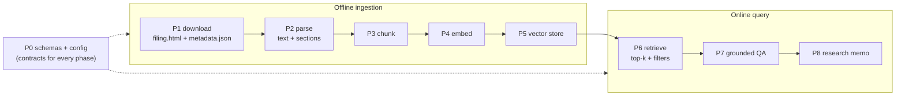

# RAG Implementation Notes

> **Living build journal.** One section per implemented phase explaining *what the
> mechanism does, how it works, and how the next phase uses it* — written right after
> each phase lands. Companion to [RAG_TODO.md](RAG_TODO.md) (the ordered checklist)
> and [rag_concepts.md](rag_concepts.md) (the theory). Updated as P3→P8 ship.
>
> **Status:** P0 ✅ · P1 ✅ · P2 ✅ · P3 ✅ · P4 ✅ · P5 ✅ · P6–P8 pending.

---

## Where each phase sits

The MVP is an **offline ingestion** path that fills a store, and an **online query**
path that reads it. Phases map onto that pipeline:



---

## P0 — Scaffolding and config

**Role.** The **interfaces-first foundation**. P0 ships *no behavior* — its only job is
to lock the typed data contracts and configuration that every later phase plugs into,
so P1–P8 build against stable shapes instead of inventing them mid-stream.

**Key files.**
- `schemas/documents.py` — `DocumentMetadata`, `Document`, `DocumentChunk` (and, added in
  P1, `FilingRef`).
- `schemas/retrieval.py` — `RetrievedChunk`, `EvidenceSet`.
- `settings.py` — RAG config block.
- empty `documents/`, `rag/`, `research/` packages; `.gitignore data/`.

**What the mechanism establishes (and why).**
- **The document contract.** A `Document` is full text + `DocumentMetadata` (provenance:
  ticker, type, source, url, `filing_date`, `document_id`, section, `ingested_at`). A
  `DocumentChunk` is one retrieval unit that **carries flat, denormalized metadata**
  (ticker / type / date / section copied onto every chunk). This denormalization is the
  load-bearing decision: the vector store (P5) filters on these scalar fields *at query
  time* without a join, and a citation is reconstructable from a chunk alone.
  `DocumentChunk.from_metadata(...)` keeps that copy consistent.
- **The grounding contract, defined before it's needed.** `EvidenceSet.allowed_chunk_ids()`
  and `is_empty` exist now because the **citation guard** (P7) and the
  *"Insufficient evidence found."* rule depend on them. Establishing the guard's allow-set
  this early stops P7 from drifting.
- **The leakage anchor.** `filing_date` is on every chunk from day one, so if filings ever
  feed a *model* later, point-in-time correctness is already enforceable (invariant #6).
- **Config knobs.** `embedding_provider` (local default), `embedding_model`,
  `rag_chunk_tokens`/`rag_chunk_overlap`/`rag_top_k`, and the `data/` paths — all read via
  `settings`, no hard-coding.

**How later phases use it.** Every phase imports these schemas; P2 emits `Document`, P3
emits `DocumentChunk`s, P5/P6 store and filter on the flat metadata, P7 checks answers
against `EvidenceSet.allowed_chunk_ids()`.

**Key decisions.** Interfaces first; **heavy deps deferred** to the phase that needs them
(`fastembed` → P4, `chromadb` → P5), so P0 stays dependency-free and CI stays fast.
**Carry-forward noted in P0 review:** normalize tickers to upper-case at the corpus
boundary (done in P1) so metadata filters match regardless of input casing.

---

## P1 — SEC document download

**Role.** Acquire raw filings (10-K / 10-Q / 8-K) into the local corpus via SEC's
**official EDGAR API** (not scraping), idempotently and offline-testably.

**Key files.**
- `providers/sec_edgar.py` — the EDGAR client + pure parsers.
- `providers/_http.py` — `HttpJson` gained custom **headers** + **`get_text`**.
- `schemas/documents.py` — `+= FilingRef`.
- `documents/ticker_cik.py`, `documents/download.py`, `documents/manifest.py`.
- CLI `documents download-sec`.

**What the mechanism does — three EDGAR endpoints.**
1. **ticker → CIK** (`company_tickers.json`). `_parse_cik_map` normalizes SEC's
   `{ "0": {cik_str, ticker, …}, … }` into `{TICKER → 10-digit CIK}`. Cached (changes
   rarely).
2. **filing list** (`data.sec.gov/submissions/CIK##########.json`). The index stores
   filings as **parallel arrays** (`form[i]`, `filingDate[i]`, `accessionNumber[i]`,
   `primaryDocument[i]`). `_parse_filings` zips them, keeps **exact** form matches (so
   `10-K/A` amendments are excluded when `10-K` is requested), skips malformed rows, sorts
   newest-first, caps to a limit → `FilingRef`s.
3. **filing document** (`www.sec.gov/Archives/edgar/data/{cik}/{accession}/{doc}`).
   `FilingRef.url` builds this path (CIK as a bare integer, accession with dashes stripped);
   `download_filing` fetches the HTML via `get_text`.

**Compliance + robustness baked in.**
- **`User-Agent`** (name + contact) from `settings.sec_user_agent` is set on every request —
  SEC fair-access requires it. `available()` reflects whether it's configured; a live call
  without it raises a clear error.
- **Throttle** ≤ 10 req/s (`_throttle`, monotonic-clock min-interval) — SEC's rate cap.
- **`DiskCache`** for the JSON indexes (free re-runs within TTL).

**Download orchestration (`download.py`).** For each `FilingRef`: write the primary document
to `data/raw/sec/{TICKER}/{FORM}/{filing_date}/filing.html` plus a `metadata.json` sidecar.
**Idempotent + safe:** a filing already on disk (or in the manifest) is **skipped** — raw is
**never overwritten** (so a local edit survives a re-run). A per-filing failure is recorded
and does **not** abort the rest. `manifest.py` is the queryable history keyed by
`document_id`.

**How P2 uses it.** P2 reads exactly what P1 writes: `filing.html` + `metadata.json` from a
filing directory.

**Key decisions.** Official API behind a provider (invariant #3); `SEC_USER_AGENT` is the
only secret and only for *live* downloads (tests use `httpx.MockTransport` fixtures);
ticker upper-cased at the boundary (the P0-review fix). `filings.recent` covers ~the latest
1,000 filings — enough for the MVP; deep history (sharded `filings.files`) is deferred.

---

## P2 — Parsing (HTML → text + sections)

**Role.** Turn a raw filing (`filing.html` + `metadata.json`) into **clean text split on
EDGAR section anchors**, so each section is a citeable retrieval unit. Pure + fail-soft.

**Key file.** `documents/parsers.py`.

**Mechanism 1 — `html_to_text` (HTML → readable text).**
1. Parse the HTML to a DOM with `lxml`.
2. **Depth-first walk** (`_walk`) reconstructs reading order. lxml stores text in two places —
   `element.text` (before the first child) and each child's `.tail` (after that child) — so
   the walk appends `el.text`, then for each child recurses **and** appends `child.tail`.
   - Drops `script`/`style`/`head`/`title` (noise).
   - Appends a newline after every **block** tag (`p`, `div`, `tr`, `table`, `h1–h6`, `li`, …)
     so each paragraph / row / header lands on its **own line** — this is what makes
     line-anchored section detection possible.
   - Comments/PIs (non-string `.tag`) are skipped; their tail is still captured by the parent.
3. **Normalize** (`_normalize`): collapse spaces/tabs/non-breaking-spaces to one space, strip
   each line, drop blanks.
   **Fail-soft:** empty → `""`; plain text (no `<`) → normalized as-is; unparseable HTML →
   regex tag-strip fallback (never raises). lxml decodes entities for free
   (`&nbsp;` → space, `&rsquo;` → ').
   - **Inline-XBRL handling (real-filing fix).** All modern filings are iXBRL XHTML with an XML
     declaration; `lxml.html.fromstring` rejects a *str* carrying an encoding declaration, so we
     **strip the leading `<?xml …?>`** before parsing — otherwise it raised and we fell into the
     dumb regex fallback (one giant line, no sections, XBRL junk leaked). We also **skip the
     `ix:hidden`/`ix:header`/… metadata** (non-displayed facts) while keeping the visible
     `ix:nonFraction`/`ix:nonNumeric` facts. Found by validating against real NVDA/AVGO/TSLA
     10-Ks (synthetic fixtures missed it); after the fix each real 10-K parses into ~47 sections
     incl. Item 1A / Item 7. Regression-tested with a synthetic iXBRL fixture (offline).

**Mechanism 2 — `detect_sections` (text → labeled sections).** Filings are organized by
standardized **Item** headers (`Item 1A. Risk Factors`, `Item 7. MD&A`, 8-K `Item 2.02.`).
The regex `_ITEM_RE` matches them at line start (`MULTILINE`) — covering both letter
(`1A`) and decimal (`2.02`) numbering. Section *i* = the text between header *i* and header
*i+1*; the label is the header line. Cover text before the first header → `Preamble`; no
headers found → one unlabeled section.

**Mechanism 3 — provenance + assembly.** `parse_metadata` loads the `metadata.json` sidecar
into a typed `DocumentMetadata` (extra keys like `accession_number` ignored). `load_filing`
ties it together → `ParsedFiling(metadata, text, sections)`, with `to_document()` for the
full-text view.

**Worked trace.**
```
<p>NVIDIA CORP&nbsp;Annual Report</p><script>…</script>
<div>Item 1A. Risk Factors</div><p>Our business faces&nbsp;risks…</p>
<div>Item 7. Management&rsquo;s Discussion…</div><p>Revenue grew…</p>
```
→ `html_to_text` (script gone, entities decoded, block newlines) →
```
NVIDIA CORP Annual Report
Item 1A. Risk Factors
Our business faces risks…
Item 7. Management’s Discussion…
Revenue grew…
```
→ `detect_sections`: `[Preamble]`, `[Item 1A. Risk Factors]`, `[Item 7. Management’s …]`.

**How P3 uses it.** P3 chunks **each `Section`** independently (never crossing a section
boundary), copying the metadata onto every `DocumentChunk`.

**Known limitation (deferred to P3).** A filing's table-of-contents *also* lists the Item
headers, so detection emits a few **short, header-only duplicate sections**. P2 leaves them
in by design; **P3 dedup** drops sections that are essentially a header with no body.

**Key decisions.** Pure, deterministic, fail-soft → fully unit-testable offline (no network).
Tables are flattened to text (fine for prose-heavy Risk Factors / MD&A). `lxml.*` added to
the mypy `ignore_missing_imports` override.

---

## P3 — Section-aware chunking

**Role.** Turn each parsed `Section` (from P2) into **retrieval-sized `DocumentChunk`s** —
the units that get embedded (P4), stored (P5), and retrieved (P6). Pure + deterministic.

**Key file.** `rag/chunking.py` (`chunk_sections`, `chunk_filing`).

**Why chunk at all.** One vector can't faithfully represent a 100-page 10-K, and you want
to retrieve + cite the *specific* passage. Chunk size trades two errors: too big → the
embedding is a blurred average (low precision, wasted tokens); too small → the chunk loses
the context needed to be self-explanatory. The MVP targets a few-hundred-word window with
overlap (see [rag_concepts.md](rag_concepts.md) §4.6).

**What the mechanism does.**
- **Token budget without a tokenizer.** To stay dependency-free (a real tokenizer is a P4
  concern), the token budget is converted to a **word** budget via a proxy:
  `target_words = round(chunk_tokens × 0.75)` (≈ 1 English token ≈ 0.75 words). The default
  900 tokens ≈ ~675 words. `_target_words` is the single swap-point if we later want exact
  tokenization.
- **Sliding word-window, per section.** Each section's text is split into words and walked
  with a fixed window of `target_words` advancing by `step = target − overlap_words`
  (`_windows`). So **every non-final window is exactly `target` words** (no giant chunks),
  **consecutive chunks share exactly `overlap_words`** (a fact straddling a boundary survives
  in both), and the windowing is bounded *within one section* → **chunks never cross a
  section boundary** (Risk Factors and MD&A never bleed together).
- **Dedup / no-tiny (folds in P2's deferred work).** A section whose body has
  `< min_chunk_words` (15) words is dropped — this removes P2's header-only table-of-contents
  duplicates (`Item 1A.` ≈ 2 words) and trivial cover lines, and guarantees no degenerately
  tiny chunk. A section shorter than `target` but above the floor becomes one clean chunk.
- **TOC-stub dedup (real-corpus refinement).** Some table-of-contents lines survive the 15-word
  floor: the TOC renders the item number and title in separate cells, so a stub like
  `Item 5.\nMarket for Registrant's Common Equity…\n33` (title + page number, ~17 words) slips
  through. These are exactly the sections whose **label is a *bare* item header** (no title) —
  `parsers.is_bare_item_header`. But 8-K *content* items render bare-header too (the number on
  its own line) and are real, so the rule needs a body guard: drop only when **bare header AND
  body < `toc_stub_max_words` (25)**. The live corpus shows a clean empty gap — TOC stubs ≤ 17
  words, the shortest real bare-header section (an 8-K incorporation-by-reference) 38 words — so
  25 separates them with zero false drops (validated: 21 stubs removed across 149 filings, every
  real section kept).
- **Metadata carry-through.** Each window becomes a `DocumentChunk` via
  `DocumentChunk.from_metadata(...)`, copying the filing's flat metadata (ticker / type /
  date / source / url) onto the chunk and stamping the section label. `chunk_index` is a
  **document-global running counter**, so `chunk_id = document_id:index` is unique across the
  whole filing — the key the vector store dedupes/updates on.

**Worked sizing example.** With `chunk_tokens=200, overlap=0.2` → `target=150`, `overlap=30`,
`step=120`. A 400-word section yields windows `[0:150]`, `[120:270]`, `[240:390]`, `[360:400]`
— each ≤ 150 words, adjacent pairs sharing their 30 boundary words, together covering w0…w399
with no gaps.

**How P4/P5 use it.** P4 embeds each chunk's `.text`; P5 stores the vector keyed by
`chunk_id` with the flat metadata as filter fields; P6 retrieves + filters on them.

**Key decisions.** Pure/deterministic → fully offline-tested (12 tests: size bounds, exact
overlap, complete coverage, boundary preservation, dedup, metadata/`chunk_id` integrity,
determinism, `overlap=0`, edges). Chunk **text stays clean** (just the section's words); the
section label lives in metadata — P4 can optionally *prepend* it to the embedding input for
extra topical context without changing stored text. The word-proxy and `min_chunk_words`
floor are the two heuristics most worth revisiting once we see real filings.

---

## P4 — Embeddings

**Role.** Turn chunk/query **text into dense vectors** so "relevance" becomes "closeness"
(see [rag_concepts.md](rag_concepts.md) §4.1–4.3). This is the first phase with a real
external model; everything downstream (store, retrieve) operates on these vectors.

**Key file.** `rag/embeddings.py`.

**The Protocol (one seam, swappable backends).** `Embedder` declares `name`, `dim`,
`embed_documents(texts) → list[list[float]]`, `embed_query(text) → list[float]`. Document
vs query is split because retrieval models (BGE/E5) prepend a **query instruction** for
search — so the *same* model embeds passages and queries differently. Three implementations
sit behind it:
- **`FastEmbedEmbedder`** (default) — local `BAAI/bge-small-en-v1.5` (384-d) via `fastembed`,
  which runs **onnxruntime, not torch** (so it can't trigger the macOS torch+lightgbm OpenMP
  segfault). `embed_query` routes through fastembed's `query_embed` (the BGE prefix) when
  present. The model **loads lazily on first `embed`**, so constructing it is free.
- **`OpenAIEmbedder`** (opt-in) — `text-embedding-3-small` (1536-d). Checks the API key
  *before* importing `openai` so a missing key gives the clear settings error; `dim` comes
  from a known-dims table (no model load).
- **`VoyageEmbedder`** (opt-in) — default `voyage-4` (1024-d), Anthropic's recommended
  provider (200M-token free pool); `voyage-finance-2` is the finance-tuned A/B alternative.
  Uses Voyage's asymmetric `input_type` (`"document"` vs `"query"`); separate
  `VOYAGE_API_KEY`, independent billing.
- **`FakeEmbedder`** — deterministic, dependency-free: hashes text to a fixed-dim **unit
  vector** (so dot product = cosine). Same text → same vector. It lives in the module (not the
  tests) because P5/P6 reuse it as their embedder double, mirroring `providers/fake.py`.

`build_embedder(settings)` selects local / OpenAI / Voyage by `settings.embedding_provider` —
and because every backend is lazy, the selector neither loads a model nor builds a client.

**Cost/CI discipline baked in.** Documents are embedded **once at ingestion**; a search
embeds only the one query string (§3.1). The heavy backends are **extras**, not core deps —
`[rag]` (fastembed) and `[openai]` — so CI's `.[dev]` install never pulls them and the
suite never downloads a model: tests run on `FakeEmbedder` + an injected fake OpenAI client.
The real BGE model is exercised only by a test gated behind `RUN_EMBED_TESTS`
(`importorskip("fastembed")`), skipped in CI. `fastembed.*`/`openai.*` are in the mypy
ignore-missing-imports override so type-checking passes without the extras installed.

**How P5/P6 use it.** P5 stores `embed_documents(chunk_texts)` vectors keyed by `chunk_id`
with the chunk's flat metadata; P6 calls `embed_query(question)` and does the nearest-neighbor
lookup. `dim` lets the store size its collection.

**Key decisions.** One Protocol → provider swap is a one-line config change with zero impact
on chunking/store/retrieval code. Extras (not core) keep base install + CI light, consistent
with the repo's `[sequence]`/`[gdelt]` pattern — the real app installs `.[rag]`. The
local↔OpenAI quality gap is negligible for SEC retrieval (§ cost analysis), so local is the
honest default.

---

## P5 — Vector store

**Role.** Persist chunk **vectors + flat metadata** and serve **metadata-filtered cosine
top-k**. This is a pure storage + nearest-neighbour layer: it takes *pre-computed* vectors
(the `Embedder` runs in P6's pipeline, not here), does no LLM work, and is embedder-agnostic.

**Key files.** `src/stock_agent/rag/vector_store.py`; `ChunkFilter` added to
`schemas/retrieval.py`; tests `tests/unit/test_vector_store.py`.

**How it works (step by step).**
1. **`ChunkFilter`** (schema) — a metadata predicate: `ticker / document_types / sections /
   date_from / date_to`, AND-combined, with `.matches(chunk)` (used by in-Python backends) and
   `.is_empty`. Shared by the store (P5) and the retriever (P6) so "scope the search" has one
   definition. Filter is applied **before** ranking (filter → top-k).
2. **`VectorStore` Protocol** — `add(chunks, vectors)` (1:1, upsert by `chunk_id`),
   `query(query_vector, *, top_k, where) -> list[RetrievedChunk]`, `count()`.
3. **`InMemoryVectorStore`** — pure-Python: holds chunks/vectors in dicts keyed by `chunk_id`
   (re-add = upsert), ranks by `_cosine` (robust to non-unit vectors), filters via
   `where.matches`. Dependency-free, so **CI exercises the full filter/ranking contract here**;
   also a chromadb-free fallback and the backend P6 tests use.
4. **`ChromaVectorStore`** — persistent local Chroma. `chromadb` is **imported lazily** (it is
   the `[rag]` extra, absent in CI). The collection is created with `hnsw:space="cosine"`, and
   `add` **upserts** by `chunk_id` (so re-ingesting a filing replaces, never duplicates —
   matches the idempotent download/ingest philosophy). Flat metadata is written per chunk;
   `filing_date` is stored both as an ISO string (citation) and a `YYYYMMDD` int
   (`filing_date_ord`) so date ranges use Chroma's numeric `$gte`/`$lte`; `section` is omitted
   when `None` (Chroma rejects null values). `_to_chroma_where` translates a `ChunkFilter` into
   a Chroma `where` clause (single condition, or `$and` of several).
5. **Distance → similarity (the P0 carry-forward).** Chroma's cosine space returns a cosine
   *distance* (lower = closer); we expose **similarity** as `score = 1 − distance`. Because our
   embedders emit unit-norm vectors, that is exactly cosine similarity — so `RetrievedChunk.score`
   is consistent ("higher = closer") across both backends. The gated Chroma test asserts Chroma's
   scores ≈ `InMemoryVectorStore`'s direct cosine (`abs_tol=1e-4`).

**How P6 uses it.** The pipeline embeds chunks once (`embedder.embed_documents`) and calls
`store.add(chunks, vectors)` at ingestion; per query it embeds the question
(`embedder.embed_query`) and calls `store.query(qv, top_k=settings.rag_top_k, where=...)`,
wraps the hits in an `EvidenceSet`, and (P7) hands that — and only that — to the synthesis LLM.

**Key decisions.** Store takes pre-computed vectors (keeps the store embedder-agnostic and
trivially testable with `FakeEmbedder`). Two backends behind one Protocol so CI stays offline
(InMemory) while production persists (Chroma) — same pattern as `FakeEmbedder`/`FastEmbedEmbedder`.
Cosine space (not L2) makes the distance→similarity conversion a clean `1 − d`. **Validated on
the real corpus**: 201 NVDA+AVGO 10-K chunks ingested with the real BGE embedder — persistence
held across a reopen, and `ticker`/`form`/`section` filters returned exactly the right chunks.

## P6–P8 — pending

Appended as each lands: **P6** retrieval + ingest pipeline · **P7** grounded QA ·
**P8** research memo.
