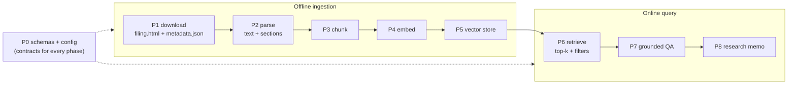

# RAG Implementation Notes

> **Living build journal.** One section per implemented phase explaining *what the
> mechanism does, how it works, and how the next phase uses it* — written right after
> each phase lands. Companion to [RAG_TODO.md](RAG_TODO.md) (the ordered checklist)
> and [rag_concepts.md](rag_concepts.md) (the theory). Updated as P3→P8 ship.
>
> **Status:** P0 ✅ · P1 ✅ · P2 ✅ · P3–P8 pending.

---

## Where each phase sits

The MVP is an **offline ingestion** path that fills a store, and an **online query**
path that reads it. Phases map onto that pipeline:



---

## P0 — Scaffolding and config

**Role.** The **interfaces-first foundation**. P0 ships *no behavior* — its only job is
to lock the typed data contracts and configuration that every later phase plugs into,
so P1–P8 build against stable shapes instead of inventing them mid-stream.

**Key files.**
- `schemas/documents.py` — `DocumentMetadata`, `Document`, `DocumentChunk` (and, added in
  P1, `FilingRef`).
- `schemas/retrieval.py` — `RetrievedChunk`, `EvidenceSet`.
- `settings.py` — RAG config block.
- empty `documents/`, `rag/`, `research/` packages; `.gitignore data/`.

**What the mechanism establishes (and why).**
- **The document contract.** A `Document` is full text + `DocumentMetadata` (provenance:
  ticker, type, source, url, `filing_date`, `document_id`, section, `ingested_at`). A
  `DocumentChunk` is one retrieval unit that **carries flat, denormalized metadata**
  (ticker / type / date / section copied onto every chunk). This denormalization is the
  load-bearing decision: the vector store (P5) filters on these scalar fields *at query
  time* without a join, and a citation is reconstructable from a chunk alone.
  `DocumentChunk.from_metadata(...)` keeps that copy consistent.
- **The grounding contract, defined before it's needed.** `EvidenceSet.allowed_chunk_ids()`
  and `is_empty` exist now because the **citation guard** (P7) and the
  *"Insufficient evidence found."* rule depend on them. Establishing the guard's allow-set
  this early stops P7 from drifting.
- **The leakage anchor.** `filing_date` is on every chunk from day one, so if filings ever
  feed a *model* later, point-in-time correctness is already enforceable (invariant #6).
- **Config knobs.** `embedding_provider` (local default), `embedding_model`,
  `rag_chunk_tokens`/`rag_chunk_overlap`/`rag_top_k`, and the `data/` paths — all read via
  `settings`, no hard-coding.

**How later phases use it.** Every phase imports these schemas; P2 emits `Document`, P3
emits `DocumentChunk`s, P5/P6 store and filter on the flat metadata, P7 checks answers
against `EvidenceSet.allowed_chunk_ids()`.

**Key decisions.** Interfaces first; **heavy deps deferred** to the phase that needs them
(`fastembed` → P4, `chromadb` → P5), so P0 stays dependency-free and CI stays fast.
**Carry-forward noted in P0 review:** normalize tickers to upper-case at the corpus
boundary (done in P1) so metadata filters match regardless of input casing.

---

## P1 — SEC document download

**Role.** Acquire raw filings (10-K / 10-Q / 8-K) into the local corpus via SEC's
**official EDGAR API** (not scraping), idempotently and offline-testably.

**Key files.**
- `providers/sec_edgar.py` — the EDGAR client + pure parsers.
- `providers/_http.py` — `HttpJson` gained custom **headers** + **`get_text`**.
- `schemas/documents.py` — `+= FilingRef`.
- `documents/ticker_cik.py`, `documents/download.py`, `documents/manifest.py`.
- CLI `documents download-sec`.

**What the mechanism does — three EDGAR endpoints.**
1. **ticker → CIK** (`company_tickers.json`). `_parse_cik_map` normalizes SEC's
   `{ "0": {cik_str, ticker, …}, … }` into `{TICKER → 10-digit CIK}`. Cached (changes
   rarely).
2. **filing list** (`data.sec.gov/submissions/CIK##########.json`). The index stores
   filings as **parallel arrays** (`form[i]`, `filingDate[i]`, `accessionNumber[i]`,
   `primaryDocument[i]`). `_parse_filings` zips them, keeps **exact** form matches (so
   `10-K/A` amendments are excluded when `10-K` is requested), skips malformed rows, sorts
   newest-first, caps to a limit → `FilingRef`s.
3. **filing document** (`www.sec.gov/Archives/edgar/data/{cik}/{accession}/{doc}`).
   `FilingRef.url` builds this path (CIK as a bare integer, accession with dashes stripped);
   `download_filing` fetches the HTML via `get_text`.

**Compliance + robustness baked in.**
- **`User-Agent`** (name + contact) from `settings.sec_user_agent` is set on every request —
  SEC fair-access requires it. `available()` reflects whether it's configured; a live call
  without it raises a clear error.
- **Throttle** ≤ 10 req/s (`_throttle`, monotonic-clock min-interval) — SEC's rate cap.
- **`DiskCache`** for the JSON indexes (free re-runs within TTL).

**Download orchestration (`download.py`).** For each `FilingRef`: write the primary document
to `data/raw/sec/{TICKER}/{FORM}/{filing_date}/filing.html` plus a `metadata.json` sidecar.
**Idempotent + safe:** a filing already on disk (or in the manifest) is **skipped** — raw is
**never overwritten** (so a local edit survives a re-run). A per-filing failure is recorded
and does **not** abort the rest. `manifest.py` is the queryable history keyed by
`document_id`.

**How P2 uses it.** P2 reads exactly what P1 writes: `filing.html` + `metadata.json` from a
filing directory.

**Key decisions.** Official API behind a provider (invariant #3); `SEC_USER_AGENT` is the
only secret and only for *live* downloads (tests use `httpx.MockTransport` fixtures);
ticker upper-cased at the boundary (the P0-review fix). `filings.recent` covers ~the latest
1,000 filings — enough for the MVP; deep history (sharded `filings.files`) is deferred.

---

## P2 — Parsing (HTML → text + sections)

**Role.** Turn a raw filing (`filing.html` + `metadata.json`) into **clean text split on
EDGAR section anchors**, so each section is a citeable retrieval unit. Pure + fail-soft.

**Key file.** `documents/parsers.py`.

**Mechanism 1 — `html_to_text` (HTML → readable text).**
1. Parse the HTML to a DOM with `lxml`.
2. **Depth-first walk** (`_walk`) reconstructs reading order. lxml stores text in two places —
   `element.text` (before the first child) and each child's `.tail` (after that child) — so
   the walk appends `el.text`, then for each child recurses **and** appends `child.tail`.
   - Drops `script`/`style`/`head`/`title` (noise).
   - Appends a newline after every **block** tag (`p`, `div`, `tr`, `table`, `h1–h6`, `li`, …)
     so each paragraph / row / header lands on its **own line** — this is what makes
     line-anchored section detection possible.
   - Comments/PIs (non-string `.tag`) are skipped; their tail is still captured by the parent.
3. **Normalize** (`_normalize`): collapse spaces/tabs/non-breaking-spaces to one space, strip
   each line, drop blanks.
   **Fail-soft:** empty → `""`; plain text (no `<`) → normalized as-is; unparseable HTML →
   regex tag-strip fallback (never raises). lxml decodes entities for free
   (`&nbsp;` → space, `&rsquo;` → ').

**Mechanism 2 — `detect_sections` (text → labeled sections).** Filings are organized by
standardized **Item** headers (`Item 1A. Risk Factors`, `Item 7. MD&A`, 8-K `Item 2.02.`).
The regex `_ITEM_RE` matches them at line start (`MULTILINE`) — covering both letter
(`1A`) and decimal (`2.02`) numbering. Section *i* = the text between header *i* and header
*i+1*; the label is the header line. Cover text before the first header → `Preamble`; no
headers found → one unlabeled section.

**Mechanism 3 — provenance + assembly.** `parse_metadata` loads the `metadata.json` sidecar
into a typed `DocumentMetadata` (extra keys like `accession_number` ignored). `load_filing`
ties it together → `ParsedFiling(metadata, text, sections)`, with `to_document()` for the
full-text view.

**Worked trace.**
```
<p>NVIDIA CORP&nbsp;Annual Report</p><script>…</script>
<div>Item 1A. Risk Factors</div><p>Our business faces&nbsp;risks…</p>
<div>Item 7. Management&rsquo;s Discussion…</div><p>Revenue grew…</p>
```
→ `html_to_text` (script gone, entities decoded, block newlines) →
```
NVIDIA CORP Annual Report
Item 1A. Risk Factors
Our business faces risks…
Item 7. Management’s Discussion…
Revenue grew…
```
→ `detect_sections`: `[Preamble]`, `[Item 1A. Risk Factors]`, `[Item 7. Management’s …]`.

**How P3 uses it.** P3 chunks **each `Section`** independently (never crossing a section
boundary), copying the metadata onto every `DocumentChunk`.

**Known limitation (deferred to P3).** A filing's table-of-contents *also* lists the Item
headers, so detection emits a few **short, header-only duplicate sections**. P2 leaves them
in by design; **P3 dedup** drops sections that are essentially a header with no body.

**Key decisions.** Pure, deterministic, fail-soft → fully unit-testable offline (no network).
Tables are flattened to text (fine for prose-heavy Risk Factors / MD&A). `lxml.*` added to
the mypy `ignore_missing_imports` override.

---

## P3–P8 — pending

Appended as each lands: **P3** chunking · **P4** embeddings · **P5** vector store ·
**P6** retrieval · **P7** grounded QA · **P8** research memo.
