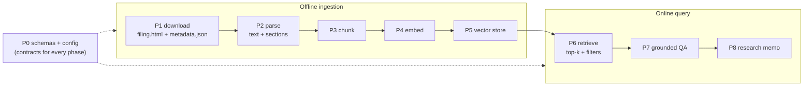

# RAG Implementation Notes

> **Living build journal.** One section per implemented phase explaining *what the
> mechanism does, how it works, and how the next phase uses it* — written right after
> each phase lands. Companion to [RAG_TODO.md](RAG_TODO.md) (the ordered checklist)
> and [rag_concepts.md](rag_concepts.md) (the theory). Updated as each phase ships.
>
> **Status:** P0–P8 ✅ (MVP) · P8.5 ✅ (chat agent) · P9a–P9e ✅ (go-live: spend guard · A/B →
> voyage-4 · namespacing + production embed · bulk download · quarterly refresh) — **RAG layer complete**.

---

## Where each phase sits

The MVP is an **offline ingestion** path that fills a store, and an **online query**
path that reads it. Phases map onto that pipeline:



---

## P0 — Scaffolding and config

**Role.** The **interfaces-first foundation**. P0 ships *no behavior* — its only job is
to lock the typed data contracts and configuration that every later phase plugs into,
so P1–P8 build against stable shapes instead of inventing them mid-stream.

**Key files.**
- `schemas/documents.py` — `DocumentMetadata`, `Document`, `DocumentChunk` (and, added in
  P1, `FilingRef`).
- `schemas/retrieval.py` — `RetrievedChunk`, `EvidenceSet`.
- `settings.py` — RAG config block.
- empty `documents/`, `rag/`, `research/` packages; `.gitignore data/`.

**What the mechanism establishes (and why).**
- **The document contract.** A `Document` is full text + `DocumentMetadata` (provenance:
  ticker, type, source, url, `filing_date`, `document_id`, section, `ingested_at`). A
  `DocumentChunk` is one retrieval unit that **carries flat, denormalized metadata**
  (ticker / type / date / section copied onto every chunk). This denormalization is the
  load-bearing decision: the vector store (P5) filters on these scalar fields *at query
  time* without a join, and a citation is reconstructable from a chunk alone.
  `DocumentChunk.from_metadata(...)` keeps that copy consistent.
- **The grounding contract, defined before it's needed.** `EvidenceSet.allowed_chunk_ids()`
  and `is_empty` exist now because the **citation guard** (P7) and the
  *"Insufficient evidence found."* rule depend on them. Establishing the guard's allow-set
  this early stops P7 from drifting.
- **The leakage anchor.** `filing_date` is on every chunk from day one, so if filings ever
  feed a *model* later, point-in-time correctness is already enforceable (invariant #6).
- **Config knobs.** `embedding_provider` (local default), `embedding_model`,
  `rag_chunk_tokens`/`rag_chunk_overlap`/`rag_top_k`, and the `data/` paths — all read via
  `settings`, no hard-coding.

**How later phases use it.** Every phase imports these schemas; P2 emits `Document`, P3
emits `DocumentChunk`s, P5/P6 store and filter on the flat metadata, P7 checks answers
against `EvidenceSet.allowed_chunk_ids()`.

**Key decisions.** Interfaces first; **heavy deps deferred** to the phase that needs them
(`fastembed` → P4, `chromadb` → P5), so P0 stays dependency-free and CI stays fast.
**Carry-forward noted in P0 review:** normalize tickers to upper-case at the corpus
boundary (done in P1) so metadata filters match regardless of input casing.

---

## P1 — SEC document download

**Role.** Acquire raw filings (10-K / 10-Q / 8-K) into the local corpus via SEC's
**official EDGAR API** (not scraping), idempotently and offline-testably.

**Key files.**
- `providers/sec_edgar.py` — the EDGAR client + pure parsers.
- `providers/_http.py` — `HttpJson` gained custom **headers** + **`get_text`**.
- `schemas/documents.py` — `+= FilingRef`.
- `documents/ticker_cik.py`, `documents/download.py`, `documents/manifest.py`.
- CLI `documents download-sec`.

**What the mechanism does — three EDGAR endpoints.**
1. **ticker → CIK** (`company_tickers.json`). `_parse_cik_map` normalizes SEC's
   `{ "0": {cik_str, ticker, …}, … }` into `{TICKER → 10-digit CIK}`. Cached (changes
   rarely).
2. **filing list** (`data.sec.gov/submissions/CIK##########.json`). The index stores
   filings as **parallel arrays** (`form[i]`, `filingDate[i]`, `accessionNumber[i]`,
   `primaryDocument[i]`). `_parse_filings` zips them, keeps **exact** form matches (so
   `10-K/A` amendments are excluded when `10-K` is requested), skips malformed rows, sorts
   newest-first, caps to a limit → `FilingRef`s.
3. **filing document** (`www.sec.gov/Archives/edgar/data/{cik}/{accession}/{doc}`).
   `FilingRef.url` builds this path (CIK as a bare integer, accession with dashes stripped);
   `download_filing` fetches the HTML via `get_text`.

**Compliance + robustness baked in.**
- **`User-Agent`** (name + contact) from `settings.sec_user_agent` is set on every request —
  SEC fair-access requires it. `available()` reflects whether it's configured; a live call
  without it raises a clear error.
- **Throttle** ≤ 10 req/s (`_throttle`, monotonic-clock min-interval) — SEC's rate cap.
- **`DiskCache`** for the JSON indexes (free re-runs within TTL).

**Download orchestration (`download.py`).** For each `FilingRef`: write the primary document
to `data/raw/sec/{TICKER}/{FORM}/{filing_date}/filing.html` plus a `metadata.json` sidecar.
**Idempotent + safe:** a filing already on disk (or in the manifest) is **skipped** — raw is
**never overwritten** (so a local edit survives a re-run). A per-filing failure is recorded
and does **not** abort the rest. `manifest.py` is the queryable history keyed by
`document_id`.

**How P2 uses it.** P2 reads exactly what P1 writes: `filing.html` + `metadata.json` from a
filing directory.

**Key decisions.** Official API behind a provider (invariant #3); `SEC_USER_AGENT` is the
only secret and only for *live* downloads (tests use `httpx.MockTransport` fixtures);
ticker upper-cased at the boundary (the P0-review fix). `filings.recent` covers ~the latest
1,000 filings — enough for the MVP; deep history (sharded `filings.files`) is deferred.

---

## P2 — Parsing (HTML → text + sections)

**Role.** Turn a raw filing (`filing.html` + `metadata.json`) into **clean text split on
EDGAR section anchors**, so each section is a citeable retrieval unit. Pure + fail-soft.

**Key file.** `documents/parsers.py`.

**Mechanism 1 — `html_to_text` (HTML → readable text).**
1. Parse the HTML to a DOM with `lxml`.
2. **Depth-first walk** (`_walk`) reconstructs reading order. lxml stores text in two places —
   `element.text` (before the first child) and each child's `.tail` (after that child) — so
   the walk appends `el.text`, then for each child recurses **and** appends `child.tail`.
   - Drops `script`/`style`/`head`/`title` (noise).
   - Appends a newline after every **block** tag (`p`, `div`, `tr`, `table`, `h1–h6`, `li`, …)
     so each paragraph / row / header lands on its **own line** — this is what makes
     line-anchored section detection possible.
   - Comments/PIs (non-string `.tag`) are skipped; their tail is still captured by the parent.
3. **Normalize** (`_normalize`): collapse spaces/tabs/non-breaking-spaces to one space, strip
   each line, drop blanks.
   **Fail-soft:** empty → `""`; plain text (no `<`) → normalized as-is; unparseable HTML →
   regex tag-strip fallback (never raises). lxml decodes entities for free
   (`&nbsp;` → space, `&rsquo;` → ').
   - **Inline-XBRL handling (real-filing fix).** All modern filings are iXBRL XHTML with an XML
     declaration; `lxml.html.fromstring` rejects a *str* carrying an encoding declaration, so we
     **strip the leading `<?xml …?>`** before parsing — otherwise it raised and we fell into the
     dumb regex fallback (one giant line, no sections, XBRL junk leaked). We also **skip the
     `ix:hidden`/`ix:header`/… metadata** (non-displayed facts) while keeping the visible
     `ix:nonFraction`/`ix:nonNumeric` facts. Found by validating against real NVDA/AVGO/TSLA
     10-Ks (synthetic fixtures missed it); after the fix each real 10-K parses into ~47 sections
     incl. Item 1A / Item 7. Regression-tested with a synthetic iXBRL fixture (offline).

**Mechanism 2 — `detect_sections` (text → labeled sections).** Filings are organized by
standardized **Item** headers (`Item 1A. Risk Factors`, `Item 7. MD&A`, 8-K `Item 2.02.`).
The regex `_ITEM_RE` matches them at line start (`MULTILINE`) — covering both letter
(`1A`) and decimal (`2.02`) numbering. Section *i* = the text between header *i* and header
*i+1*; the label is the header line. Cover text before the first header → `Preamble`; no
headers found → one unlabeled section.

**Mechanism 3 — provenance + assembly.** `parse_metadata` loads the `metadata.json` sidecar
into a typed `DocumentMetadata` (extra keys like `accession_number` ignored). `load_filing`
ties it together → `ParsedFiling(metadata, text, sections)`, with `to_document()` for the
full-text view.

**Worked trace.**
```
<p>NVIDIA CORP&nbsp;Annual Report</p><script>…</script>
<div>Item 1A. Risk Factors</div><p>Our business faces&nbsp;risks…</p>
<div>Item 7. Management&rsquo;s Discussion…</div><p>Revenue grew…</p>
```
→ `html_to_text` (script gone, entities decoded, block newlines) →
```
NVIDIA CORP Annual Report
Item 1A. Risk Factors
Our business faces risks…
Item 7. Management’s Discussion…
Revenue grew…
```
→ `detect_sections`: `[Preamble]`, `[Item 1A. Risk Factors]`, `[Item 7. Management’s …]`.

**How P3 uses it.** P3 chunks **each `Section`** independently (never crossing a section
boundary), copying the metadata onto every `DocumentChunk`.

**Known limitation (deferred to P3).** A filing's table-of-contents *also* lists the Item
headers, so detection emits a few **short, header-only duplicate sections**. P2 leaves them
in by design; **P3 dedup** drops sections that are essentially a header with no body.

**Key decisions.** Pure, deterministic, fail-soft → fully unit-testable offline (no network).
Tables are flattened to text (fine for prose-heavy Risk Factors / MD&A). `lxml.*` added to
the mypy `ignore_missing_imports` override.

---

## P3 — Section-aware chunking

**Role.** Turn each parsed `Section` (from P2) into **retrieval-sized `DocumentChunk`s** —
the units that get embedded (P4), stored (P5), and retrieved (P6). Pure + deterministic.

**Key file.** `rag/chunking.py` (`chunk_sections`, `chunk_filing`).

**Why chunk at all.** One vector can't faithfully represent a 100-page 10-K, and you want
to retrieve + cite the *specific* passage. Chunk size trades two errors: too big → the
embedding is a blurred average (low precision, wasted tokens); too small → the chunk loses
the context needed to be self-explanatory. The MVP targets a few-hundred-word window with
overlap (see [rag_concepts.md](rag_concepts.md) §4.6).

**What the mechanism does.**
- **Token budget without a tokenizer.** To stay dependency-free (a real tokenizer is a P4
  concern), the token budget is converted to a **word** budget via a proxy:
  `target_words = round(chunk_tokens × 0.75)` (≈ 1 English token ≈ 0.75 words). The default
  900 tokens ≈ ~675 words. `_target_words` is the single swap-point if we later want exact
  tokenization.
- **Sliding word-window, per section.** Each section's text is split into words and walked
  with a fixed window of `target_words` advancing by `step = target − overlap_words`
  (`_windows`). So **every non-final window is exactly `target` words** (no giant chunks),
  **consecutive chunks share exactly `overlap_words`** (a fact straddling a boundary survives
  in both), and the windowing is bounded *within one section* → **chunks never cross a
  section boundary** (Risk Factors and MD&A never bleed together).
- **Dedup / no-tiny (folds in P2's deferred work).** A section whose body has
  `< min_chunk_words` (15) words is dropped — this removes P2's header-only table-of-contents
  duplicates (`Item 1A.` ≈ 2 words) and trivial cover lines, and guarantees no degenerately
  tiny chunk. A section shorter than `target` but above the floor becomes one clean chunk.
- **TOC-stub dedup (real-corpus refinement).** Some table-of-contents lines survive the 15-word
  floor: the TOC renders the item number and title in separate cells, so a stub like
  `Item 5.\nMarket for Registrant's Common Equity…\n33` (title + page number, ~17 words) slips
  through. These are exactly the sections whose **label is a *bare* item header** (no title) —
  `parsers.is_bare_item_header`. But 8-K *content* items render bare-header too (the number on
  its own line) and are real, so the rule needs a body guard: drop only when **bare header AND
  body < `toc_stub_max_words` (25)**. The live corpus shows a clean empty gap — TOC stubs ≤ 17
  words, the shortest real bare-header section (an 8-K incorporation-by-reference) 38 words — so
  25 separates them with zero false drops (validated: 21 stubs removed across 149 filings, every
  real section kept).
- **Metadata carry-through.** Each window becomes a `DocumentChunk` via
  `DocumentChunk.from_metadata(...)`, copying the filing's flat metadata (ticker / type /
  date / source / url) onto the chunk and stamping the section label. `chunk_index` is a
  **document-global running counter**, so `chunk_id = document_id:index` is unique across the
  whole filing — the key the vector store dedupes/updates on.

**Worked sizing example.** With `chunk_tokens=200, overlap=0.2` → `target=150`, `overlap=30`,
`step=120`. A 400-word section yields windows `[0:150]`, `[120:270]`, `[240:390]`, `[360:400]`
— each ≤ 150 words, adjacent pairs sharing their 30 boundary words, together covering w0…w399
with no gaps.

**How P4/P5 use it.** P4 embeds each chunk's `.text`; P5 stores the vector keyed by
`chunk_id` with the flat metadata as filter fields; P6 retrieves + filters on them.

**Key decisions.** Pure/deterministic → fully offline-tested (12 tests: size bounds, exact
overlap, complete coverage, boundary preservation, dedup, metadata/`chunk_id` integrity,
determinism, `overlap=0`, edges). Chunk **text stays clean** (just the section's words); the
section label lives in metadata — P4 can optionally *prepend* it to the embedding input for
extra topical context without changing stored text. The word-proxy and `min_chunk_words`
floor are the two heuristics most worth revisiting once we see real filings.

---

## P4 — Embeddings

**Role.** Turn chunk/query **text into dense vectors** so "relevance" becomes "closeness"
(see [rag_concepts.md](rag_concepts.md) §4.1–4.3). This is the first phase with a real
external model; everything downstream (store, retrieve) operates on these vectors.

**Key file.** `rag/embeddings.py`.

**The Protocol (one seam, swappable backends).** `Embedder` declares `name`, `dim`,
`embed_documents(texts) → list[list[float]]`, `embed_query(text) → list[float]`. Document
vs query is split because retrieval models (BGE/E5) prepend a **query instruction** for
search — so the *same* model embeds passages and queries differently. Three implementations
sit behind it:
- **`FastEmbedEmbedder`** (default) — local `BAAI/bge-small-en-v1.5` (384-d) via `fastembed`,
  which runs **onnxruntime, not torch** (so it can't trigger the macOS torch+lightgbm OpenMP
  segfault). `embed_query` routes through fastembed's `query_embed` (the BGE prefix) when
  present. The model **loads lazily on first `embed`**, so constructing it is free.
- **`OpenAIEmbedder`** (opt-in) — `text-embedding-3-small` (1536-d). Checks the API key
  *before* importing `openai` so a missing key gives the clear settings error; `dim` comes
  from a known-dims table (no model load).
- **`VoyageEmbedder`** (opt-in) — default `voyage-4` (1024-d), Anthropic's recommended
  provider (200M-token free pool); `voyage-finance-2` is the finance-tuned A/B alternative.
  Uses Voyage's asymmetric `input_type` (`"document"` vs `"query"`); separate
  `VOYAGE_API_KEY`, independent billing.
- **`FakeEmbedder`** — deterministic, dependency-free: hashes text to a fixed-dim **unit
  vector** (so dot product = cosine). Same text → same vector. It lives in the module (not the
  tests) because P5/P6 reuse it as their embedder double, mirroring `providers/fake.py`.

`build_embedder(settings)` selects local / OpenAI / Voyage by `settings.embedding_provider` —
and because every backend is lazy, the selector neither loads a model nor builds a client.

**Cost/CI discipline baked in.** Documents are embedded **once at ingestion**; a search
embeds only the one query string (§3.1). The heavy backends are **extras**, not core deps —
`[rag]` (fastembed) and `[openai]` — so CI's `.[dev]` install never pulls them and the
suite never downloads a model: tests run on `FakeEmbedder` + an injected fake OpenAI client.
The real BGE model is exercised only by a test gated behind `RUN_EMBED_TESTS`
(`importorskip("fastembed")`), skipped in CI. `fastembed.*`/`openai.*` are in the mypy
ignore-missing-imports override so type-checking passes without the extras installed.

**How P5/P6 use it.** P5 stores `embed_documents(chunk_texts)` vectors keyed by `chunk_id`
with the chunk's flat metadata; P6 calls `embed_query(question)` and does the nearest-neighbor
lookup. `dim` lets the store size its collection.

**Key decisions.** One Protocol → provider swap is a one-line config change with zero impact
on chunking/store/retrieval code. Extras (not core) keep base install + CI light, consistent
with the repo's `[sequence]`/`[gdelt]` pattern — the real app installs `.[rag]`. The
local↔OpenAI quality gap is negligible for SEC retrieval (§ cost analysis), so local is the
honest default.

---

## P5 — Vector store

**Role.** Persist chunk **vectors + flat metadata** and serve **metadata-filtered cosine
top-k**. This is a pure storage + nearest-neighbour layer: it takes *pre-computed* vectors
(the `Embedder` runs in P6's pipeline, not here), does no LLM work, and is embedder-agnostic.

**Key files.** `src/stock_agent/rag/vector_store.py`; `ChunkFilter` added to
`schemas/retrieval.py`; tests `tests/unit/test_vector_store.py`.

**How it works (step by step).**
1. **`ChunkFilter`** (schema) — a metadata predicate: `ticker / document_types / sections /
   date_from / date_to`, AND-combined, with `.matches(chunk)` (used by in-Python backends) and
   `.is_empty`. Shared by the store (P5) and the retriever (P6) so "scope the search" has one
   definition. Filter is applied **before** ranking (filter → top-k).
2. **`VectorStore` Protocol** — `add(chunks, vectors)` (1:1, upsert by `chunk_id`),
   `query(query_vector, *, top_k, where) -> list[RetrievedChunk]`, `count()`.
3. **`InMemoryVectorStore`** — pure-Python: holds chunks/vectors in dicts keyed by `chunk_id`
   (re-add = upsert), ranks by `_cosine` (robust to non-unit vectors), filters via
   `where.matches`. Dependency-free, so **CI exercises the full filter/ranking contract here**;
   also a chromadb-free fallback and the backend P6 tests use.
4. **`ChromaVectorStore`** — persistent local Chroma. `chromadb` is **imported lazily** (it is
   the `[rag]` extra, absent in CI). The collection is created with `hnsw:space="cosine"`, and
   `add` **upserts** by `chunk_id` (so re-ingesting a filing replaces, never duplicates —
   matches the idempotent download/ingest philosophy). Flat metadata is written per chunk;
   `filing_date` is stored both as an ISO string (citation) and a `YYYYMMDD` int
   (`filing_date_ord`) so date ranges use Chroma's numeric `$gte`/`$lte`; `section` is omitted
   when `None` (Chroma rejects null values). `_to_chroma_where` translates a `ChunkFilter` into
   a Chroma `where` clause (single condition, or `$and` of several).
5. **Distance → similarity (the P0 carry-forward).** Chroma's cosine space returns a cosine
   *distance* (lower = closer); we expose **similarity** as `score = 1 − distance`. Because our
   embedders emit unit-norm vectors, that is exactly cosine similarity — so `RetrievedChunk.score`
   is consistent ("higher = closer") across both backends. The gated Chroma test asserts Chroma's
   scores ≈ `InMemoryVectorStore`'s direct cosine (`abs_tol=1e-4`).

**How P6 uses it.** The pipeline embeds chunks once (`embedder.embed_documents`) and calls
`store.add(chunks, vectors)` at ingestion; per query it embeds the question
(`embedder.embed_query`) and calls `store.query(qv, top_k=settings.rag_top_k, where=...)`,
wraps the hits in an `EvidenceSet`, and (P7) hands that — and only that — to the synthesis LLM.

**Key decisions.** Store takes pre-computed vectors (keeps the store embedder-agnostic and
trivially testable with `FakeEmbedder`). Two backends behind one Protocol so CI stays offline
(InMemory) while production persists (Chroma) — same pattern as `FakeEmbedder`/`FastEmbedEmbedder`.
Cosine space (not L2) makes the distance→similarity conversion a clean `1 − d`. **Validated on
the real corpus**: 201 NVDA+AVGO 10-K chunks ingested with the real BGE embedder — persistence
held across a reopen, and `ticker`/`form`/`section` filters returned exactly the right chunks.

## P6 — Retrieval + ingest pipeline

**Role.** The two paths that *use* everything built so far. **Ingest** (write): downloaded
filings → chunks → vectors → store. **Retrieve** (read): question → vector → filtered cosine
top-k → deduped `EvidenceSet`. Still NO LLM — P6 decides *which* chunks become grounding; P7
turns them into a cited answer.

**Key files.** `src/stock_agent/rag/pipeline.py` (ingest), `src/stock_agent/rag/retriever.py`
(retrieve); CLI `documents ingest` + `rag query` in `cli/app.py`; tests
`tests/unit/test_rag_pipeline.py`, `tests/unit/test_retriever.py`.

**Ingest — `pipeline.ingest_ticker` (step by step).**
1. `iter_filing_dirs(documents_dir, ticker)` walks `sec/{TICKER}/**/filing.html` (the P1 layout).
2. Each dir → `load_filing` (P2) → `chunk_filing` (P3, with the configured `chunk_tokens`/
   `chunk_overlap`). All of the ticker's chunks are collected.
3. **One batch** `embedder.embed_documents([c.text …])` (P4) → vectors, then a single
   `store.add(chunks, vectors)` (P5). Because the store **upserts by `chunk_id`**, re-ingesting
   the same corpus is a no-op on count — ingestion is idempotent (matches the idempotent
   download). Returns `IngestResult(ticker, filings, chunks)`.

**Retrieve — `retriever.Retriever.retrieve` (step by step).**
1. `embed_query(query)` → `q` (same model as the chunks; BGE adds its query-instruction prefix).
2. `store.query(q, top_k = top_k × over_fetch, where)` — filtered cosine top-k, **over-fetched
   ×4** so the next step has slack.
3. **`_dedup_by_text`** — drop chunks with identical normalized text, keeping the highest-scored.
   SEC filings repeat boilerplate verbatim across years (and adjacent chunks overlap), so without
   this the same passage could occupy several of the few evidence slots.
4. Truncate to `top_k`, wrap as `EvidenceSet(query, chunks)`. Empty store / no match →
   `EvidenceSet.is_empty` (P7 must then refuse, not invent).

**CLI.** `documents ingest --ticker NVDA [--all]` builds the embedder + store from settings and
ingests; `rag query --ticker NVDA --question "…"` retrieves and prints citations + scores +
excerpts (no LLM — `--answer` synthesis arrives in P7). Both are thin wiring over the functions
above.

**Key decisions.** Embedder + store are **injected** (CLI builds from settings; tests pass
`FakeEmbedder` + `InMemoryVectorStore`) — the whole read/write path is exercised in CI with no
model or chromadb. Dedup is by **exact normalized text** (not by document or near-duplicate),
so it removes only true repeats and never merges genuinely distinct overlapping chunks.
**Validated end-to-end on the real corpus**: NVDA+AVGO ingested to 2062 chunks; a query embedded
to a 384-d unit vector retrieved the correct MD&A/Risk-Factor chunks, and the store-reported
score matched a hand-computed `q·d` to 6 decimals — confirming `embed → ANN(cosine) →
1 − distance` is exactly cosine similarity through the real Chroma store.

## P7 — Grounded question answering

**Role.** The first (and only) paid LLM call in the RAG read path: one call turns a question +
the retrieved `EvidenceSet` (P6) into a **cited** `GroundedAnswer`. This is where the
numbers-vs-narrative + non-hallucination invariants are enforced — the model may *summarize and
cite* the filings, never invent facts, figures, or sources.

**Key files.** `research/synthesis.py` (the call + guards), `research/prompts.py` (versioned
`research.v1`), `schemas/research.py` (`GroundedAnswer`, `SourceCitation`); CLI `rag query
--answer`; tests `tests/unit/test_research_synthesis.py`.

**How it works (step by step).**
1. **Empty short-circuit.** `evidence.is_empty` → return "Insufficient evidence found."
   (`insufficient_evidence=True`) with **no LLM call** — honest refusal + don't pay to answer
   from nothing.
2. **Seed the number-grounding set** from the source chunk texts (`NumberGrounding.add_from`),
   so the only figures the answer may state are ones written in the filings.
3. **One LLM call.** `build_user` numbers the evidence `[1..N]` (each = citation label + chunk
   text); the prompt requires answering ONLY from those sources, citing inline `[n]`, inventing
   no numbers, and setting `insufficient_evidence` if the sources don't cover the question. The
   model returns a JSON object (`answer`, `citations`, `insufficient_evidence`), parsed leniently.
4. **Citation guard.** Collect every cited marker — inline `[n]` in the answer text *and* the
   `citations` list — and reject any outside `[1..N]` (a fabricated source). This is the
   "cited ⊆ retrieved" invariant.
5. **Number guard.** `grounding.ungrounded(answer)` flags any percentage/decimal not traceable to
   a source (bare integers like years/counts are intentionally ignored).
6. **One retry, then raise.** If either guard fires, append a corrective note naming exactly what
   was wrong and call once more; if it still fails, raise `ResearchGuardError` rather than emit an
   ungrounded answer. On success, resolve each marker → `SourceCitation(marker, chunk_id, label)`.

**Key decisions.** Prompt lives in `research/` (not `rag/prompts.py` as the TODO sketched) so
`rag/` stays LLM-free per its invariant, and it sits beside the call it serves (mirrors
`llm/prompts/synthesis.py` ↔ `llm/synthesizer.py`). Citations are **numbered markers** resolved
back to real `chunk_id`s — the answer can only point at chunks that were actually retrieved, which
is what makes every claim auditable. Reused `NumberGrounding` (built for the forecast synthesizer)
rather than a second number checker. The whole path is tested with a canned `TextLLM` — CI makes
no API call; the real call is exercised only via `rag query --answer`.

## P8 — Integrated research memo

**Role.** The capstone: one memo per ticker that fuses the QUANTITATIVE models (technicals +
forecast) with the QUALITATIVE narrative (news + SEC filings), in a single grounded synthesis
call. Numbers come from the modules; every filing-derived claim is cited; there is no
recommendation field (the non-advisory invariant).

**Key files.** `research/memo.py` (`build_memo` + `render_memo_markdown`), `pipelines/research.py`
(`run_research`), `schemas/research.py` (`ResearchMemo`), prompt `memo.v1` in `research/prompts.py`,
CLI `research --ticker`; tests `tests/unit/test_memo.py`.

**How it works (step by step).**
1. **Gather (`run_research`, orchestration).** Reuse the existing blocks: `PriceLoader` →
   `compute_snapshot` (technicals) → `HistoricalSimulation` baseline forecasts; `NewsFetcher` +
   `summarize_news` (optional). **New:** SEC evidence via three *targeted* retrievals (risk
   factors / business drivers / MD&A), combined by **`_round_robin_merge`** — it interleaves the
   three result lists (next-best unseen chunk from each in turn), deduping by `chunk_id`, up to a
   cap of 10. This **guarantees per-section coverage**: a plain global score-cap let Risk-Factors
   chunks (which score highest across *every* query) crowd out the others, so the Business-Drivers
   and Management-Commentary sections ended up grounded in the wrong filing section — the
   round-robin fixes that (post-P8 review fix). The memo *is* the synthesis, so an LLM is required
   (unlike `analyze`, which degrades); a failed/guard-rejected memo is wrapped as a
   `ResearchPipelineError` (clean CLI message, not a traceback).
2. **Deterministic quant sections.** `build_memo` copies `snapshot.numeric_indicators()` and the
   `ScenarioForecast`s **verbatim** into the memo — the LLM never emits these numbers.
3. **Seed the number-grounding set** from the forecast + snapshot + news + SEC source texts (the
   only figures the narrative may state).
4. **One synthesis call.** `build_memo_user` renders the quant signal lines + news themes +
   numbered SEC sources; `memo.v1` asks for the narrative sections as JSON, citing SEC claims
   inline `[n]`, inventing no numbers, giving no recommendation.
5. **Guards (shared with P7).** Citation guard (every `[n]` inline + listed ⊆ retrieved sources)
   and number grounding (`NumberGrounding.ungrounded` over all narrative text). One corrective
   retry, then `MemoGuardError`. Markers resolve to `SourceCitation`s.
6. **Render.** `render_memo_markdown` lays out Executive Summary → Technical Indicators →
   Probability Scenarios → Recent News → Business Drivers → Risk Factors → Bullish/Bearish
   Evidence → Uncertainty Notes → Management Commentary → Source Citations, with the
   not-financial-advice header.

**Key decisions.** Quant sections are code-rendered, not LLM-written, so the numbers-vs-narrative
invariant holds structurally. The SEC evidence uses *multiple targeted* retrievals (not one
composite query) merged round-robin for balanced per-section coverage. The shared synthesis
helpers (`loads_lenient`, `markers_in_text`, `correction`) live in `research/_shared.py` — used by
both P7 (`synthesis.py`) and P8 (`memo.py`) — and `NumberGrounding` is reused rather than
reimplemented. **Known limitation:** the number-grounding guard is seeded from ~10 full SEC chunks,
so it is *recall-favoring* — it reliably blocks a figure absent from all inputs, but can miss a
fabricated number that coincidentally matches an unrelated value in the sources. The load-bearing
numbers (technicals, scenarios) are exact, code-rendered, and never pass through the LLM, so this
limitation affects only incidental figures the model might cite in prose. Tested end-to-end with a
canned `TextLLM`; the two real LLM calls (news summary + memo) run only via `research --ticker`.

---

**MVP complete (P0–P8).** Full path: `documents download-sec` → `documents ingest` →
`rag query [--answer]` / `research --ticker` → cited, auditable SEC-grounded output. Post-MVP work
(switch to voyage-4, bulk download, scheduling, spend guard, retrieval A/B) is tracked in
[RAG_TODO.md](RAG_TODO.md) → P9.

---

## P8.5 — Wire RAG into the chat agent

**Role.** P0–P8 made SEC-grounded QA + the integrated memo reachable **only via the CLI**. P8.5
exposes them to the chat agent (`agent/`, the Streamlit chat) as **two tools** so a conversational
"what are NVDA's risk factors?" actually searches the embedded filings, and "give me the full
picture on NVDA" returns the integrated memo — both cited and guarded. The locked decision: expose
the **guarded synthesis**, not raw retrieval — each tool makes its own guarded LLM call(s) and
returns *cited, validated* output (the `summarize_news` pattern), so P7's citation guard + number
grounding (and P8's, for the summary) stay intact rather than handing raw chunks to the agent.

**Key files.** `agent/tools.py` (`search_filings` + `research_summary` schemas, `_tool_search_filings`,
`_tool_research_summary`, the memoized `_get_retriever`), `agent/prompts/agent.py` (`agent.v16`
routing), `pipelines/research.py` (`run_research` gained a `retriever=` passthrough),
`ui/chat_app.py` (`_render_sources` "Filing sources" expander); tests
`tests/integration/test_agent_rag_tools.py` (+9) and the version/registration assertion in
`test_agent_runtime.py`.

**How it works (step by step).**
1. **Memoized retriever.** `ToolExecutor._get_retriever()` lazily builds **one**
   `Retriever(build_embedder, build_vector_store)` per session and caches it on `self._retriever`
   (mirrors `_backtest_cache`), so repeated filing questions / the summary don't reload the
   embedding model or re-open the store. Tests inject a fake by setting `executor._retriever`.
2. **`search_filings(ticker, question, top_k?)`** → `_tool_search_filings`: no-LLM guard
   (`self._llm is None → {"error": …}`, like `summarize_news`); `_get_retriever().retrieve(question,
   top_k, where=ChunkFilter(ticker=...))`; **empty retrieval** → relay P7's
   "Insufficient evidence found." + `insufficient_evidence=True` + a **hint** to
   `documents download-sec`/`ingest` the ticker (the tool **never** ingests on the fly — parse+chunk+
   embed ~1k chunks is too slow for a chat turn; auto-ingest is P9). Otherwise the single guarded
   `answer_question(question, evidence, llm=self._llm)` (P7) → compact `{answer,
   insufficient_evidence, n_sources, citations:[{marker,label,chunk_id}]}`. `ResearchGuardError` /
   `LLMError` are caught → `{"error": …}` (the dispatch only catches `ProviderError/ValueError/KeyError`).
3. **`research_summary(ticker, days?)`** → `_tool_research_summary`: no-LLM guard; calls **P8's**
   `run_research(ticker, …, llm=self._llm, retriever=self._get_retriever())` under
   `_run_with_timeout(120s)` (heaviest tool — forecast + retrieval + a news-summary call + the memo
   synthesis ≈ 2 LLM calls). `ResearchPipelineError` (a `RuntimeError`, outside the dispatch tuple)
   is caught **inside the handler** → `{"error": …}`. Returns a **compact** dict (NOT the full
   Markdown — too long for a tool result): `executive_summary`, the section lists
   (drivers/risks/bull/bear/uncertainty/recent_news), `forecasts` headline rows
   (`model`/`horizon_days`/`prob_up`/`expected_return`/`var_95`), `technical_indicators`, and
   resolved `citations`. `run_research` now accepts an optional `retriever` so the agent's session
   retriever is reused instead of rebuilding the embedder.
4. **Routing (`agent.v16`).** Added patterns: a *specific filing question* (risk factors, business,
   MD&A, management commentary, accounting, legal) → `search_filings`, with "relay the [n] citations,
   never answer a filing question from general knowledge, surface the insufficient-evidence hint";
   an *explicit full-picture / "executive summary" / "overview of TICKER"* → `research_summary` (the
   expensive path, reserved for explicit requests). The existing manual "executive summary"
   composition is kept as the fallback (no filings ingested, or `research_summary` errors).
5. **Guards / grounding stay automatic.** Both tools' numbers + citations are already guarded
   (P7/P8), and the agent runtime seeds its numeric-grounding set from each tool result
   (`grounding.add_from(result)`), so a relayed SEC figure (e.g. "41%") or model figure (e.g. P(up)
   "76%") grounds from the tool output — no new guard needed. Non-advisory is preserved (neither tool
   recommends). Dependency direction stays downward: `agent/ → pipelines/research → research/ → rag/`.
6. **UI.** `_sources_from_tool_results` collects citations from the RAG tool *outputs* (not the LLM,
   so it can't introduce a fabricated source), deduped by `(marker, label)`; `_render_sources` shows
   them in a "📑 Filing sources" expander. Persisted on the message (`sources`) and round-tripped
   through the thread store so they survive reruns/restarts alongside charts.

**Key decisions.** (a) Guarded synthesis over raw retrieval — keeps the citation/number guards at the
boundary. (b) No on-the-fly ingest in a chat turn (latency); prerequisite is `documents
download-sec` + `documents ingest` for the ticker. (c) One session-memoized retriever shared by both
tools and threaded into `run_research`, so the embedder loads at most once per chat session.
(d) `research_summary` returns a compact dict, not the Markdown memo, to keep the tool-result token
cost bounded. **Tested** offline with a fake `Retriever` (FakeEmbedder + InMemoryVectorStore) + canned
`TextLLM`, and `run_research` monkeypatched for the summary path — no model download, no live LLM.

**MVP + chat integration complete (P0–P8.5).** Next: P9 (voyage-4 embeddings, bulk download,
quarterly refresh, spend guard, retrieval A/B) and watchlist auto-ingest.

---

## P9a — Embedding spend guard

**Role.** A client-side hard ceiling on the embedding tokens any single ingest run may consume,
enforced **before** the embedder is called — so an over-budget run incurs *zero* provider spend.
It is independent of (and complementary to) the provider's own dashboard limits. P9a is sequenced
**first** in P9 because the paid embed-once switch to `voyage-4` (P9c) embeds the whole corpus
against a finite 200M-token free pool; without this guard a misconfigured re-embed could silently
burn it. Default behaviour is unchanged (local `fastembed` is free → ceiling `None` = unlimited).

**Key files / mechanism (step-by-step).**
1. `rag/chunking.py` `estimate_tokens(texts)` — the words↔tokens proxy lived only inside the
   chunker (`_target_words` uses `_WORDS_PER_TOKEN = 0.75`). Promoted to a public estimator that
   is its **inverse**: `tokens ≈ words / 0.75`. One source of truth for the conversion, no
   tokenizer dependency, deterministic. (Not billing-exact — adequate for a hard budget.)
2. `settings.py` `rag_max_embed_tokens: int | None = None` — the configurable ceiling; `None`
   disables the guard (preserves the free-local default).
3. `rag/pipeline.py` — `ingest_ticker(..., max_embed_tokens=None)` parses + chunks as before,
   then `embed_tokens = estimate_tokens([c.text for c in chunks])` **before** embedding. If a
   ceiling is set and the estimate exceeds it, it raises `EmbedBudgetExceeded(ticker, estimated,
   ceiling)` *before* `embedder.embed_documents` — nothing is embedded or stored. The estimate is
   logged (`rag.ingest`) and returned on `IngestResult.embed_tokens` for observability + a future
   cross-ticker tally.
4. `cli/app.py` `documents ingest` passes `settings.rag_max_embed_tokens` and, on
   `EmbedBudgetExceeded`, aborts the run loud (`typer.Exit(1)`) rather than silently over-spending
   — the user deliberately raises the ceiling to proceed. The success line now reports the token
   estimate.

**Scope decision.** The ceiling is enforced **per `ingest_ticker` run** (the unit that batches one
ticker's embed call). `IngestResult.embed_tokens` is returned so a cross-ticker cumulative budget
for `--all` can be layered on later without touching the guard; the per-run hard stop is the
correctness-relevant primitive and the smallest vertical slice.

**How P9b/P9c use it.** P9c (paid voyage ingest) runs with `rag_max_embed_tokens` set to a sane
ceiling so a re-embed can't exhaust the free pool by surprise; P9b's A/B confirms the chunking +
embedder are locked *before* that one-time embed, so the budget is spent once on the settled corpus.

**Tested** (offline, FakeEmbedder + InMemoryVectorStore): proxy value (`6 words / 0.75 = 8`,
empty → 0), under-ceiling success + non-zero `embed_tokens`, over-ceiling raises and a
call-counting embedder confirms **embed was never invoked** + the store stayed empty, and
`max_embed_tokens=None` reproduces prior behaviour. No model download, no network.

---

## P9b — Retrieval-quality A/B harness

**Role.** Compare embedders (local `fastembed` vs `voyage-4` vs `voyage-finance-2`) on a small
**labeled** query set, so the production embedder *and* the chunking are **locked before** the
one-time paid ingest (P9c). Embedding the wrong config would burn the finite free-token pool, so
this is the evidence gate in front of 9c.

**Chunking-invariant relevance — the key design choice.** Labels are answer-bearing phrases
(`LabeledQuery.relevant_spans`), not `chunk_id`s. A retrieved chunk is relevant iff its text
contains *any* span (lowercased + whitespace-collapsed). Because the label is a phrase, the **same
labeled set scores different embedders AND different chunking configs** — exactly what "confirm the
chunking is settled" requires (chunk-id labels would break the moment you re-chunk).

**Key files / mechanism (step-by-step).**
1. `rag/eval.py`
   - `LabeledQuery{query, relevant_spans[≥1], ticker?, top_k?}` + `is_relevant(chunk)` predicate.
   - Pure ranking metrics over a ranked relevance-flag list: `hit_at_k` (success@k), `reciprocal_rank`
     (mean → MRR), `precision_at_k` (denominator = chunks *actually* returned, so a small corpus
     isn't penalized), `recall_at_k(flags, n_relevant, k)` (`n_relevant` = relevant chunks in the
     ticker-scoped corpus; 0-relevant queries return 0 and are **excluded** from the mean).
   - `evaluate_query(retriever, q, top_k, corpus_chunks)` → `QueryReport`: retrieves with the same
     `ChunkFilter(ticker=…)` used in prod, flags each hit, computes the four metrics + the corpus
     relevant-count denominator.
   - `run_ab(corpus_chunks, queries, embedders, *, top_k, store_factory=InMemoryVectorStore)`: for
     each embedder, build a **fresh store**, embed the *fixed* corpus, retrieve every query, aggregate
     → `EmbedderReport` (mean metrics + `per_query`). Chunking is held constant across embedders (the
     corpus is chunked once by the caller); to A/B chunking, call twice with different `corpus_chunks`.
   - `format_reports_markdown` → a GitHub comparison table.
2. `rag/pipeline.py` `build_chunks(ticker, …)` — extracted from `ingest_ticker` (the parse+chunk
   front half) so ingest and the eval corpus build share one code path; behavior-preserving
   (`iter_filing_dirs` is sorted → identical chunk order), covered by the existing ingest tests.
3. `cli/app.py` `rag eval --queries FILE --compare local,voyage,voyage-finance,openai [--top-k]` +
   `_named_embedder` (constructs a specific embedder by name, independent of `embedding_provider`,
   so one run compares several). `configs/rag_eval_queries.example.json` is the template
   (`{query, relevant_spans[], ticker?}`).

**Provider-agnostic + offline.** `run_ab` injects embedders + a `store_factory`, so CI tests it with
`FakeEmbedder` + `InMemoryVectorStore` (a query whose text equals a chunk's text self-matches at
rank 1 → deterministic). The **real** fastembed/voyage comparison is a caller run (needs models/keys
+ an ingested corpus); the harness logic is fully unit-tested. **Tested:** metric golden values,
relevance predicate (case/whitespace-insensitive, any-span, empty-span rejected), `evaluate_query`
self-match, `run_ab` aggregation + store isolation + embedder order, Markdown table.

**How P9c uses it.** Run `rag eval` on the labeled set; once `voyage-*` shows the target recall@k /
MRR **and** the chunking is settled (stable scores across chunk-param variants), flip
`embedding_provider=voyage` and do the one-time paid embed under the 9a spend ceiling.

---

## P9c — Voyage-4 switch mechanism (per-embedder store namespacing)

**Role.** Make switching the embedding provider (local `fastembed` → `voyage-4`) **safe and
reproducible**. P9c has two halves: the **mechanism** (this section — code, $0) and the **one-time
paid embed** (a manual ops run, deferred to after 9d + the 9b A/B). Only the mechanism is in code.

**The bug it fixes.** `build_vector_store` created **one fixed Chroma collection** (`"filings"`) for
every embedder. But embedders have **different vector dimensions** — BGE `bge-small` is 384-d,
voyage-4 is 1024-d. Chroma fixes a collection's dimensionality on first write, so after flipping to
voyage a re-ingest would push 1024-d vectors into the 384-d `"filings"` collection → a dimension
mismatch (error at best, silently corrupted nearest-neighbour search at worst). The switch was unsafe.

**Mechanism (key files).**
1. `rag/embeddings.py` `embedding_namespace(settings)` — a stable provider+model identity that
   **mirrors `build_embedder`'s selection** (`local-{model}` / `voyage-{voyage-4}` /
   `openai-{model}`), so the namespace always matches the embedder actually built.
2. `rag/vector_store.py` `collection_name_for(namespace)` — slugifies it to a Chroma-safe name
   (3–512 chars of `[A-Za-z0-9._-]`, alnum start/end): `local-BAAI/bge-small-en-v1.5` →
   `filings-local-baai-bge-small-en-v1-5`; `voyage-voyage-4` → `filings-voyage-voyage-4`.
3. `build_vector_store(settings)` now passes that as `collection_name`. **Each embedder owns its own
   collection** in the same `vector_store_dir`; switching `embedding_provider` targets a fresh one,
   so local and voyage corpora coexist and never mix dimensions. (`ChromaVectorStore` stays
   embedder-agnostic — it just takes a `collection_name`; only the factory wires the namespace.
   No import cycle: `vector_store → embeddings → settings`.)

**One-time switch runbook (the deferred paid step — run LAST, after 9d + 9b A/B).**
1. `pip install -e ".[voyage]"`; set `VOYAGE_API_KEY` in `.env`.
2. Set a spend ceiling: `rag_max_embed_tokens` (9a) to a sane bound for the full corpus.
3. (9b) `python -m stock_agent rag eval --queries … --compare local,voyage,voyage-finance` →
   confirm voyage hits the target recall@k / MRR **and** chunking is stable across chunk-param
   variants. Lock chunking.
4. Flip `embedding_provider=voyage`; `python -m stock_agent documents ingest --all`. This embeds the
   **whole** corpus once into the new `filings-voyage-voyage-4` collection (the 384-d local
   collection is left intact as a fallback / for A/B). Spend the free pool **once** here.
5. The agent + research pipeline read the voyage collection automatically (`build_vector_store`
   picks the namespace from the same setting). The old local collection can be deleted to reclaim disk.

**Note (local re-ingest).** Because the local collection name also changed (now namespaced), any
pre-9c local store under the old `"filings"` name is no longer read — re-run `documents ingest`
once to repopulate the namespaced local collection ($0; fastembed is free).

**Tested** (offline): `embedding_namespace` distinguishes providers + carries the local model;
`collection_name_for` is Chroma-safe (regex + bounds) and maps the degenerate empty namespace to the
base name; `build_vector_store` yields **different** collection names for `local` vs `voyage`
Settings (construction is lazy → no chromadb import, no network).

---

## P9d — Bulk historical download

**Role.** Take the P1 download path from "a few latest filings per ticker" to "**2–3 years of the
full universe**", so the corpus is complete **before** the one-time paid voyage embed (9c-run) — you
download free + idempotently now, embed once later. Two gaps over P1: P1 bounded history only by a
per-form **count** (`limit`) and the CLI `--all` loop had **no per-ticker error isolation** (a bad
CIK aborted the whole universe) and no aggregate summary.

**Mechanism (key files).**
1. **Date floor** — `providers/sec_edgar._parse_filings` gains `since: date | None`: after the form
   filter it drops `filing_date < since`, then sorts newest-first and caps to `limit` (now a *safety
   ceiling within the window*, not the history bound). Plumbed through `list_filings(…, since=)` and
   `documents.download_filings(…, since=)`. `None` preserves the old count-only behaviour.
2. **`documents.bulk_download(tickers, provider, *, documents_dir, forms, limit, since) →
   BulkDownloadResult`** — runs `download_filings` per ticker inside a try/except so a **whole-ticker**
   failure (bad CIK / `ProviderUnavailable`, which `download_filings` does *not* catch — it only
   isolates per-*filing* errors) is recorded in `failed_tickers` and never aborts the universe.
   Aggregates totals (`downloaded`/`skipped`/`errors`) + keeps `per_ticker`. Idempotent (delegates to
   `download_filings`, which skips anything already on disk / in the manifest), so a re-run resumes.
3. **CLI** `documents download-sec` gains `--since YYYY-MM-DD` and `--years N`; the floor is
   `--since` if given, else `today − N years`, else none. Both single-ticker and `--all` now route
   through `bulk_download`; output is per-ticker lines + a `— total:` summary + any `! failed`
   tickers. (Business logic lives in `documents/`, CLI stays thin.)

**Scope note (recent-window).** Only EDGAR's `filings.recent` array (~1000 newest filings) is read —
far more than a 2–3yr 10-K/10-Q/8-K window needs (~30–60 filings). Complete deep history for
hyperactive 8-K filers would require fetching the older `filings.files` JSON shards; deferred.

**Runbook (free, your machine — not run in CI).**
1. Ensure `SEC_USER_AGENT="Name email"` in `.env` (fair-access; the CLI exits if absent).
2. `python -m stock_agent documents download-sec --all --years 3 --limit 60` — resumable; re-run to
   pick up failures (printed as `! TICKER: …`) or new filings.
3. Then `documents ingest --all` (local fastembed, $0) to chunk+embed for the 9b A/B. The paid
   voyage embed (9c-run) comes last, once chunking + embedder are locked.

**Tested** (offline, `FakeEdgar`/`MultiEdgar` + monkeypatched CLI): `_parse_filings` + `download_filings`
date-floor filtering; `bulk_download` aggregation, whole-ticker isolation (one ticker raises → others
still download), idempotent re-run; CLI `--years` floor math, explicit `--since` precedence over
`--years`, bad-date exit, `--all` universe routing + summary. No live SEC calls.

---

## P9e — Quarterly refresh (incremental ingest + local schedule)

**Role.** Keep the SEC corpus current on a schedule without re-paying for the whole corpus. The
constraint that shapes the design: a naive quarterly `ingest --all` re-embeds **every** chunk
(~80M voyage tokens) — 4×/yr would exceed the 200M free pool. So the refresh must embed **only new
chunks**. P9e is the last RAG phase; the MVP corpus stays SEC-filings-only.

**Mechanism (key files).**
1. `rag/vector_store.py` `VectorStore.existing_ids(ids) -> set[str]` (Protocol + both backends):
   InMemory intersects its id dict; Chroma uses `collection.get(ids=…, include=[])` (returns only
   the present ids, no documents/embeddings fetched). The primitive incremental ingest needs.
2. `rag/pipeline.py` `ingest_ticker(…, incremental=True)`: after chunking, `store.existing_ids(...)`
   partitions chunks into present vs new; **embeds + stores only the new ones**;
   `IngestResult.skipped_existing` reports the rest; the spend guard + token estimate apply to the
   *new* chunks only (so a refresh's cost reflects what it actually embeds). `bulk_ingest` threads
   `incremental` through + aggregates `skipped_existing`. Default `incremental=False` preserves the
   full-rebuild behavior (a one-off `ingest --all`).
3. `cli/app.py` `documents refresh --all --months N`: (a) `bulk_download(since=today−N months)`
   pulls newly-filed docs (manifest-idempotent); (b) re-ingest **only the tickers whose download
   returned new filings** with `incremental=True` — so it parses a handful of tickers and embeds
   only their new chunks. "Corpus is up to date" when nothing changed; reports new chunks + tokens
   + `skipped_existing` + any failures. Uses the configured production embedder under the 9a ceiling.

**Scheduling = local launchd (not CI) — a deliberate decision.** The model-retrain workflow trains
in CI and publishes a small artifact for `make pull-models`. That doesn't transfer here: the
production vector store is the **local** Chroma `data/vectorstore`, and the embedder is **voyage-4**
(a paid key in the local `.env`). A CI job can't update a local store without shipping a large
vectorstore artifact + holding the voyage secret. So the refresh runs locally:
`make refresh-filings` + `configs/launchd/com.stock-agent.refresh-filings.plist.template` (Jan/Apr/
Jul/Oct, 09:00; the 6-month window + idempotency absorb a missed run) + `configs/launchd/README.md`
(install/manage, plus a Linux cron one-liner). A CI **download-only** variant remains possible (free,
no secret) if pre-fetching filings is ever wanted — the ingest stays local regardless.

**Tested** (offline): `existing_ids` reports the present subset (+ empty); incremental ingest with a
counting embedder — first ingest embeds once, a no-new re-ingest embeds **zero** times
(`skipped_existing` = all), adding a filing embeds **once** more (only the new chunks);
`bulk_ingest(incremental=True)` second pass embeds nothing; CLI `refresh` scans the whole universe to
download but ingests **only changed tickers** with `incremental=True`, and skips ingest entirely when
nothing is new. No live SEC/voyage calls.

**RAG layer complete (P0–P9).**

---

# Advanced RAG track (A1–A6)

Roadmap: [ADVANCED_RAG_TODO.md](ADVANCED_RAG_TODO.md). Theory: [rag_concepts.md](rag_concepts.md).
Every A-phase ships **default-OFF / behind the existing retrieval contract**, gated by a measured
A1 win, and adds a concepts section (the math) plus this build journal (the mechanism).

## A1 — Retrieval evaluation (generalize `rag/eval.py`)

**Role.** Turn the P9b *embedder* A/B into the **measuring stick for the whole advanced track**: a
generic harness that scores any retrieval system (dense today; reranked/hybrid/graph later) on the
labeled set, so A2–A6 land as *measured* wins rather than vibes. This is the gate in front of every
later phase.

**The one contract everything plugs into — `RetrievalSystem`.** A `@runtime_checkable` Protocol in
`rag/eval.py`: a read-only `name` + `retrieve(query, *, top_k, where) -> EvidenceSet`. The existing
`Retriever` satisfies it (we added a `name` property, default `f"dense:{embedder.name}"`); the A2
reranker, A3 hybrid retriever, and A5 graph retriever will too. Because the metric code depends only
on this Protocol — never a concrete class — adding a retrieval mode never touches `eval`,
`research/synthesis`, `research/memo`, or the agent tools. (mypy detail: the Protocol's `name` is a
**read-only property**, not a bare `name: str`, so a concrete `@property` is accepted.)

**Graded, chunking-invariant relevance.** P9b relevance was binary (does the chunk contain any answer
span?). A1 keeps the chunking-invariant *phrase* labels but makes relevance **graded**:
- `LabeledQuery.relevance_grade(chunk) -> int` = the count of **distinct** `relevant_spans` the chunk
  contains. A chunk answering more of the question gets a higher grade — this integer is the nDCG
  *gain* `rel_i`. `is_relevant` is now just `grade > 0` (backward compatible).
- New **optional** metadata gates `expected_document_types` / `expected_sections`: a chunk scores 0
  unless its `document_type` / `section` is in the given set (e.g. require the answer to come from
  "Item 1A. Risk Factors"). Both default `None` (no constraint), so the 25-Q P9b set is unchanged.
  Still chunking-invariant (no `chunk_id`s — those rot on every re-chunk, which A2/A3 do constantly).

**New metrics (pure functions).**
1. `ndcg_at_k(gains, k, *, ideal_gains=None)` — normalized discounted cumulative gain in [0, 1].
   `_dcg(g) = Σ_i (2^{g_i} − 1)/log2(i+1)` (exponential gain, log rank-discount). The **ideal** DCG
   (denominator) is `_dcg` of `ideal_gains` sorted descending; `evaluate_query` passes the **full set
   of corpus-relevant grades**, so a relevant chunk that was *not retrieved* still inflates the ideal
   and correctly **caps** the score (passing only the retrieved gains would make nDCG optimistic).
   Returns 0 when IDCG = 0.
2. `citation_accuracy(answer, evidence, labeled) -> float | None` — **precision of an answer's
   citations**: the fraction of `[n]` markers whose resolved `chunk_id` is a *relevant* retrieved
   chunk. A citation to a never-retrieved chunk counts wrong (the P7 guard should already preclude
   it). Returns `None` when the answer has no citations (honest refusal / no claim) so the aggregate
   **excludes** it rather than scoring a non-answer 0. This is the *deterministic* generation-quality
   metric; the paid LLM **faithfulness** judge is a separate, deferred opt-in layer.

**Aggregation + back-compat.**
- `evaluate_query(system, q, *, top_k, corpus_chunks) -> QueryReport` (now widened to any
  `RetrievalSystem`; `QueryReport` gains an `ndcg` field). It computes retrieved gains + the
  ticker-scoped corpus gains in one place.
- `evaluate_system(system, queries, *, top_k, corpus_chunks) -> SystemReport` — the new generic
  spine; the `ndcg`/`recall` means **exclude** queries with no corpus-relevant chunk (mislabeled /
  out-of-corpus), while `hit`/`mrr`/`precision` average over all.
- `run_ab(...)` is now a **thin wrapper**: build a fresh store per embedder, wrap in
  `Retriever(embedder, store, name=key)`, call `evaluate_system`, re-wrap the result as
  `EmbedderReport` (a `SystemReport` subclass whose `embedder` property mirrors `system`). Existing
  P9b callers/tests are unchanged.
- `format_reports_markdown` is generic over `SystemReport` and now prints an `nDCG@k` column; the
  header reads `system` (was `embedder`) since it renders any system comparison.

**Surfaces.** `rag eval` CLI gains `--report PATH` (dumps the reports as JSON for a local baseline);
the labeled-file schema documents the two new optional fields. `make rag-eval` runs the **real local
benchmark** (`--compare local --report outputs/rag_eval/local.json`) — deliberately **not** in
`make check`: `FakeEmbedder` is hash-based (non-semantic), so CI tests the harness *mechanics*
deterministically while the real numbers come from a local run against the embedded corpus (exactly
like model backtests are local, not CI).

**Tested (offline, no model/LLM/network):** nDCG goldens (self-ideal `[1,0,1]→0.9197`; ideal-pool
cap `[1]` vs `[1,1,1]→0.4693`; perfect order → 1.0); `citation_accuracy` (mixed citations → 0.5;
no-citations → None); `relevance_grade` distinct-span count + the section/type gate dropping a
span-match in the wrong section; `RetrievalSystem` conformance for `Retriever` + a `_FixedSystem`
fake; `evaluate_system` name + nDCG; all P9b tests still green.

**How A2/A3/A5 use it.** Each implements `RetrievalSystem`, is scored by `evaluate_system` on the
same labeled set, and must beat the dense baseline's nDCG/recall before promotion. `--systems
dense,hybrid,reranked` (the multi-system CLI surface) lands with A2/A3, when more than one system
type exists. **Deferred (opt-in, by design):** LLM-judge faithfulness; a `baseline.json` regression
gate; growing the benchmark to 60–100 Q.

## A2 — Reranking (`rag/rerank.py`)

**Role.** Add a second, more accurate scoring stage *after* dense retrieval. Dense search uses a
**bi-encoder** (query and chunk embedded independently → coarse cosine); a **cross-encoder** scores
each `(query, chunk)` pair *jointly* → far more accurate but too costly for the whole corpus. So:
retrieve a wide candidate set cheaply, rerank just those, keep the best few. Default-OFF: with
`rerank_provider="none"` the pipeline is byte-identical to A1.

**Contract move (prerequisite).** The `RetrievalSystem` Protocol moved `rag/eval.py → rag/retriever.py`
(beside `Retriever`) and is re-exported from `eval.py`. A1 put it in `eval.py`; A2 makes *production*
code (`agent/`, `pipelines/`) depend on the retrieval contract, and importing it from `eval` is the
wrong dependency direction. `retriever.py` is a leaf core module, so it is the correct home.

**Key files / mechanism (step-by-step).**
1. `rag/rerank.py`
   - **`Reranker` Protocol** — `name` + `rerank(query, chunks) -> list[RetrievedChunk]` (returns a
     **new** list, reordered best-first, with rerank scores in `.score`; never mutates chunk text →
     citations/number-grounding untouched).
   - **`NoOpReranker`** (`name="noop"`) — identity; the default, so "rerank off" is a real object,
     not a branch.
   - **`FastEmbedReranker`** (`name="fastembed-rerank"`) — lazy
     `fastembed.rerank.cross_encoder.TextCrossEncoder` (onnx, **no torch**; default
     `Xenova/ms-marco-MiniLM-L-6-v2`). `model.rerank(query, docs)` → one score per doc (input order);
     we `sort` desc and rebuild `RetrievedChunk`s. Model loads on first call → construction is free,
     CI never downloads it.
   - **`VoyageReranker`** (`name="voyage-rerank"`) — opt-in `voyageai` `client.rerank(...)`
     (default `rerank-2`), reuses `voyage_api_key` via `settings.require`; client lazy + injectable.
   - **`build_reranker(settings)`** — selector mirroring `build_embedder` (`local`/`voyage`/else NoOp).
   - **`RerankingRetriever(base: RetrievalSystem, reranker, *, fetch_k=30)`** — `retrieve` over-fetches
     `max(fetch_k, top_k)` from `base`, reranks, slices `top_k`. **Empty base → passthrough** (the
     insufficient-evidence refusal path survives). Satisfies `RetrievalSystem` (`name =
     f"rerank({reranker.name})+{base.name}"`), so it composes — today it wraps the dense `Retriever`;
     at A3 it can wrap the hybrid retriever with no change.
   - **`build_retrieval_system(settings, *, store=None)`** — the single gated factory: plain
     `Retriever` when `rerank_provider="none"`, else wrapped. `store` injectable (tests/agent pass one;
     prod defaults to `build_vector_store`). All backends lazy → cheap + offline.
2. `settings.py` — `rerank_provider: Literal["none","local","voyage"]="none"`, `rerank_fetch_k=30`,
   `rerank_model=""` (empty → per-provider default).
3. **Wire-in (default-OFF, one factory):** `pipelines/research._gather_sec_evidence`,
   `agent/tools.ToolExecutor._get_retriever`, and the `rag query` CLI all build via
   `build_retrieval_system`; their retriever annotations widened `Retriever → RetrievalSystem`. With
   the default config every site returns a plain `Retriever`, so behavior is unchanged until a user
   sets `RERANK_PROVIDER`.

**Tested (offline, no download):** Protocol conformance (NoOp/Fake); NoOp passthrough; `FakeReranker`
(lexical-overlap stand-in) reorders a buried-relevant chunk to the top **and** truncates to `top_k`;
`fetch_k<top_k` clamps up (the base is asked for `top_k`, never fewer); empty passthrough;
`RerankingRetriever` is a `RetrievalSystem`; `build_reranker("none")→NoOp`; `build_retrieval_system`
gating (`none→Retriever`, `local→RerankingRetriever`, no model load); **A1↔A2 composition** —
`evaluate_system` scores a `RerankingRetriever` and reports `system="rerank(fake-rerank)+dense:fake"`.
The real onnx cross-encoder is exercised only behind `RUN_RERANK_TESTS=1` (downloads a model).

**How A3 uses it.** A3's `HybridRetriever` will also be a `RetrievalSystem`; the production read path
becomes hybrid→rerank simply by having `build_retrieval_system` wrap the hybrid base instead of the
dense one — no change to `RerankingRetriever`, synthesis, memo, or the agent. **Deferred:** turning
rerank on by default (gated on a measured A1 `make rag-eval` win over the dense baseline).
